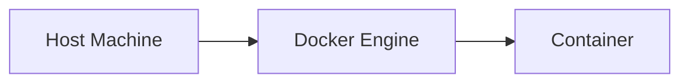

# CommandLinux

> A personal technical blog where I document what I am learning about Linux, Docker, Kubernetes, Terraform, Cloud Native, and DevOps.

🌐 **Live site:** [commandlinux.dev](https://www.commandlinux.dev)

## About

CommandLinux is a personal space for publishing technical notes, practical explanations, diagrams, and study insights.

The goal is simple: learn in public, organize knowledge, and share content that may help other people who are studying the same technologies.

Topics currently covered include:

* Linux
* Docker
* Kubernetes
* Terraform
* Cloud Native
* DevOps

## Tech Stack

* [Astro](https://astro.build/)
* TypeScript
* React
* Markdown and MDX
* Mermaid diagrams
* Astro Content Collections
* RSS Feed
* Sitemap generation

## How This Project Was Built

The frontend was built with [Astro](https://astro.build/), and AI tools were used along the way to help with styling, layout, and content.

The automation side — the GitHub Actions workflow and script that automatically translate posts from Portuguese to English using the Gemini API — was designed and implemented by me. You can check it out at [`.github/workflows/translate-posts.yml`](.github/workflows/translate-posts.yml) and [`scripts/translate-posts.mjs`](scripts/translate-posts.mjs).

## Features

* Posts written in Markdown
* Categories and tags
* Syntax highlighting for code blocks
* Mermaid diagrams for technical explanations
* SEO metadata and Open Graph support
* RSS feed and sitemap generation
* Responsive layout
* Automatic post translation (PT → EN) via GitHub Actions and the Gemini API

## Getting Started

### Requirements

* Node.js `>= 22.12.0`
* npm

### Installation

```bash
git clone https://github.com/csarsantos96/commandlinux-blog.git
cd commandlinux-blog
npm install
```

### Run locally

```bash
npm run dev
```

The development server will be available at:

```text
http://localhost:4321
```

## Available Commands

| Command                   | Description                                  |
| ------------------------- | -------------------------------------------- |
| `npm run dev`             | Starts the local development server          |
| `npm run build`           | Builds the production version of the website |
| `npm run preview`         | Previews the production build locally        |
| `npm run astro -- check`  | Runs Astro checks                            |
| `npm run astro -- --help` | Shows Astro CLI help                         |

## Creating a New Post

Create a new Markdown file inside:

```text
src/content/posts/
```

Example:

```md
---
title: Understanding Linux Namespaces
description: A practical introduction to Linux namespaces and container isolation.
date: 2026-07-07
category: LINUX
tags: [linux, containers, namespaces]
draft: false
---

Your post content goes here.
```

Posts support standard Markdown syntax, code blocks, images, links, and Mermaid diagrams.

### Mermaid Example



## Project Structure

```text
.
├── .github/
│   └── workflows/       # GitHub Actions workflows (post translation)
├── public/              # Static files such as images and favicons
├── scripts/             # Automation scripts (post translation)
├── src/
│   ├── components/      # Reusable UI components
│   ├── content/
│   │   └── posts/       # Blog posts written in Markdown
│   ├── layouts/         # Page layouts
│   ├── pages/           # Astro routes and pages
│   ├── styles/          # Global and component styles
│   └── content.config.ts
├── astro.config.mjs
└── package.json
```

## Author

Created and maintained by [César Santos](https://github.com/csarsantos96).

---

Built as a personal learning journal for technology, infrastructure, and cloud-native studies.
