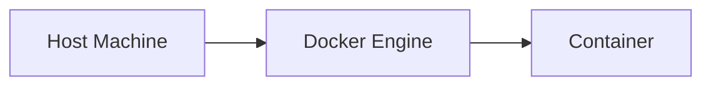

# CommandLinux

> A personal technical blog where I document what I am learning about Linux, Docker, Kubernetes, Terraform, Cloud Native, and DevOps.

🌐 **Live site:** [commandlinux.dev](https://www.commandlinux.dev)

## About

CommandLinux is a personal space for publishing technical notes, practical explanations, diagrams, and study insights.

The goal is simple: learn in public, organize knowledge, and share content that may help other people who are studying the same technologies.

Topics currently covered include:

* Linux
* Docker
* Kubernetes
* Terraform
* Cloud Native
* DevOps

## Tech Stack

* [Astro](https://astro.build/)
* TypeScript
* React
* Markdown and MDX
* Mermaid diagrams
* Astro Content Collections
* RSS Feed
* Sitemap generation
* Reactions backed by Upstash Redis

## How This Project Was Built

The frontend was built with [Astro](https://astro.build/), and AI tools were used along the way to help with styling, layout, and content.

The automation side was designed and implemented by me, and includes two GitHub Actions workflows:

* **Post translation** — automatically translates new posts from Portuguese to English using the Gemini API. See [`.github/workflows/translate-posts.yml`](.github/workflows/translate-posts.yml) and [`scripts/translate-posts.mjs`](scripts/translate-posts.mjs).
* **Newsletter drafts** — creates localized Hostinger Reach campaign drafts for newly published posts. See [`.github/workflows/newsletter.yml`](.github/workflows/newsletter.yml).

## Features

* Posts written in Markdown
* Categories and tags
* Syntax highlighting for code blocks
* Mermaid diagrams for technical explanations
* SEO metadata and Open Graph support
* RSS feed and sitemap generation
* Responsive layout
* Portuguese and English routes
* Reading progress, post reactions, and social sharing
* Automatic post translation (PT → EN) via GitHub Actions and the Gemini API
* Hostinger Reach subscriptions for PT and EN, plus automatic campaign drafts for new posts

## Getting Started

### Requirements

* Node.js `>= 22.12.0`
* npm

### Installation

```bash
git clone https://github.com/csarsantos96/commandlinux-blog.git
cd commandlinux-blog
npm install
```

### Environment variables

The website can run locally without environment variables. Reactions, post translation, and the Hostinger Reach integration use the following variables:

```bash
# Post reactions (Upstash Redis)
REDIS_KV_REST_API_URL=
REDIS_KV_REST_API_TOKEN=

# Post translation
GEMINI_API_KEY=
GEMINI_MODEL=gemini-2.5-flash # optional

# Hostinger Reach
HOSTINGER_REACH_API_TOKEN=
HOSTINGER_REACH_PROFILE_UUID=
HOSTINGER_REACH_SENDER_EMAIL=
HOSTINGER_REACH_SENDER_NAME=
```

Add them to a local `.env` file when needed. Do not commit this file.

### Run locally

```bash
npm run dev
```

The development server will be available at:

```text
http://localhost:4321
```

## Available Commands

| Command                   | Description                                               |
|---------------------------|-----------------------------------------------------------|
| `npm run dev`             | Starts the local development server                       |
| `npm run build`           | Builds the production version of the website              |
| `npm run preview`         | Previews the production build locally                     |
| `npm run astro -- --help` | Shows Astro CLI help                                      |
| `npm run translate:posts` | Translates new/updated posts (PT → EN) via the Gemini API |
| `npm run newsletter:preview -- <post>` | Generates a local HTML preview without calling Reach |
| `npm run newsletter:profiles` | Lists Reach profiles using the configured API token |
| `npm run test:newsletter` | Tests post detection and newsletter rendering |

## Creating a New Post

Create a new Markdown file inside:

```text
src/content/posts/
```

Example:

```md
---
title: Understanding Linux Namespaces
description: A practical introduction to Linux namespaces and container isolation.
date: 2026-07-07
updatedDate: 2026-07-08 # optional
category: LINUX
tags: [linux, containers, namespaces]
draft: false
language: pt
series: Linux Internals # optional
part: 1                # optional; current part of the series
totalParts: 3          # optional; total number of parts
---

Your post content goes here.
```

Posts support standard Markdown syntax, code blocks, images, links, and Mermaid diagrams.

## Newsletter with Hostinger Reach

The newsletter form sends subscriptions to the server-side `/api/newsletter-subscribe` function. The API token is never exposed to the browser. Subscribers are assigned to `newsletter-pt` or `newsletter-en` according to the page language. Reach double opt-in settings still apply.

On a push to `main`, the newsletter workflow compares `github.event.before` with `github.sha`. It processes added published posts and posts changed from `draft: true` to published, including multiple PT or EN posts in one push. Edits to published posts are ignored. Each article receives a deterministic language-and-URL key, and existing Reach campaigns are checked before a draft is created. Reach does not select recipients or send this campaign through this integration; review the language tag or segment and send it from the Reach interface.

Series metadata is read only from the current article. A complete `series` + `part` + `totalParts` set is shown in the email; an incomplete series shows only its name. Posts are never grouped or inferred from publication order.

Create a local preview without contacting Reach:

```bash
npm run newsletter:preview -- src/content/posts/<post>.md
```

The generated file is written to `.newsletter-preview/`. Configure the four `HOSTINGER_REACH_*` variables as Vercel environment variables and GitHub Actions secrets. If the profile UUID is unknown, set the API token locally and run `npm run newsletter:profiles`.

Portuguese posts live directly in `src/content/posts/`. English files in `src/content/posts/en/` are generated by the translation workflow and should not normally be edited by hand.

### Mermaid Example


```mermaid
flowchart LR
    A[Host Machine] --> B[Docker Engine]
    B --> C[Container]
```

## Project Structure

```text
.
├── .github/
│   └── workflows/       # GitHub Actions workflows (post translation, newsletter)
├── api/                  # Serverless APIs for reactions and newsletter subscriptions
├── public/              # Static files such as images and favicons
├── scripts/             # Translation and newsletter automation scripts
├── src/
│   ├── components/      # Reusable UI components
│   ├── content/
│   │   └── posts/
│   │       ├── *.md     # Blog posts written in Markdown (PT)
│   │       └── en/      # Auto-generated English translations
│   ├── layouts/         # Page layouts
│   ├── pages/           # Astro routes and pages
│   ├── styles/          # Global and component styles
│   └── content.config.ts
├── astro.config.mjs
└── package.json
```

## Author

Created and maintained by [César Santos](https://github.com/csarsantos96).

---

Built as a personal learning journal for technology, infrastructure, and cloud-native studies.
