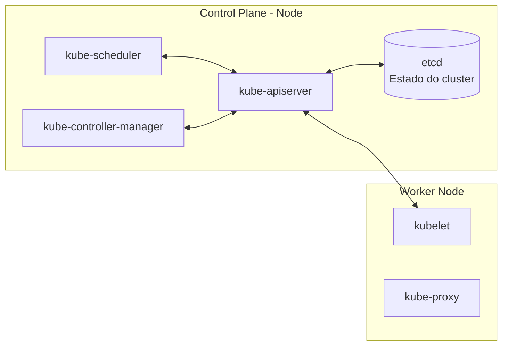

No `Kubernetes` , o cluster é dividido basicamente en duas partes:  

### **Control Plane** = Cérebro do cluster
### **Workers** = Máquinas que fazem o trabalho pesado.  

  

# **Control Plane**
O Control Plane decide o que acontece nos clusters. Ele não costuma rodar a aplicação diretamente, mas é ele que administra todo o ambiente.

### 
 **Arquitetura básica do Kubernetes**
  

## **etcd** -> Ele guarda todas as informações. Todo o estado real do `cluster`. Ele só conversa com o `kube API SERVER`.  

## **kube API SERVER** -> Só ele tem a permissão por default de conversar com o etcd. A função dele é pegar o status do `cluster`como um todo. ELe que vai conversar com todo mundo. Toda a comunicação do `cluster`acontece através do `kube API SERVER`.  

## **kube shedule** -> Ele é o responsável por fazer o gerenciamento de onde vai rodar cada um dos contrainers, ele é o controler responsável onde que vai os novos containers, é ele que saber da capacidade dos nós(nodes).  

## **kube control manager** -> É o gerente de todos os controllers, ele que vai garantir o estado do `cluster`. Ele é o controlador do `cluster`.  
  
  

# **Workers**  

## **kubelet** -> Ele é o agente o kubernets dentro do nó(node), e qualquer nó(node) do `kubernetes` vai ter um `kubelet`. É ele que vê se tudo está ok e que conversa com o `kube APISERVER`, recebendo a especificação dos Pods daquele node e reportando o estado de volta.  

## **kube proxy** -> Todo nó (node) vai ter um `kube proxy`. É ele que vai fazer a comunicação dos `pods` com o resto do mundo, ele observa recursos do cluster e configura as regras de rede no nó (node).  

   

# **Portas utilizadas pelos componentes do Kubernetes**  

## Portas utilizadas pelos componentes do Kubernetes

| Componente | Porta padrão | Protocolo |
|---|---:|---|
| kube-apiserver | 6443 | TCP |
| etcd | 2379–2380 | TCP |
| kube-scheduler | 10259 | TCP |
| kube-controller-manager | 10257 | TCP |
| kubelet | 10250 | TCP |
| kube-proxy | 10256 | TCP |

## Portas de exposição de aplicações

| Recurso | Porta padrão | Protocolo |
|---|---:|---|
| Service do tipo NodePort | 30000–32767 | TCP ou UDP |   

 