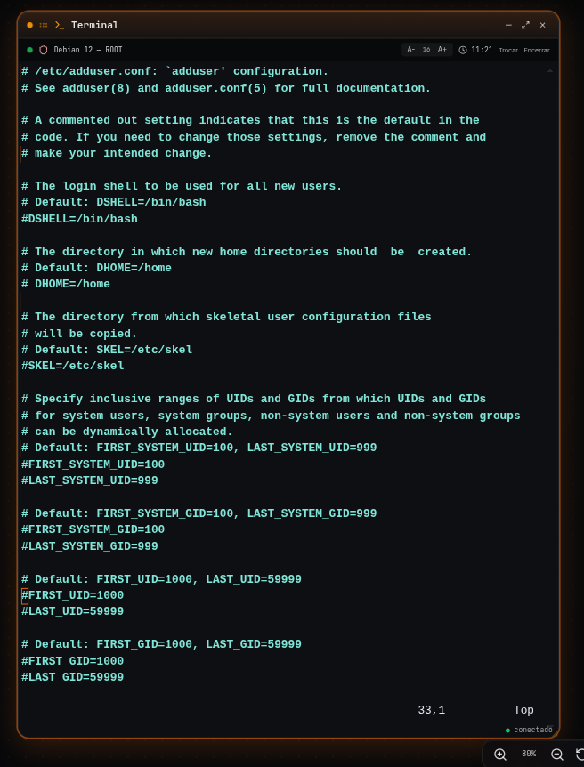
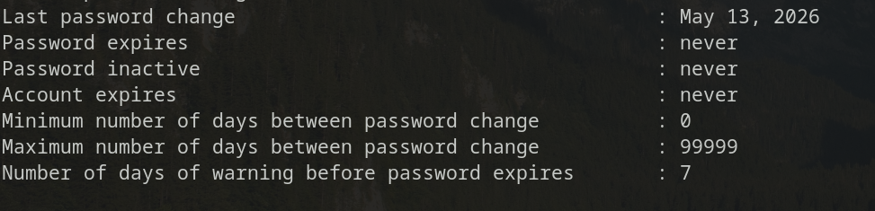

Essas são minhas anotações de caderno sobre administração de usuários no Linux, parte do curso **Linux para Cloud Native** da LINUXtips, dentro da trilha do PICK 2026. Passei tudo a limpo aqui porque escrever fixa o conteúdo, e porque um dia isso vira referência rápida quando eu não lembrar de uma flag.

> As saídas apresentadas são exemplos. UIDs, nomes e caminhos podem variar de acordo com o sistema.

# UID: a identidade real de um usuário

O Linux não enxerga usuários pelo nome. Internamente, tudo é controlado pelo **UID** (*User Identification*), um número.

O nome do usuário é apenas um rótulo amigável para nós, humanos. O sistema, os processos e as permissões de arquivo trabalham com o número.

Isso fica claro com o comando `id`:

```bash
id
```

Saída:

```text
uid=1000(user) gid=1000(user) groups=1000(user),10(wheel),975(docker)
```

Comparando com o usuário `root`:

```bash
id root
```

Saída:

```text
uid=0(root) gid=0(root) groups=0(root)
```

O `root` sempre terá UID `0`. Nenhum outro usuário deveria ter esse número.

# `/etc/passwd`: o registro de usuários do sistema

O arquivo `/etc/passwd` guarda a lista de todos os usuários do sistema.

```bash
cat /etc/passwd
```

Saída (uma linha, como exemplo):

```text
user:x:1000:1000::/home/user:/usr/bin/zsh
```

Cada linha é dividida em sete campos, separados por `:`

```text
nome:senha:UID:GID:GECOS:diretório home:shell
```

| Campo | Significado |
|---|---|
| `user` | Nome do usuário |
| `x` | Indica que a senha está armazenada em outro arquivo (`/etc/shadow`) |
| `1000` | UID — identificador único do usuário |
| `1000` | GID — identificador do grupo primário |
| `user` | GECOS — informações quaisquer sobre o usuário (nome completo, telefone etc.) |
| `/home/user` | Diretório home do usuário |
| `/usr/bin/zsh` | Shell padrão do usuário |

O `x` no segundo campo não significa que não existe senha. Significa que ela não está mais aqui — décadas atrás o hash ficava direto no `/etc/passwd`, que qualquer usuário pode ler. Hoje ele mora no `/etc/shadow`, legível apenas por `root`.

Repare também nos números de UID e GID:

- Os **primeiros usuários do sistema** (contas de serviço, criadas automaticamente) recebem UIDs baixos.
- O **primeiro usuário humano** criado normalmente recebe UID `1000`.

# `/etc/group`: os grupos do sistema

Da mesma forma que o `/etc/passwd` lista usuários, o `/etc/group` lista todos os grupos.

```bash
cat /etc/group
```

Saída (exemplo):

```text
wheel:x:10:user
docker:x:975:user
user:x:1000:
```

# Criando um novo usuário: `adduser` x `useradd`

Existem dois comandos para criar usuários, e a diferença entre eles importa.

- **`useradd`** é o comando nativo, de baixo nível. Ele cria a entrada no `/etc/passwd`, mas **não** cria o diretório home, não pede senha e não configura nada além do que for passado explicitamente. É seco e direto — perfeito para scripts e automações, onde você quer controlar cada detalhe.
- **`adduser`** é um script interativo que roda por cima do `useradd`. Ele faz perguntas, cria o diretório home, copia os arquivos padrão do `/etc/skel`, define a senha e configura o shell. Para criar usuários humanos no dia a dia, uso o `adduser`. Para automação, uso `useradd` com as flags explícitas.

## Criando com `adduser`

```bash
sudo adduser java
```

O comando pergunta interativamente pelo nome completo e outras informações (o chamado campo **GECOS**):

```text
Nome completo []: Java Git
Número da sala []: 900
Telefone comercial []: 987654321
Telefone residencial []: 123456789
Outro []: Corinthiano
```

Conferindo o resultado no `/etc/passwd`:

```bash
cat /etc/passwd
```

Saída:

```text
java:x:1002:1002:Java Git,900,987654321,123456789,Corinthiano:/home/java:/bin/bash
```

O campo GECOS concatena todas as respostas em uma única string, separada por vírgulas:

```text
Java Git,900,987654321,123456789,Corinthiano
```

E o `adduser` já cuidou de tudo: criou o diretório home, copiou o `/etc/skel` e configurou o shell padrão (`/bin/bash`), sem que eu precisasse passar nenhuma flag.

## Criando com `useradd`

Com `useradd`, cada detalhe precisa ser informado manualmente:

```bash
sudo useradd -u 1234 -g 0 -d /tmp/lore -s /bin/sh lore
```

| Flag | Significado |
|---|---|
| `-u 1234` | UID do usuário |
| `-g 0` | GID do grupo primário |
| `-d /tmp/lore` | Diretório home |
| `-s /bin/sh` | Shell padrão |
| `lore` | Nome do usuário |

Resultado em `/etc/passwd`:

```bash
cat /etc/passwd
```

Saída:

```text
lore:x:1234:0::/tmp/lore:/bin/sh
```

O campo GECOS ficou vazio, porque não passei nenhuma informação para ele.

Além disso, o diretório home **não** foi criado:

```bash
ls /home
```

Saída:

```text
estudante  java
```

O `lore` não aparece. O `useradd`, sem mais nada, só escreve a linha no `/etc/passwd` — não cria pasta, não copia nada.

## A flag `-m`: criando o home automaticamente

Para o `useradd` criar o diretório home, é preciso passar a flag `-m`:

```bash
sudo useradd -u 3881 -g 1000 -m -d /home/intel -s /bin/sh intel
```

A flag `-m` cria automaticamente o diretório home do usuário, copiando o conteúdo do `/etc/skel` para dentro dele.

```bash
ls /home
```

Saída:

```text
estudante  intel  java
```

Agora sim, `intel` aparece.

# Definindo a senha com `passwd`

Um usuário recém-criado não tem senha definida. Para configurá-la:

```bash
sudo passwd intel
```

Saída:

```text
Nova senha:
Digite novamente a nova senha:
passwd: senha atualizada com sucesso
```

# Trocando de usuário com `su`

O comando `su` (*switch user*, ou simplesmente "trocar de usuário") permite assumir a sessão de outro usuário no terminal.

```bash
su - intel
```

Saída:

```text
Senha:
```

O traço (`-`) depois do `su` inicia uma **sessão completa de login** — carregando as variáveis de ambiente do usuário de destino, como se ele tivesse feito login diretamente, em vez de apenas herdar o ambiente do usuário atual.

Conferindo a identidade dentro da nova sessão:

```bash
id
```

Saída:

```text
uid=3881(intel) gid=1000(estudante) groups=1000(estudante)
```

Para voltar ao usuário anterior:

```bash
exit
```

Ou pressionando `Ctrl + D`.

# `/etc/adduser.conf`: configurando o comportamento padrão

O `adduser` lê suas configurações padrão de um arquivo:

```bash
vim /etc/adduser.conf
```

Ele define, entre outras coisas, a faixa de UID reservada para usuários "de sistema" (contas de serviço, não humanas):

```text
FIRST_SYSTEM_UID=100
LAST_SYSTEM_UID=999
```



Ou seja: UIDs entre `100` e `999` são reservados para o sistema. Usuários humanos criados a partir daí começam em `1000`, como vimos lá em cima.

# `/etc/skel`: o molde para novos usuários

O `/etc/skel` é um diretório que funciona como **modelo** para todo novo usuário criado no Linux.

Seu conteúdo típico são os dotfiles padrão — `.bashrc`, `.bash_profile`, `.profile` e, em algumas distros, `.bash_logout` ou uma pasta `.config`.

Ao editar qualquer um desses arquivos dentro do `/etc/skel`, todo novo usuário criado a partir dali recebe esses padrões automaticamente, copiados para dentro do seu próprio diretório home.

O caminho usado como modelo é configurável através da variável `SKEL`, definida em:

```text
/etc/default/useradd
```

# Removendo um usuário: `deluser` / `userdel`

Para remover um usuário:

```bash
sudo deluser python
```

Isso remove o usuário, mas mantém o diretório home intacto.

Para remover também o diretório home junto:

```bash
sudo deluser -r python
```

# Bloqueando e desbloqueando uma conta

Às vezes não queremos apagar o usuário, apenas impedir o acesso temporariamente.

```bash
sudo passwd -l java
```

A flag `-l` (*lock*) bloqueia a senha da conta, sem apagar o usuário nem seus dados.

Para desbloquear:

```bash
sudo passwd -u java
```

A flag `-u` (*unlock*) libera novamente o acesso.

# `/etc/shadow`: onde as senhas realmente vivem

O `/etc/shadow` é o arquivo que armazena os hashes de senha dos usuários. Diferente do `/etc/passwd`, ele exige privilégios de root para ser lido:

```bash
sudo cat /etc/shadow
```

Saída (uma linha, como exemplo):

```text
java:$6$4vSalt$hashaquiofuscado...:20033:0:99999:7:::
```

Cada linha tem **nove campos**, separados por `:`

```text
usuário:senha:última_mudança:min:max:aviso:inatividade:expiração:reservado
```

| # | Campo | Significado |
|---|---|---|
| 1 | Usuário | Nome da conta |
| 2 | Senha | Hash da senha (`!` ou `*` = conta bloqueada, vazio = sem senha) |
| 3 | Última mudança | Dias desde `01/01/1970` da última alteração de senha |
| 4 | Min | Dias mínimos que devem passar antes de poder trocar de novo |
| 5 | Max | Dias máximos até a senha expirar |
| 6 | Aviso | Dias de aviso antes da senha expirar |
| 7 | Inatividade | Dias após a expiração até a conta ser desativada |
| 8 | Expiração | Data (em dias desde 1970) em que a conta expira |
| 9 | Reservado | Campo não utilizado |

## Identificando o algoritmo de hash

O prefixo no campo de senha indica qual algoritmo foi usado:

| Prefixo | Algoritmo |
|---|---|
| `$6$` | SHA-512 |
| `$y$` | yescrypt |
| `$2b$` | bcrypt |

Uma conta bloqueada com `passwd -l` aparece com um `!` no início do campo de senha, na frente do hash original — a senha continua ali, só que inutilizada para autenticação.

# `chage`: gerenciando a política de expiração

O `chage` (*change age*) gerencia a política de expiração de senha de uma conta.

Executado sem opções, entra em modo interativo, perguntando cada valor:

```bash
sudo chage java
```

## Consultando a política atual

```bash
sudo chage -l java
```

Saída:




A flag `-l` lista as informações atuais de expiração da conta. Consultar a própria conta não exige privilégios de root.

## Principais flags

| Flag | Significado |
|---|---|
| `-l` | Lista as informações de expiração |
| `-E data` | Data de expiração da conta (`AAAA-MM-DD`), ou `-1` para nunca expirar |
| `-M dias` | Máximo de dias de validade da senha |
| `-m dias` | Mínimo de dias entre trocas de senha |
| `-W dias` | Dias de aviso antes da senha expirar |
| `-I dias` | Dias de inatividade após a expiração até a conta ser desativada |
| `-d data` | Data da última troca de senha (`-d 0` força a troca no próximo login) |

## Exemplos

```bash
sudo chage -l java
```

Mostra a política atual do usuário `java`.

```bash
sudo chage -M 90 -W 7 java
```

Faz a senha expirar em 90 dias, avisando 7 dias antes.

```bash
sudo chage -E 2026-12-31 java
```

Faz a conta expirar em 31/12/2026.

```bash
sudo chage -d 0 java
```

Obriga a troca de senha no próximo login.

## Expirando a senha diretamente

Existe também um atalho via `passwd`:

```bash
sudo passwd -e java
```

A flag `-e` expira a senha imediatamente, forçando a troca no próximo login — equivalente ao `chage -d 0`.

# Resumo dos comandos

| Situação | Comando |
|---|---|
| Ver a identidade (UID/GID) de um usuário | `id` |
| Ver os usuários do sistema | `cat /etc/passwd` |
| Ver os grupos do sistema | `cat /etc/group` |
| Criar usuário interativamente, com home | `adduser` |
| Criar usuário com controle explícito | `useradd` |
| Criar home automaticamente com `useradd` | `useradd -m` |
| Definir/trocar senha | `passwd` |
| Trocar de usuário (sessão completa) | `su - usuário` |
| Remover usuário | `deluser` / `userdel` |
| Remover usuário e seu home | `deluser -r` |
| Bloquear/desbloquear conta | `passwd -l` / `passwd -u` |
| Ver hashes de senha (root) | `cat /etc/shadow` |
| Ver/definir política de expiração | `chage` |
| Forçar troca de senha no próximo login | `passwd -e` ou `chage -d 0` |

# Conclusão

O `/etc/passwd` e o `/etc/group` respondem "quem é quem" no sistema. O `/etc/shadow` guarda o que realmente protege essas contas — e por isso só o root pode lê-lo.

`adduser` e `useradd` fazem, no fundo, a mesma coisa: escrever uma linha no `/etc/passwd`. A diferença é o quanto cada um automatiza por você. No dia a dia, `adduser` poupa trabalho; em scripts, `useradd` com flags explícitas garante previsibilidade.

E o `chage` fecha o ciclo: não basta criar a conta e definir uma senha, é preciso decidir por quanto tempo essa senha continua válida, e o que acontece quando ela expira.

**Próximas anotações:** grupos e permissões (`chmod`, `chown`, `umask`), sudoers e gerenciamento de pacotes.

## Referências

- [GNU/Linux `shadow-utils`](https://github.com/shadow-maint/shadow) — projeto que mantém `useradd`, `userdel`, `passwd` e `chage`.
- `man 5 passwd`, `man 5 shadow`, `man 5 group` — documentação oficial dos formatos de arquivo.
- `man 8 useradd`, `man 8 chage` — documentação oficial dos comandos.
- [Debian Administrator's Handbook — Managing Rights](https://debian-handbook.info/browse/stable/sect.managing-rights.html) — referência sobre `adduser`, `/etc/skel` e gerenciamento de contas.
- [LINUXtips — Linux para Cloud Native](https://linuxtips.io/linux-para-cloud-native/) — curso utilizado como base dos meus estudos e destas anotações, dentro da trilha PICK.