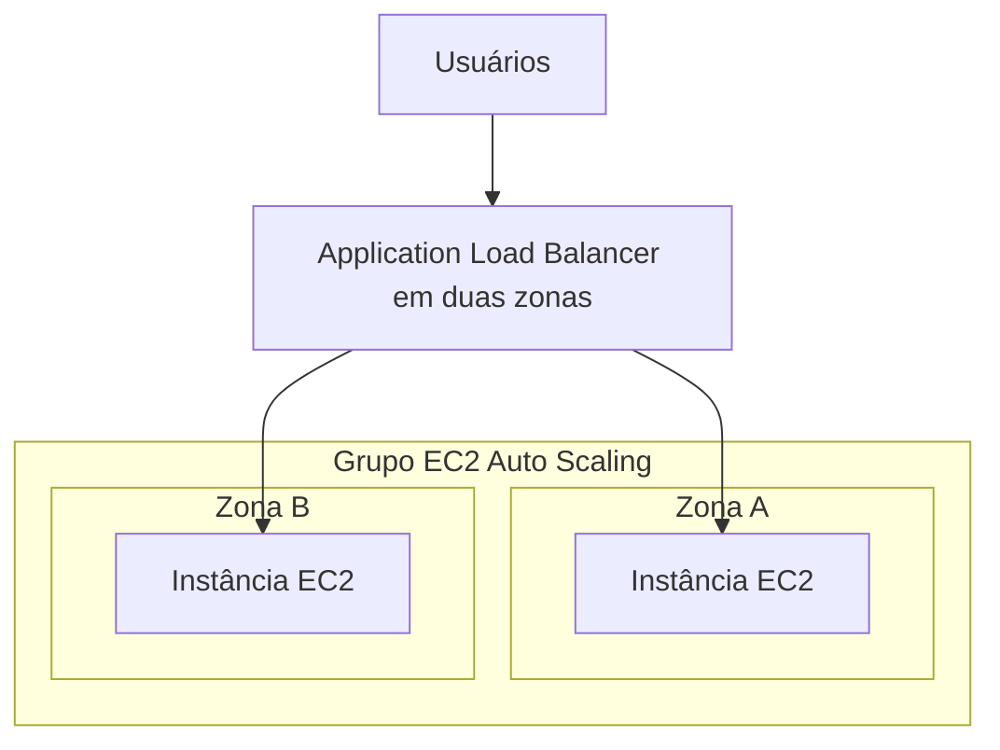

⸻

Sua aplicação recebeu mais acessos. Você pode aumentar o servidor ou colocar mais servidores para trabalhar. Se escolher a segunda opção, alguém precisa distribuir as requisições entre eles.

É nesse ponto que aparecem o Amazon Elastic Compute Cloud (EC2) Auto Scaling e o Elastic Load Balancing (ELB), da Amazon Web Services (AWS). Eles se complementam, mas fazem trabalhos diferentes.

## Escala vertical e horizontal

Na **escala vertical**, você altera os recursos de uma máquina: mais ou menos processamento e memória. No EC2, mudar o tipo de uma instância existente normalmente envolve pará-la e iniciá-la novamente, além de verificar compatibilidade. Não é correto presumir uma alteração sem interrupção. [Alteração do tipo de instância](https://docs.aws.amazon.com/AWSEC2/latest/UserGuide/ec2-instance-resize.html).

Na **escala horizontal**, você altera a quantidade de máquinas. Passar de duas para quatro instâncias é aumentar horizontalmente; voltar para duas é reduzir horizontalmente.

Escalabilidade é a capacidade de acomodar crescimento. Elasticidade envolve ajustar recursos conforme a demanda aumenta ou diminui. Para isso acontecer automaticamente, as políticas e os limites precisam estar configurados.

## Auto Scaling administra a quantidade

Um grupo do EC2 Auto Scaling define capacidade mínima, desejada e máxima. As políticas podem modificar a capacidade desejada dentro desses limites. O serviço também pode substituir instâncias consideradas não saudáveis.

Por exemplo, um grupo com mínimo de duas instâncias e máximo de seis não cresce sem limite. E configurar somente o máximo não cria, por si só, uma política de expansão. [Funcionamento do EC2 Auto Scaling](https://docs.aws.amazon.com/autoscaling/ec2/userguide/what-is-amazon-ec2-auto-scaling.html).

## O balanceador distribui o tráfego

Um load balancer recebe conexões e encaminha o tráfego aos destinos configurados. Ele não instala a aplicação nem aumenta sozinho o número de instâncias do grupo.

| Componente | Responsabilidade |
| --- | --- |
| Instância EC2 | Executar a aplicação |
| EC2 Auto Scaling | Manter ou ajustar a quantidade de instâncias |
| Load balancer | Distribuir tráfego entre destinos |

O ELB oferece diferentes tipos. O Application Load Balancer (ALB) atende aplicações que usam Hypertext Transfer Protocol (HTTP) e sua versão protegida, HTTPS (*Hypertext Transfer Protocol Secure*). O Network Load Balancer (NLB) atende necessidades de transporte como Transmission Control Protocol (TCP) e User Datagram Protocol (UDP). O Gateway Load Balancer (GWLB) permite inserir e escalar appliances de rede, como firewalls. [Visão geral do ELB](https://docs.aws.amazon.com/elasticloadbalancing/latest/userguide/what-is-load-balancing.html).

## Arquitetura: aplicação em duas zonas

Imagine uma aplicação web hipotética em duas zonas de disponibilidade, ou AZs (*Availability Zones*). O diagrama mostra o fluxo lógico da camada de aplicação; não detalha sub-redes, rotas ou persistência.

Quando a demanda cresce, uma política pode adicionar instâncias. Depois de prontas e registradas, elas passam a atender tráfego conforme a integração com o balanceador.

Isso funciona melhor quando qualquer instância consegue atender uma requisição. Se o login do usuário existir apenas na memória de uma máquina, encaminhá-lo para outra pode quebrar sua sessão. A aplicação precisa planejar onde mantém estado e dados compartilhados.

## Verificações de saúde têm significado e limites

Um *health check* verifica critérios definidos para considerar um destino saudável. Um processo aceitar conexão não prova que todas as funções da aplicação estão funcionando; o teste precisa representar uma condição útil.

Normalmente, o ALB encaminha tráfego para destinos saudáveis. Porém, se todos os destinos de um grupo estiverem não saudáveis, existe o comportamento *fail-open*, que permite encaminhar para todos. Por isso, “um destino com problema nunca recebe tráfego” é uma simplificação incorreta. [Verificações de saúde do ALB](https://docs.aws.amazon.com/elasticloadbalancing/latest/application/target-group-health-checks.html).

Além disso, para o Auto Scaling considerar os resultados de saúde do balanceador na substituição de instâncias, essa integração deve estar habilitada. [Saúde do grupo de Auto Scaling](https://docs.aws.amazon.com/autoscaling/ec2/userguide/health-checks-overview.html).

## Quando usar e quando repensar

Essa combinação atende aplicações que podem distribuir trabalho entre instâncias e precisam ajustar capacidade. Ela também ajuda a reduzir dependência de um único servidor.

Não resolve automaticamente um banco de dados lento, uma aplicação que exige estado local exclusivo ou uma dependência externa indisponível. Antes de adicionar máquinas, identifique o gargalo e confira se a aplicação aceita distribuição.

## Questão autoral para a CLF-C02

Uma aplicação já usa um balanceador, mas precisa aumentar e diminuir automaticamente a quantidade de instâncias conforme a demanda. Qual componente deve ser configurado para essa função?

- **A.** Amazon Route 53.
- **B.** Amazon EC2 Auto Scaling.
- **C.** Um segundo nome de domínio.
- **D.** Apenas uma nova regra de encaminhamento no balanceador.

**Resposta: B.** Auto Scaling administra a capacidade do grupo conforme a configuração.

A fornece resolução e roteamento de nomes, não essa gestão de instâncias. C não altera capacidade. D muda o encaminhamento, mas não cria uma política de expansão e redução.

## Resumo

Escala vertical altera recursos de uma máquina. Escala horizontal altera sua quantidade. Auto Scaling administra capacidade; o balanceador distribui tráfego. Para a certificação e para uma arquitetura real, associe cada componente à sua função e lembre que a aplicação também precisa suportar a distribuição.

## Documentação oficial

- [EC2 Auto Scaling](https://docs.aws.amazon.com/autoscaling/ec2/userguide/what-is-amazon-ec2-auto-scaling.html)
- [Elastic Load Balancing](https://docs.aws.amazon.com/elasticloadbalancing/latest/userguide/what-is-load-balancing.html)
- [Verificações de saúde do ALB](https://docs.aws.amazon.com/elasticloadbalancing/latest/application/target-group-health-checks.html)
- [Integração de verificações de saúde](https://docs.aws.amazon.com/autoscaling/ec2/userguide/health-checks-overview.html)
