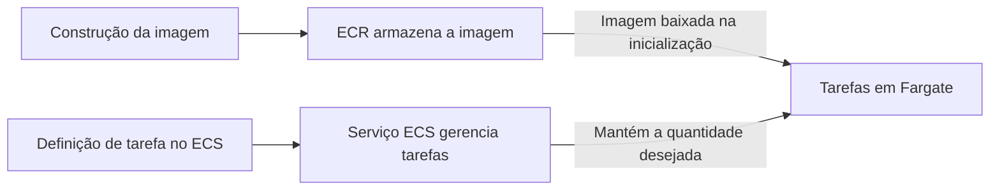

⸻

Você empacotou uma aplicação em uma imagem de contêiner. Agora precisa armazenar essa imagem, decidir como executar suas cópias e fornecer capacidade computacional.

São três problemas diferentes. Entender essa divisão evita boa parte da confusão entre os serviços de contêineres da Amazon Web Services (AWS).

## Imagem não é contêiner em execução

A imagem reúne o conteúdo necessário para iniciar a aplicação, como arquivos e dependências. O contêiner é uma execução criada a partir dessa imagem.

Enviar uma imagem a um registro não coloca a aplicação no ar. Ainda falta configurar execução, rede, permissões e, quando necessário, armazenamento persistente.

## ECR guarda imagens

O Amazon Elastic Container Registry (ECR) é um registro de imagens. Ele permite armazenar e disponibilizar imagens para quem tem permissão de enviá-las ou baixá-las.

Uma rotina de entrega pode construir a imagem, enviá-la ao ECR e atualizar a aplicação para usar essa versão. O registro participa da distribuição do artefato; ele não é o componente responsável por manter suas réplicas em execução. [Documentação do ECR](https://docs.aws.amazon.com/AmazonECR/latest/userguide/what-is-ecr.html).

## ECS e EKS organizam a execução

O Amazon Elastic Container Service (ECS) é o serviço de orquestração de contêineres da AWS. Você descreve tarefas e pode usar um serviço para manter a quantidade desejada de tarefas funcionando.

O Amazon Elastic Kubernetes Service (EKS) oferece Kubernetes gerenciado. Ele é relevante quando o projeto precisa desse ecossistema, de seus recursos e de suas interfaces. Gerenciar o plano de controle não significa que todas as escolhas de configuração, atualizações e segurança da aplicação desapareçam. [ECS](https://docs.aws.amazon.com/AmazonECS/latest/developerguide/Welcome.html), [EKS](https://docs.aws.amazon.com/eks/latest/userguide/what-is-eks.html).

Escolher EKS apenas porque “Kubernetes é mais completo” não define um requisito. Considere o conhecimento da equipe, as integrações necessárias e o trabalho operacional que o projeto aceita.

## Fargate fornece computação

AWS Fargate permite executar contêineres sem administrar as instâncias subjacentes. Ele trabalha com ECS e com cargas compatíveis no EKS.

**Fargate não é outro orquestrador.** A escolha de orquestração e a escolha de capacidade são relacionadas, mas separadas. No modelo com instâncias Amazon Elastic Compute Cloud (EC2) administradas pela equipe, essa equipe também cuida dos hosts. Com Fargate, essa camada é gerenciada pela AWS.

Isso não transforma o contêiner em uma função Lambda nem elimina configurações de memória, processamento, rede ou permissões. [Fargate com ECS](https://docs.aws.amazon.com/AmazonECS/latest/developerguide/AWS_Fargate.html).

| Serviço | Responsabilidade principal | Pergunta correspondente |
| --- | --- | --- |
| ECR | Registro de imagens | Onde armazeno a imagem? |
| ECS | Orquestração | Como organizo tarefas e serviços com a solução da AWS? |
| EKS | Kubernetes gerenciado | Preciso executar workloads Kubernetes? |
| Fargate | Capacidade sem administrar hosts | Quem gerencia os servidores dos contêineres? |
| EC2 | Instâncias computacionais | Preciso controlar os hosts? |

## Exemplo: aplicação web com ECS e Fargate

Considere uma equipe que já tem a aplicação em contêiner e não possui uma exigência de Kubernetes. Ela pode armazenar a imagem no ECR, definir uma tarefa no ECS e executar o serviço com Fargate.

O diagrama representa artefato e gerenciamento, não o caminho do tráfego dos usuários. Para receber requisições, a aplicação ainda precisa de uma configuração de entrada compatível com o projeto.

Se um contêiner for substituído, os dados importantes não devem depender de arquivos temporários daquela execução. O serviço de armazenamento precisa ser escolhido e configurado separadamente.

## Quando avaliar outra combinação

EKS faz sentido quando Kubernetes é um requisito real. EC2 merece avaliação quando há necessidades específicas de host, hardware ou configurações incompatíveis com o ambiente gerenciado escolhido.

Fargate reduz a administração dos servidores, mas é preciso conferir os recursos suportados. Nem toda carga que funciona em um host configurado livremente pode ser movida sem adaptação.

Para uma aplicação simples, também vale considerar se contêineres são necessários naquele momento. A escolha deve reduzir o trabalho do projeto, não adicionar uma plataforma apenas para usar todas as siglas.

## Questão autoral para a CLF-C02

Uma equipe quer usar o orquestrador próprio da AWS e executar contêineres sem gerenciar as instâncias subjacentes. Qual combinação corresponde a esse requisito?

- **A.** ECR sozinho.
- **B.** ECS com Fargate.
- **C.** EKS obrigatório com hosts administrados manualmente.
- **D.** Apenas volumes de armazenamento.

**Resposta: B.** ECS organiza a execução, e Fargate fornece a capacidade sem a administração dos hosts pela equipe.

A armazena imagens, mas não mantém a aplicação executando. C adiciona Kubernetes e administração de hosts, sem atender à escolha descrita. D não fornece orquestração nem execução.

## Resumo

ECR armazena imagens. ECS e EKS orquestram. Fargate fornece computação gerenciada para cargas compatíveis. EC2 oferece controle sobre instâncias. Na certificação e na prática, identifique primeiro qual dessas responsabilidades o cenário está pedindo.

## Documentação oficial

- [Amazon ECR](https://docs.aws.amazon.com/AmazonECR/latest/userguide/what-is-ecr.html)
- [Amazon ECS e opções de capacidade](https://docs.aws.amazon.com/AmazonECS/latest/developerguide/Welcome.html)
- [Amazon EKS](https://docs.aws.amazon.com/eks/latest/userguide/what-is-eks.html)
- [AWS Fargate com ECS](https://docs.aws.amazon.com/AmazonECS/latest/developerguide/AWS_Fargate.html)
