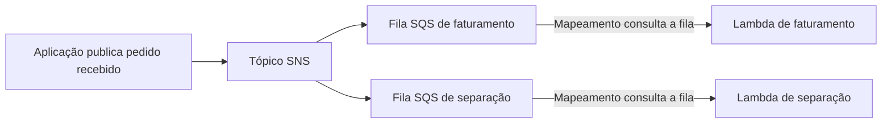

⸻

Um site pode receber pedidos mais rápido do que consegue processá-los. Se cada requisição precisar esperar por todos os componentes, a lentidão de um serviço se espalha para os outros.

Na Amazon Web Services (AWS), filas, notificações e funções ajudam a separar essas etapas. Mas armazenar uma mensagem, distribuí-la e executar o trabalho são funções diferentes.

## Desacoplar é reduzir a dependência direta

Numa chamada síncrona, o componente que fez a solicitação normalmente espera a resposta. Num fluxo assíncrono, ele pode registrar o trabalho e deixar que outro componente o execute depois.

Essa separação é chamada de **desacoplamento**. Ela não elimina todas as dependências: os componentes ainda precisam concordar sobre o formato e o significado das mensagens. O que muda é a necessidade de estarem disponíveis e responderem ao mesmo tempo.

## Amazon SQS: trabalho esperando em uma fila

O Amazon Simple Queue Service (SQS) armazena mensagens para consumo. Um produtor envia a mensagem; um consumidor a recebe, executa o trabalho e confirma sua conclusão por meio da exclusão da mensagem.

A mensagem fica temporariamente invisível a outros consumidores durante o período de visibilidade. Se o processamento não terminar corretamente, ela pode voltar a ser recebida. Filas têm retenção limitada: não são um arquivo permanente de pedidos.

Filas Standard podem entregar uma mensagem mais de uma vez e não garantem ordenação estrita. Filas FIFO, de *First In, First Out*, oferecem recursos de ordenação e deduplicação. Ainda assim, é necessário projetar o processamento corretamente. [Guia do SQS](https://docs.aws.amazon.com/AWSSimpleQueueService/latest/SQSDeveloperGuide/welcome.html).

## Amazon SNS: uma publicação, vários destinos

O Amazon Simple Notification Service (SNS) trabalha com publicação e assinatura. O produtor publica em um tópico, e as assinaturas definem os destinos que recebem a notificação.

Isso é útil quando o mesmo acontecimento interessa a componentes diferentes. Uma confirmação de pedido pode ser relevante para faturamento e separação de mercadorias. Cada etapa deve receber sua própria notificação. [Guia do SNS](https://docs.aws.amazon.com/sns/latest/dg/welcome.html).

Uma fila compartilhada entre consumidores concorrentes não substitui esse padrão: ela distribui o trabalho entre consumidores; não entrega uma cópia independente para cada sistema de negócio.

## AWS Lambda: executar o processamento

O Lambda executa código sem que você provisione os servidores usados pela função. A AWS administra essa infraestrutura, enquanto você configura o código, as permissões, os recursos e o tratamento de erros.

Uma execução de função tem duração máxima de 15 minutos. Escala automática também possui limites e configurações; não significa capacidade infinita. [Limites do Lambda](https://docs.aws.amazon.com/lambda/latest/dg/gettingstarted-limits.html).

Na integração com SQS, um mapeamento de origem de eventos do Lambda consulta a fila e invoca a função com lotes de mensagens. Não é o produtor chamando diretamente sua função nesse caminho. [Lambda com SQS](https://docs.aws.amazon.com/lambda/latest/dg/with-sqs.html).

| Serviço | Papel principal | Não substitui |
| --- | --- | --- |
| SQS | Armazenar trabalho para consumo assíncrono | Código que processa a mensagem |
| SNS | Distribuir uma publicação a assinantes | Fila independente para cada etapa, quando ela é necessária |
| Lambda | Executar código | Armazenamento durável do estado do negócio |

## Cenário: pedido recebido

Neste exemplo hipotético, duas etapas precisam ser informadas sobre o mesmo pedido. Cada uma possui uma fila própria, o que permite velocidades e novas tentativas independentes.

O desenho mostra a comunicação entre etapas, não uma transação completa de compra. A confirmação ao usuário precisa refletir se o pedido foi apenas recebido ou se seu processamento já terminou.

## Falhas precisam fazer parte do desenho

**Idempotência** significa que repetir o mesmo pedido de operação não produz efeitos extras indevidos. Se uma mensagem de faturamento for processada novamente, a aplicação não deve gerar uma cobrança duplicada.

Também é necessário tratar falhas por mensagem. Na integração entre Lambda e SQS, a resposta parcial de lote pode evitar repetir mensagens que já foram processadas com sucesso, quando configurada e implementada corretamente.

Uma fila de mensagens não processadas, ou DLQ (*Dead-Letter Queue*), permite separar mensagens que excederam as tentativas previstas. Ela ajuda na investigação, mas não corrige o conteúdo nem executa o trabalho sozinha.

## Quando usar e quando não usar

Filas ajudam a absorver picos e separar etapas que podem acontecer depois. SNS atende à distribuição de notificações. Lambda atende a tarefas que cabem em seu modelo de execução.

Se o usuário precisa da resposta calculada imediatamente, uma fila não remove esse requisito. Se uma tarefa indivisível excede o limite da função, considere outro ambiente de computação. E nenhuma dessas escolhas dispensa acompanhamento de erros e mensagens acumuladas.

## Questão autoral para a CLF-C02

Uma empresa precisa enviar o mesmo evento a dois sistemas. Cada sistema deve processá-lo no próprio ritmo, mantendo uma fila independente. Qual combinação atende melhor?

- **A.** Uma única fila SQS consumida pelos dois sistemas concorrentes.
- **B.** Apenas uma função Lambda, sem mecanismo de distribuição.
- **C.** Um tópico SNS com uma assinatura SQS para cada sistema.
- **D.** Um registro de domínio para cada mensagem.

**Resposta: C.** O tópico distribui a publicação, e cada fila mantém o trabalho de seu consumidor.

A distribui trabalho entre consumidores concorrentes, sem criar a cópia independente pedida. B não implementa sozinha esse desenho. D não tem relação com mensageria.

## Resumo

SQS mantém trabalho em espera, SNS distribui publicações e Lambda executa código. Para a certificação, diferencie essas responsabilidades. Na aplicação, complete o desenho com retenção, novas tentativas, idempotência e tratamento de falhas.

## Documentação oficial

- [Amazon SQS](https://docs.aws.amazon.com/AWSSimpleQueueService/latest/SQSDeveloperGuide/welcome.html)
- [Amazon SNS](https://docs.aws.amazon.com/sns/latest/dg/welcome.html)
- [Lambda com SQS](https://docs.aws.amazon.com/lambda/latest/dg/with-sqs.html)
- [Limites do Lambda](https://docs.aws.amazon.com/lambda/latest/dg/gettingstarted-limits.html)
