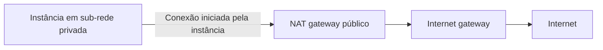

⸻

Uma instância está ligada, mas não consegue receber conexões. O problema pode estar na rota, no endereço, numa regra de segurança ou no próprio serviço que deveria responder.

Para entender esse caminho na Amazon Web Services (AWS), comece separando organização da rede, roteamento e filtragem de tráfego.

## VPC e sub-redes

Amazon Virtual Private Cloud (VPC) é a rede virtual logicamente isolada onde você organiza recursos. Ela pertence a uma região e pode conter sub-redes em diferentes zonas de disponibilidade.

Uma sub-rede é uma divisão do espaço de endereços da VPC e fica em uma única zona. Instâncias do Amazon Elastic Compute Cloud (EC2) usam interfaces de rede nessas sub-redes.

Uma **sub-rede pública** tem rota direta para um internet gateway. A privada não tem essa rota direta. Isso descreve o caminho da rede; não significa que todos os recursos na sub-rede pública estejam automaticamente expostos.

## O caminho até a internet

Um Internet Gateway (IGW) conecta a VPC à internet. No caso de uma instância usando Internet Protocol version 4 (IPv4), o acesso direto exige endereço público adequado, rota para o gateway e regras que permitam o tráfego. O serviço também precisa estar escutando na porta correta. [Internet gateway](https://docs.aws.amazon.com/vpc/latest/userguide/VPC_Internet_Gateway.html).

Para uma instância privada iniciar conexões IPv4 com a internet, uma opção comum é um gateway público de tradução de endereços, ou NAT (*Network Address Translation*) gateway. Ele fica numa sub-rede pública, enquanto a rota da sub-rede privada aponta para ele.

O gateway permite a saída e o retorno dessas conexões, sem oferecer um caminho para a internet iniciar conexões diretamente com a instância privada. Existem também NAT gateways privados, com outra finalidade. [NAT gateways](https://docs.aws.amazon.com/vpc/latest/userguide/vpc-nat-gateway.html).

Esse é um fluxo simplificado de saída IPv4. Não representa todas as opções para IPv6 ou acesso privado a serviços.

## Security group e lista de rede

Um security group, ou grupo de segurança, controla tráfego associado às interfaces dos recursos. Uma lista de controle de acesso de rede, ou NACL (*Network Access Control List*), atua na fronteira da sub-rede.

| Característica | Security group | NACL |
| --- | --- | --- |
| Associação | Interfaces de recursos | Sub-rede |
| Regras | Permissão | Permissão e negação |
| Estado da conexão | Stateful: acompanha o tráfego de resposta | Stateless: avalia entrada e saída separadamente |
| Ordem | Regras de permissão combinadas | Regras numeradas avaliadas em ordem |

No grupo de segurança, a resposta ao tráfego permitido é autorizada pelo acompanhamento de estado. Na NACL, é preciso permitir também o caminho de retorno. As portas efêmeras usadas nesse retorno dependem dos sistemas envolvidos; não são uma faixa única que serve sem análise para todo cenário. [Security groups](https://docs.aws.amazon.com/vpc/latest/userguide/vpc-security-groups.html), [NACLs](https://docs.aws.amazon.com/vpc/latest/userguide/vpc-network-acls.html).

## O detalhe do grupo padrão

Um grupo de segurança novo, criado pelo usuário, começa sem regras de entrada e normalmente permite saída. O **grupo padrão da VPC** é diferente: suas regras iniciais permitem entrada de recursos associados ao próprio grupo.

Portanto, dizer “o grupo padrão nega toda entrada” está incorreto. Sempre verifique as regras efetivas. [Grupo de segurança padrão](https://docs.aws.amazon.com/vpc/latest/userguide/default-security-group.html).

A NACL padrão inicialmente permite tráfego de entrada e saída. Uma NACL personalizada começa bloqueando até receber regras de permissão. Cada sub-rede está associada a uma NACL, que pode atender várias sub-redes.

## Cenário: aplicação privada buscando atualizações

Uma aplicação hipotética roda em instâncias privadas. Ela precisa acessar um repositório externo para obter atualizações, mas não deve receber conexões diretas da internet.

Uma rota de saída por NAT público pode atender a esse requisito. A equipe verifica também grupos de segurança, regras de retorno nas NACLs e resolução dos nomes usados pelo repositório.

Se a necessidade for acessar apenas um serviço AWS compatível por caminho privado, um endpoint pode evitar a saída pela internet. Não é necessário instalar NAT em toda sub-rede por hábito.

## Quando usar cada controle

Grupos de segurança são adequados para expressar quais recursos podem conversar com a aplicação. NACLs oferecem uma camada adicional de controle por sub-rede, incluindo negações explícitas.

Não transforme NACLs complexas na primeira resposta a qualquer erro. Uma regra de retorno esquecida pode bloquear tráfego legítimo. E filtros não substituem rotas: permitir uma porta não cria um caminho de rede.

## Questão autoral para a CLF-C02

Uma equipe precisa de regras numeradas na fronteira da sub-rede, incluindo uma negação explícita de tráfego. Qual recurso oferece esse comportamento?

- **A.** Uma imagem de máquina.
- **B.** Um security group, porque suporta regras explícitas de negação.
- **C.** Um internet gateway, porque filtra por regras numeradas.
- **D.** Uma NACL.

**Resposta: D.** A NACL avalia regras numeradas e permite tanto permissões quanto negações.

A é uma base para criar instâncias. B está errada porque security groups usam regras de permissão. C fornece conectividade, não essa lista de filtragem.

## Resumo

VPC e sub-redes organizam a rede. Rotas e gateways definem caminhos. Security groups e NACLs filtram tráfego de maneiras diferentes. Na certificação, diferencie stateful de stateless; na investigação prática, confira o caminho inteiro.

## Documentação oficial

- [Internet gateway](https://docs.aws.amazon.com/vpc/latest/userguide/VPC_Internet_Gateway.html)
- [NAT gateways](https://docs.aws.amazon.com/vpc/latest/userguide/vpc-nat-gateway.html)
- [Security groups](https://docs.aws.amazon.com/vpc/latest/userguide/vpc-security-groups.html)
- [Grupo padrão](https://docs.aws.amazon.com/vpc/latest/userguide/default-security-group.html)
- [NACLs](https://docs.aws.amazon.com/vpc/latest/userguide/vpc-network-acls.html)
