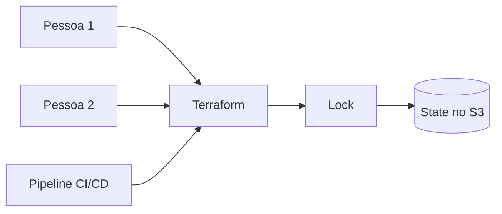

Até aqui, o Terraform vinha armazenando o state na mesma máquina em que os comandos eram executados. Isso funciona para estudar e testar, mas se torna um problema quando mais de uma pessoa precisa trabalhar no projeto. O state precisa estar num local centralizado, acessível ao time e protegido contra alterações simultâneas.

É aí que entra o **backend remoto**.

# O que é um backend no Terraform

O backend é a configuração que determina onde o Terraform armazena o state e como realiza operações relacionadas a ele.

Sem uma configuração específica, o Terraform usa o backend local. Nesse caso, o arquivo `terraform.tfstate` fica no diretório do projeto, na máquina de quem executou o comando. Para estudo isso é simples; para ambientes compartilhados, deixa o estado preso a uma única máquina e facilita divergências entre membros do time.

Com um backend remoto, o arquivo passa a ficar num serviço centralizado. Neste exemplo, o serviço escolhido é um bucket do Amazon S3.



# Configurando o backend S3

A configuração do backend fica dentro do bloco `terraform`:

```hcl
terraform {
  backend "s3" {
    bucket       = "meu-bucket-de-state"
    key          = "aula/backend/terraform.tfstate"
    region       = "us-east-2"
    encrypt      = true
    use_lockfile = true
  }
}
```

Cada argumento tem uma responsabilidade:

* `bucket` é o nome do bucket em que o state será armazenado
* `key` é o caminho do objeto dentro do bucket
* `region` é a região em que o bucket existe
* `encrypt` solicita criptografia do objeto no S3
* `use_lockfile` habilita o locking nativo no S3

O nome do bucket precisa ser globalmente único em toda a AWS. Já a `key` não é uma credencial: ela funciona como o caminho do arquivo e permite guardar states diferentes no mesmo bucket.

```hcl
key = "dev/terraform.tfstate"
key = "staging/terraform.tfstate"
key = "production/terraform.tfstate"
```

Separar as chaves dessa forma impede que ambientes diferentes escrevam no mesmo state. Isso não elimina a necessidade de planejar permissões e isolamento, mas já evita misturar, por acidente, os recursos de desenvolvimento e produção.

# O bucket não nasce junto com o backend

Existe um detalhe importante: o bucket informado no bloco do backend precisa existir antes da inicialização dessa configuração. O Terraform precisa acessar o backend para começar a trabalhar, então ele não pode depender de um recurso do mesmo state que ainda está tentando abrir.

Uma abordagem comum é manter a infraestrutura do backend em uma configuração separada, executar esse bootstrap uma vez e só depois apontar os demais projetos para o bucket criado.

Também vale habilitar o versionamento do bucket. Se um state for sobrescrito ou removido por engano, as versões anteriores ajudam na recuperação.

# Migrando o state local

Depois de adicionar ou alterar a configuração do backend, é necessário inicializar novamente o diretório:

```bash
terraform init -migrate-state
```

O Terraform detecta que o backend mudou e solicita confirmação para copiar o state existente para o novo local. Depois da migração, vale conferir o objeto no S3 e executar:

```bash
terraform plan
```

Um plano sem alterações inesperadas é uma verificação importante de que o novo backend está apontando para o state correto.

> Ao migrar, faça backup do state local, interrompa outros `plan` e `apply` e confirme cuidadosamente bucket, região e key antes de responder à confirmação.

# Locking e permissões

O locking evita que duas execuções alterem o mesmo state ao mesmo tempo. No backend S3 atual, ele pode ser habilitado com `use_lockfile = true`. O Terraform passa a usar um objeto com o sufixo `.tflock` durante a operação.

Além de acesso ao objeto do state, a identidade usada pelo Terraform precisa de permissões para ler, criar e apagar o lock. Em ambientes profissionais, essas permissões devem seguir o princípio do menor privilégio: acesso apenas ao bucket e aos caminhos necessários.

Configurações antigas costumam usar uma tabela do DynamoDB para locking. Esse mecanismo ainda pode aparecer em projetos existentes, mas está descontinuado pela HashiCorp. Para configurações novas, o lock nativo do S3 é a opção indicada na documentação atual.

# Cuidados com arquivos e credenciais

O state pode conter dados sensíveis. Por isso, ele não deve ser commitado no Git, mesmo quando o backend remoto já está configurado. Também devem ficar fora do repositório a pasta `.terraform`, arquivos de plano salvos e arquivos de variáveis que contenham segredos.

As credenciais da AWS também não devem ser escritas diretamente no bloco `backend`. É melhor usar variáveis de ambiente, perfis da AWS ou a identidade fornecida ao runner da pipeline.

# Conclusão

O backend remoto resolve uma parte essencial do trabalho em equipe com Terraform: todos passam a consultar o mesmo state, em vez de manter cópias diferentes em cada máquina. No S3, `bucket`, `key` e `region` dizem onde o arquivo vive; o versionamento ajuda na recuperação; e `use_lockfile` protege contra operações concorrentes.

O ponto mais importante é tratar essa migração como uma mudança de infraestrutura: com backup, acesso restrito e uma execução por vez.

## Referências

* [HashiCorp Developer, backend S3](https://developer.hashicorp.com/terraform/language/backend/s3): configuração, permissões e locking nativo do backend S3.
* [HashiCorp Developer, configuração de backends](https://developer.hashicorp.com/terraform/language/backend): explica o papel do backend e sua inicialização.
* [HashiCorp Developer, comando `terraform init`](https://developer.hashicorp.com/terraform/cli/commands/init): documenta a migração e a reconfiguração do backend.
* [HashiCorp Developer, estilo de configuração](https://developer.hashicorp.com/terraform/language/style): recomendações sobre arquivos que devem ou não ser versionados.
* [LINUXtips, Treinamento IaC e Pipeline Specialist](https://linuxtips.io/iac-pipeline-specialist/): treinamento de IaC com Terraform utilizado como base dos meus estudos e destas anotações.
