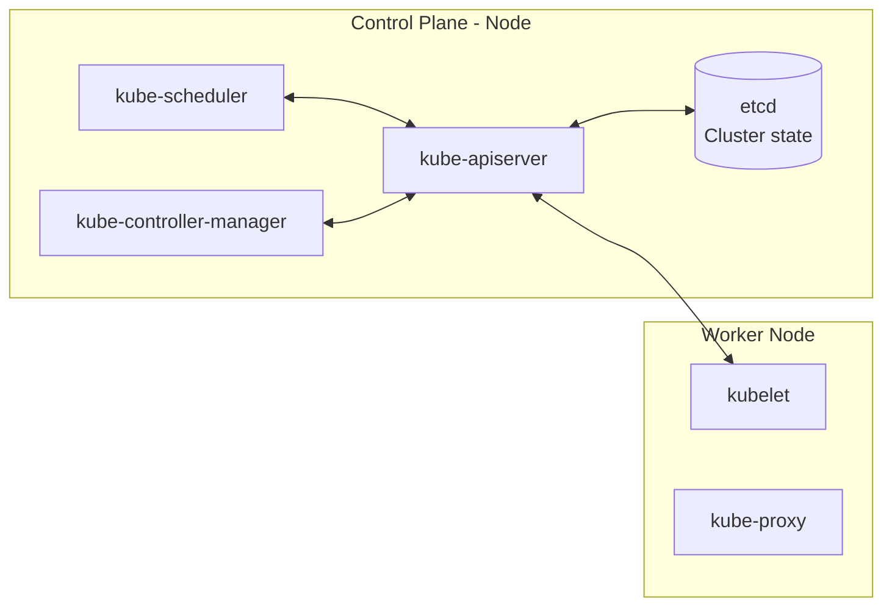

In `Kubernetes`, the cluster is basically divided into two parts:

### **Control Plane** = Cluster Brain
### **Workers** = Machines that do the heavy lifting.

# **Control Plane**
The Control Plane decides what happens in the clusters. It doesn't usually run the application directly, but it manages the entire environment.

### 
 **Basic Kubernetes Architecture**

## **etcd** -> It stores all information. The entire real state of the `cluster`. It only communicates with the `kube API SERVER`.

## **kube API SERVER** -> Only it has the default permission to communicate with `etcd`. Its function is to retrieve the status of the `cluster` as a whole. It communicates with everyone. All `cluster` communication happens through the `kube API SERVER`.

## **kube-scheduler** -> It is responsible for managing where each container will run; it is the controller responsible for where new containers go, and it knows the capacity of the nodes.

## **kube-controller-manager** -> It is the manager of all controllers; it ensures the state of the `cluster`. It is the `cluster` controller.

# **Workers**

## **kubelet** -> It is the `Kubernetes` agent within the `node`, and any `Kubernetes node` will have a `kubelet`. It checks if everything is okay and communicates with the `kube APISERVER`, receiving the `Pod` specifications for that `node` and reporting the status back.

## **kube-proxy** -> Every `node` will have a `kube-proxy`. It handles the communication of `Pods` with the rest of the world; it observes `cluster` resources and configures network rules on the `node`.

# **Ports Used by Kubernetes Components**

## Ports Used by Kubernetes Components

| Component | Default Port | Protocol |
|---:|---:|---:|
| kube-apiserver | 6443 | TCP |
| etcd | 2379–2380 | TCP |
| kube-scheduler | 10259 | TCP |
| kube-controller-manager | 10257 | TCP |
| kubelet | 10250 | TCP |
| kube-proxy | 10256 | TCP |

## Application Exposure Ports

| Resource | Default Port | Protocol |
|---:|---:|---:|
| `NodePort` type Service | 30000–32767 | TCP or UDP |
