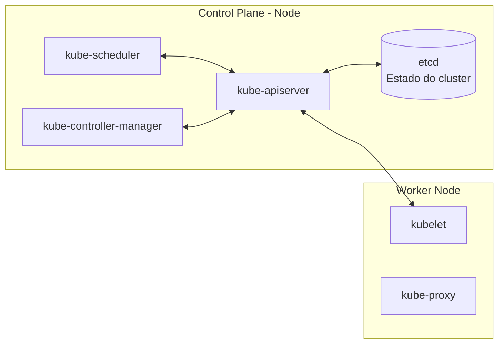

In `Kubernetes`, the cluster is basically divided into two parts:

### **Control Plane** = Brain of the cluster
### **Workers** = Machines that do the heavy lifting.

 

# **Control Plane**
The Control Plane decides what happens in the clusters. It doesn't usually run the application directly, but it manages the entire environment.

### 
 **Basic Kubernetes Architecture**

## **etcd**
It stores all information. The entire actual state of the `cluster`. It only communicates with the `kube API SERVER`.

## **kube API SERVER**
Only it has default permission to communicate with etcd. Its function is to get the status of the `cluster` as a whole. It's the one that will communicate with everyone. All `cluster` communication happens through the `kube API SERVER`.

## **kube scheduler**
It is responsible for managing where each of the containers will run; it is the controller responsible for placing new containers and knowing the capacity of the nodes.

## **kube controller manager**
It's the manager of all controllers; it ensures the state of the `cluster`. It is the `cluster`'s controller.
  
 

# **Workers**

## **kubelet**
It is the Kubernetes agent within the node, and any `Kubernetes` node will have a `kubelet`. It's the one that checks if everything is okay and communicates with the `kube APISERVER`, receiving the Pod specifications for that node and reporting the state back.

## **kube proxy**
Every node will have a `kube proxy`. It facilitates communication between `pods` and the rest of the world, observes cluster resources, and configures network rules on the node.

 

# **Ports Used by Kubernetes Components**

## Ports Used by Kubernetes Components

| Component | Default Port | Protocol |
|---|---:|---|
| kube-apiserver | 6443 | TCP |
| etcd | 2379–2380 | TCP |
| kube-scheduler | 10259 | TCP |
| kube-controller-manager | 10257 | TCP |
| kubelet | 10250 | TCP |
| kube-proxy | 10256 | TCP |

## Application Exposure Ports

| Resource | Default Port | Protocol |
|---|---:|---|
| Service do tipo NodePort | 30000–32767 | TCP ou UDP |

 

## References

- [Kubernetes — Kubernetes Components](https://kubernetes.io/pt-br/docs/concepts/overview/components/) — documents the components of the control plane and nodes.
- [Kubernetes — Ports and Protocols](https://kubernetes.io/docs/reference/networking/ports-and-protocols/) — lists the default ports used by the cluster.
- [LINUXtips — Kubernetes Essentials](https://linuxtips.io/treinamento/kubernetes-essentials/) — course used as the basis for my studies and these notes.
