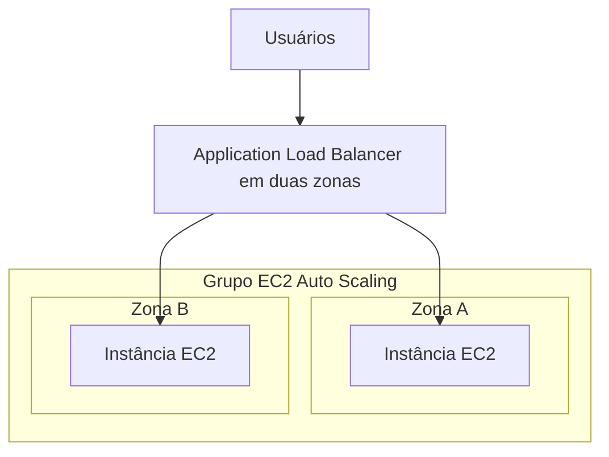

Your application received more traffic. You can increase the server's capacity or add more servers to work. If you choose the second option, someone needs to distribute requests among them.

This is where Amazon Elastic Compute Cloud (EC2) Auto Scaling and Elastic Load Balancing (ELB), from Amazon Web Services (AWS), come in. They complement each other, but perform different jobs.

## Vertical and Horizontal Scaling

In **vertical scaling**, you change a machine's resources: more or less processing and memory. In EC2, changing the type of an existing instance usually involves stopping and starting it again, in addition to checking compatibility. It's incorrect to assume a seamless change. [Changing the instance type](https://docs.aws.amazon.com/AWSEC2/latest/UserGuide/ec2-instance-resize.html).

In **horizontal scaling**, you change the number of machines. Going from two to four instances is scaling out horizontally; returning to two is scaling in horizontally.

Scalability is the ability to accommodate growth. Elasticity involves adjusting resources as demand increases or decreases. For this to happen automatically, policies and limits must be configured.

## Auto Scaling manages quantity

An EC2 Auto Scaling group defines minimum, desired, and maximum capacity. Policies can modify the desired capacity within these limits. The service can also replace instances considered unhealthy.

For example, a group with a minimum of two instances and a maximum of six does not grow without limit. And configuring only the maximum does not, by itself, create a scaling policy. [How EC2 Auto Scaling works](https://docs.aws.amazon.com/autoscaling/ec2/userguide/what-is-amazon-ec2-auto-scaling.html).

## The load balancer distributes traffic

A load balancer receives connections and forwards traffic to configured targets. It does not install the application or increase the number of instances in the group by itself.

| Component | Responsibility |
| --- | --- |
| EC2 Instance | Run the application |
| EC2 Auto Scaling | Maintain or adjust the number of instances |
| Load balancer | Distribute traffic among targets |

ELB offers different types. The Application Load Balancer (ALB) serves applications that use Hypertext Transfer Protocol (HTTP) and its secure version, HTTPS (*Hypertext Transfer Protocol Secure*). The Network Load Balancer (NLB) serves transport needs like Transmission Control Protocol (TCP) and User Datagram Protocol (UDP). The Gateway Load Balancer (GWLB) allows inserting and scaling network appliances, such as firewalls. [ELB overview](https://docs.aws.amazon.com/elasticloadbalancing/latest/userguide/what-is-load-balancing.html).

## Architecture: application in two zones

Imagine a hypothetical web application in two availability zones, or AZs (*Availability Zones*). The diagram shows the logical flow of the application layer; it does not detail subnets, routes, or persistence.

When demand grows, a policy can add instances. Once ready and registered, they start serving traffic according to their integration with the load balancer.

This works best when any instance can handle a request. If a user's login only exists in the memory of one machine, forwarding them to another could break their session. The application needs to plan where it maintains state and shared data.

## Health checks have meaning and limits

A *health check* verifies defined criteria to consider a target healthy. A process accepting connections does not prove that all application functions are working; the test needs to represent a useful condition.

Normally, the ALB forwards traffic to healthy targets. However, if all targets in a group are unhealthy, there's a *fail-open* behavior that allows forwarding to all. Therefore, 'a problematic target never receives traffic' is an incorrect simplification. [ALB health checks](https://docs.aws.amazon.com/elasticloadbalancing/latest/application/target-group-health-checks.html).

Furthermore, for Auto Scaling to consider the load balancer's health results when replacing instances, this integration must be enabled. [Auto Scaling group health](https://docs.aws.amazon.com/autoscaling/ec2/userguide/health-checks-overview.html).

## When to use and when to rethink

This combination serves applications that can distribute work among instances and need to adjust capacity. It also helps reduce dependence on a single server.

It does not automatically solve a slow database, an application that requires exclusive local state, or an unavailable external dependency. Before adding machines, identify the bottleneck and check if the application supports distribution.

## Author's question for CLF-C02

An application already uses a load balancer, but needs to automatically increase and decrease the number of instances according to demand. Which component should be configured for this function?

- **A.** Amazon Route 53.
- **B.** Amazon EC2 Auto Scaling.
- **C.** A second domain name.
- **D.** Only a new forwarding rule on the load balancer.

**Answer: B.** Auto Scaling manages the group's capacity according to its configuration.

A provides name resolution and routing, not this instance management. C does not change capacity. D changes forwarding, but does not create a scaling in and out policy.

## Summary

Vertical scaling changes a machine's resources. Horizontal scaling changes its quantity. Auto Scaling manages capacity; the load balancer distributes traffic. For certification and real-world architecture, associate each component with its function and remember that the application also needs to support distribution.

## Official documentation

- [EC2 Auto Scaling](https://docs.aws.amazon.com/autoscaling/ec2/userguide/what-is-amazon-ec2-auto-scaling.html)
- [Elastic Load Balancing](https://docs.aws.amazon.com/elasticloadbalancing/latest/userguide/what-is-load-balancing.html)
- [ALB health checks](https://docs.aws.amazon.com/elasticloadbalancing/latest/application/target-group-health-checks.html)
- [Health check integration](https://docs.aws.amazon.com/autoscaling/ec2/userguide/health-checks-overview.html)
