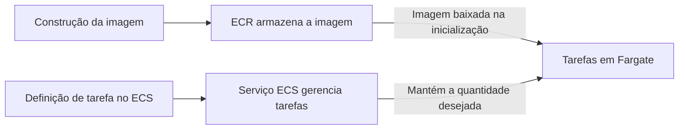

You've packaged an application into a container image. Now you need to store that image, decide how to run its copies, and provide computational capacity.

These are three different problems. Understanding this distinction avoids much of the confusion surrounding Amazon Web Services (AWS) container services.

## An image is not a running container

The image gathers the content needed to start the application, such as files and dependencies. A container is an execution created from that image.

Uploading an image to a registry does not put the application live. You still need to configure execution, networking, permissions, and, when necessary, persistent storage.

## ECR stores images

Amazon Elastic Container Registry (ECR) is an image registry. It allows storing and making images available to those with permission to upload or download them.

A delivery pipeline can build the image, upload it to ECR, and update the application to use that version. The registry participates in the artifact's distribution; it is not the component responsible for keeping its replicas running. [ECR Documentation](https://docs.aws.amazon.com/AmazonECR/latest/userguide/what-is-ecr.html).

## ECS and EKS organize execution

Amazon Elastic Container Service (ECS) is AWS's container orchestration service. You describe tasks and can use a service to maintain the desired number of running tasks.

Amazon Elastic Kubernetes Service (EKS) offers managed Kubernetes. It is relevant when the project requires this ecosystem, its features, and its interfaces. Managing the control plane does not mean that all application configuration choices, updates, and security concerns disappear. [ECS](https://docs.aws.amazon.com/AmazonECS/latest/developerguide/Welcome.html), [EKS](https://docs.aws.amazon.com/eks/latest/userguide/what-is-eks.html).

Choosing EKS just because "Kubernetes is more complete" does not define a requirement. Consider team knowledge, necessary integrations, and the operational effort the project accepts.

## Fargate provides compute capacity

AWS Fargate allows you to run containers without administering the underlying instances. It works with ECS and compatible workloads on EKS.

**Fargate is not another orchestrator.** The choice of orchestration and the choice of capacity are related but separate. In the model with Amazon Elastic Compute Cloud (EC2) instances administered by the team, that team also takes care of the hosts. With Fargate, this layer is managed by AWS.

This does not turn the container into a Lambda function nor does it eliminate memory, processing, networking, or permissions configurations. [Fargate with ECS](https://docs.aws.amazon.com/AmazonECS/latest/developerguide/AWS_Fargate.html).

| Service | Primary responsibility | Corresponding question |
| --- | --- | --- |
| ECR | Image registry | Where do I store the image? |
| ECS | Orchestration | How do I organize tasks and services with the AWS solution? |
| EKS | Managed Kubernetes | Do I need to run Kubernetes workloads? |
| Fargate | Capacity without host administration | Who manages the container servers? |
| EC2 | Compute instances | Do I need to control the hosts? |

## Example: web application with ECS and Fargate

Consider a team that already has the application in a container and does not have a Kubernetes requirement. They can store the image in ECR, define a task in ECS, and run the service with Fargate.

The diagram represents artifacts and management, not the path of user traffic. To receive requests, the application still needs an ingress configuration compatible with the project.

If a container is replaced, important data should not depend on temporary files from that execution. The storage service needs to be chosen and configured separately.

## When to evaluate another combination

EKS makes sense when Kubernetes is a real requirement. EC2 deserves evaluation when there are specific host, hardware, or configuration needs incompatible with the chosen managed environment.

Fargate reduces server administration, but you need to check the supported features. Not every workload that runs on a freely configured host can be moved without adaptation.

For a simple application, it's also worth considering whether containers are necessary at that moment. The choice should reduce project work, not add a platform just to use all the acronyms.

## Author's question for CLF-C02

A team wants to use AWS's native orchestrator and run containers without managing the underlying instances. Which combination matches this requirement?

-   **A.** ECR alone.
-   **B.** ECS with Fargate.
-   **C.** EKS mandatory with manually administered hosts.
-   **D.** Storage volumes only.

**Answer: B.** ECS organizes execution, and Fargate provides capacity without the team administering the hosts.

A stores images but does not keep the application running. C adds Kubernetes and host administration, not meeting the described choice. D does not provide orchestration or execution.

## Summary

ECR stores images. ECS and EKS orchestrate. Fargate provides managed compute capacity for compatible workloads. EC2 offers control over instances. In certification and in practice, first identify which of these responsibilities the scenario is asking for.

## Official documentation

-   [Amazon ECR](https://docs.aws.amazon.com/AmazonECR/latest/userguide/what-is-ecr.html)
-   [Amazon ECS and capacity options](https://docs.aws.amazon.com/AmazonECS/latest/developerguide/Welcome.html)
-   [Amazon EKS](https://docs.aws.amazon.com/eks/latest/userguide/what-is-eks.html)
-   [AWS Fargate with ECS](https://docs.aws.amazon.com/AmazonECS/latest/developerguide/AWS_Fargate.html)
