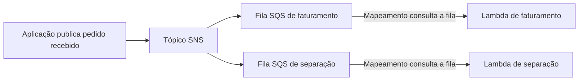

A website might receive requests faster than it can process them. If each request has to wait for all components, the slowness of one service spreads to others.

On Amazon Web Services (AWS), queues, notifications, and functions help separate these stages. But storing a message, distributing it, and executing the work are different functions.

## Decoupling is Reducing Direct Dependency

In a synchronous call, the component that made the request typically waits for the response. In an asynchronous flow, it can register the work and let another component execute it later.

This separation is called **decoupling**. It doesn't eliminate all dependencies: components still need to agree on the format and meaning of messages. What changes is the need for them to be available and respond at the same time.

## Amazon SQS: Work Waiting in a Queue

Amazon Simple Queue Service (SQS) stores messages for consumption. A producer sends the message; a consumer receives it, executes the work, and confirms its completion by deleting the message.

The message remains temporarily invisible to other consumers during the visibility period. If processing doesn't complete correctly, it can be received again. Queues have limited retention: they are not a permanent archive of requests.

Standard queues can deliver a message more than once and do not guarantee strict ordering. FIFO queues, or *First In, First Out*, offer ordering and deduplication features. Still, it's necessary to design the processing correctly. [SQS Guide](https://docs.aws.amazon.com/AWSSimpleQueueService/latest/SQSDeveloperGuide/welcome.html).

## Amazon SNS: One Publication, Multiple Destinations

Amazon Simple Notification Service (SNS) works with publish and subscribe. The producer publishes to a topic, and subscriptions define the destinations that receive the notification.

This is useful when the same event is relevant to different components. An order confirmation can be relevant for billing and goods picking. Each stage should receive its own notification. [SNS Guide](https://docs.aws.amazon.com/sns/latest/dg/welcome.html).

A shared queue among competing consumers does not replace this pattern: it distributes work among consumers; it does not deliver an independent copy to each business system.

## AWS Lambda: Executing the Processing

Lambda executes code without you provisioning the servers used by the function. AWS manages this infrastructure, while you configure the code, permissions, resources, and error handling.

A function execution has a maximum duration of 15 minutes. Automatic scaling also has limits and configurations; it doesn't mean infinite capacity. [Lambda Limits](https://docs.aws.amazon.com/lambda/latest/dg/gettingstarted-limits.html).

In SQS integration, a Lambda event source mapping polls the queue and invokes the function with batches of messages. It's not the producer directly calling your function in this path. [Lambda with SQS](https://docs.aws.amazon.com/lambda/latest/dg/with-sqs.html).

| Service | Main Role | Doesn't Replace |
| --- | --- | --- |
| SQS | Store work for asynchronous consumption | Code that processes the message |
| SNS | Distribute a publication to subscribers | Independent queue for each stage, when needed |
| Lambda | Execute code | Durable storage of business state |

## Scenario: Order Received

In this hypothetical example, two stages need to be informed about the same order. Each has its own queue, which allows for independent speeds and retries.

The diagram shows communication between stages, not a complete purchase transaction. The confirmation to the user needs to reflect whether the order was merely received or if its processing has already finished.

## Failures Need to Be Part of the Design

**Idempotency** means that repeating the same operation request does not produce undue extra effects. If a billing message is processed again, the application should not generate a duplicate charge.

It's also necessary to handle failures per message. In the integration between Lambda and SQS, partial batch response can prevent re-processing messages that have already been successfully processed, when configured and implemented correctly.

A queue for unprocessed messages, or DLQ (*Dead-Letter Queue*), allows separating messages that have exceeded the expected retries. It helps with investigation, but it doesn't correct the content or execute the work by itself.

## When to Use and When Not to Use

Queues help absorb spikes and separate stages that can happen later. SNS handles notification distribution. Lambda handles tasks that fit its execution model.

If the user needs the calculated response immediately, a queue doesn't remove that requirement. If an indivisible task exceeds the function's limit, consider another computing environment. And none of these choices obviates error monitoring and accumulated messages.

## Authorial Question for CLF-C02

A company needs to send the same event to two systems. Each system must process it at its own pace, maintaining an independent queue. Which combination best suits this?

- **A.** A single SQS queue consumed by the two competing systems.
- **B.** Only a Lambda function, without a distribution mechanism.
- **C.** An SNS topic with an SQS subscription for each system.
- **D.** A domain record for each message.

**Answer: C.** The topic distributes the publication, and each queue maintains the work for its consumer.

A distributes work among competing consumers, without creating the requested independent copy. B does not implement this design by itself. D has no relation to messaging.

## Summary

SQS holds work in waiting, SNS distributes publications, and Lambda executes code. For certification, differentiate these responsibilities. In application, complete the design with retention, retries, idempotency, and failure handling.

## Official Documentation

- [Amazon SQS](https://docs.aws.amazon.com/AWSSimpleQueueService/latest/SQSDeveloperGuide/welcome.html)
- [Amazon SNS](https://docs.aws.amazon.com/sns/latest/dg/welcome.html)
- [Lambda with SQS](https://docs.aws.amazon.com/lambda/latest/dg/with-sqs.html)
- [Lambda Limits](https://docs.aws.amazon.com/lambda/latest/dg/gettingstarted-limits.html)
