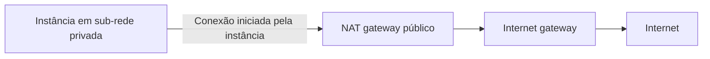

An instance is running but cannot receive connections. The problem might be in the route, the address, a security rule, or the service itself that should be responding.

To understand this path in Amazon Web Services (AWS), start by separating network organization, routing, and traffic filtering.

## VPC and subnets

Amazon Virtual Private Cloud (VPC) is the logically isolated virtual network where you organize resources. It belongs to a region and can contain subnets in different availability zones.

A subnet is a division of the VPC's address space and resides in a single zone. Amazon Elastic Compute Cloud (EC2) instances use network interfaces in these subnets.

A **public subnet** has a direct route to an internet gateway. A private one does not have this direct route. This describes the network path; it doesn't mean that all resources in the public subnet are automatically exposed.

## The path to the internet

An Internet Gateway (IGW) connects the VPC to the internet. For an instance using Internet Protocol version 4 (IPv4), direct access requires an appropriate public address, a route to the gateway, and rules that allow traffic. The service also needs to be listening on the correct port. [Internet gateway](https://docs.aws.amazon.com/vpc/latest/userguide/VPC_Internet_Gateway.html).

For a private instance to initiate IPv4 connections with the internet, a common option is a public Network Address Translation (NAT) gateway. It resides in a public subnet, while the private subnet's route points to it.

The gateway allows these connections to egress and return, without providing a path for the internet to initiate connections directly with the private instance. There are also private NAT gateways, with a different purpose. [NAT gateways](https://docs.aws.amazon.com/vpc/latest/userguide/vpc-nat-gateway.html).

This is a simplified IPv4 egress flow. It does not represent all options for IPv6 or private access to services.

## Security group and network ACL

A security group controls traffic associated with resource interfaces. A network access control list, or NACL (*Network Access Control List*), acts at the subnet boundary.

| Characteristic | Security group | NACL |
| --- | --- | --- |
| Association | Resource interfaces | Subnet |
| Rules | Allow | Allow and deny |
| Connection state | Stateful: tracks response traffic | Stateless: evaluates inbound and outbound separately |
| Order | Combined allow rules | Numbered rules evaluated in order |

In a security group, the response to allowed traffic is authorized by state tracking. In a NACL, the return path must also be allowed. The ephemeral ports used in this return depend on the systems involved; they are not a single range that serves all scenarios without analysis. [Security groups](https://docs.aws.amazon.com/vpc/latest/userguide/vpc-security-groups.html), [NACLs](https://docs.aws.amazon.com/vpc/latest/userguide/vpc-network-acls.html).

## The default group detail

A new, user-created security group starts with no inbound rules and typically allows outbound. The **VPC's default security group** is different: its initial rules allow inbound from resources associated with the group itself.

Therefore, saying "the default group denies all inbound" is incorrect. Always check the effective rules. [Default security group](https://docs.aws.amazon.com/vpc/latest/userguide/default-security-group.html).

The default NACL initially allows inbound and outbound traffic. A custom NACL starts by blocking until it receives allow rules. Each subnet is associated with one NACL, which can serve multiple subnets.

## Scenario: private application fetching updates

A hypothetical application runs on private instances. It needs to access an external repository for updates but should not receive direct connections from the internet.

An egress route via public NAT can meet this requirement. The team also checks security groups, return rules in NACLs, and resolution of names used by the repository.

If the need is to access only a compatible AWS service via a private path, an endpoint can avoid egress to the internet. It's not necessary to install NAT in every subnet out of habit.

## When to use each control

Security groups are suitable for expressing which resources can communicate with the application. NACLs offer an additional layer of control per subnet, including explicit denials.

Don't make complex NACLs the first response to every error. A forgotten return rule can block legitimate traffic. And filters don't replace routes: allowing a port doesn't create a network path.

## Author's question for CLF-C02

A team needs numbered rules at the subnet boundary, including an explicit traffic denial. Which resource offers this behavior?

- **A.** A machine image.
- **B.** A security group, because it supports explicit deny rules.
- **C.** An internet gateway, because it filters by numbered rules.
- **D.** A NACL.

**Answer: D.** A NACL evaluates numbered rules and allows both permits and denials.

A is a base for creating instances. B is incorrect because security groups use allow rules. C provides connectivity, not this filtering list.

## Summary

VPC and subnets organize the network. Routes and gateways define paths. Security groups and NACLs filter traffic in different ways. For certification, differentiate stateful from stateless; in practical investigation, check the entire path.

## Official documentation

- [Internet gateway](https://docs.aws.amazon.com/vpc/latest/userguide/VPC_Internet_Gateway.html)
- [NAT gateways](https://docs.aws.amazon.com/vpc/latest/userguide/vpc-nat-gateway.html)
- [Security groups](https://docs.aws.amazon.com/vpc/latest/userguide/vpc-security-groups.html)
- [Default group](https://docs.aws.amazon.com/vpc/latest/userguide/default-security-group.html)
- [NACLs](https://docs.aws.amazon.com/vpc/latest/userguide/vpc-network-acls.html)
