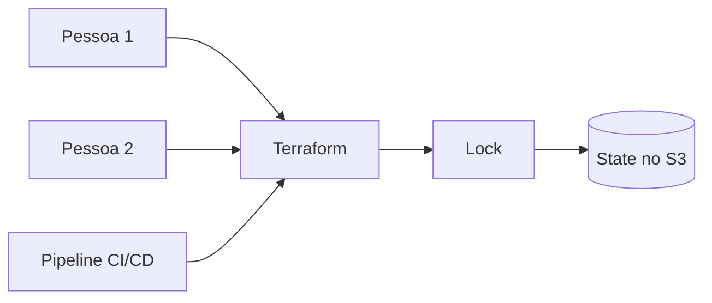

Up to now, Terraform has been storing the state on the same machine where commands were executed. This works for studying and testing but becomes a problem when more than one person needs to work on the project. The state needs to be in a centralized location, accessible to the team, and protected against simultaneous changes.

That's where the **remote backend** comes in.

# What is a backend in Terraform

The backend is the configuration that determines where Terraform stores the state and how it performs operations related to it.

Without a specific configuration, Terraform uses the local backend. In this case, the `terraform.tfstate` file is in the project directory, on the machine of whoever executed the command. For studying, this is simple; for shared environments, it leaves the state tied to a single machine and facilitates divergences among team members.

With a remote backend, the file is stored in a centralized service. In this example, the chosen service is an Amazon S3 bucket.



# Configuring the S3 backend

The backend configuration is placed within the `terraform` block:

```hcl
terraform {
  backend "s3" {
    bucket       = "meu-bucket-de-state"
    key          = "aula/backend/terraform.tfstate"
    region       = "us-east-2"
    encrypt      = true
    use_lockfile = true
  }
}
```

Each argument has a responsibility:

* `bucket` is the name of the bucket where the state will be stored
* `key` is the path to the object within the bucket
* `region` is the region where the bucket exists
* `encrypt` requests encryption of the object in S3
* `use_lockfile` enables native S3 locking

The bucket name must be globally unique across all of AWS. The `key`, on the other hand, is not a credential: it functions as a file path and allows different states to be stored in the same bucket.

```hcl
key = "dev/terraform.tfstate"
key = "staging/terraform.tfstate"
key = "production/terraform.tfstate"
```

Separating the keys this way prevents different environments from writing to the same state. This doesn't eliminate the need to plan permissions and isolation, but it does prevent accidentally mixing development and production resources.

# The bucket is not created with the backend

There's an important detail: the bucket specified in the backend block needs to exist before this configuration is initialized. Terraform needs to access the backend to start working, so it cannot depend on a resource from the same state it's still trying to open.

A common approach is to maintain the backend infrastructure in a separate configuration, perform this bootstrap once, and only then point other projects to the created bucket.

It's also worth enabling bucket versioning. If a state is accidentally overwritten or removed, previous versions help with recovery.

# Migrating the local state

After adding or changing the backend configuration, it's necessary to re-initialize the directory:

```bash
terraform init -migrate-state
```

Terraform detects that the backend has changed and prompts for confirmation to copy the existing state to the new location. After migration, it's worth checking the object in S3 and running:

```bash
terraform plan
```

A plan without unexpected changes is an important verification that the new backend is pointing to the correct state.

> When migrating, back up the local state, stop other `plan` and `apply` operations, and carefully confirm the bucket, region, and key before responding to the confirmation prompt.

# Locking and permissions

Locking prevents two executions from altering the same state simultaneously. In the current S3 backend, it can be enabled with `use_lockfile = true`. Terraform will then use an object with the `.tflock` suffix during the operation.

In addition to access to the state object, the identity used by Terraform needs permissions to read, create, and delete the lock. In professional environments, these permissions should follow the principle of least privilege: access only to the necessary bucket and paths.

Older configurations often use a DynamoDB table for locking. This mechanism may still appear in existing projects but has been deprecated by HashiCorp. For new configurations, native S3 locking is the recommended option in the current documentation.

# File and credential precautions

The state can contain sensitive data. Therefore, it should not be committed to Git, even when the remote backend is already configured. The `.terraform` folder, saved plan files, and variable files containing secrets should also be kept out of the repository.

AWS credentials should also not be written directly into the `backend` block. It's better to use environment variables, AWS profiles, or the identity provided to the pipeline runner.

# Conclusion

The remote backend solves an essential part of teamwork with Terraform: everyone consults the same state, instead of maintaining different copies on each machine. In S3, `bucket`, `key`, and `region` indicate where the file resides; versioning helps with recovery; and `use_lockfile` protects against concurrent operations.

The most important point is to treat this migration as an infrastructure change: with backup, restricted access, and one execution at a time.

## References

* [HashiCorp Developer, backend S3](https://developer.hashicorp.com/terraform/language/backend/s3): configuration, permissions, and native S3 locking for the S3 backend.
* [HashiCorp Developer, backend configuration](https://developer.hashicorp.com/terraform/language/backend): explains the role of the backend and its initialization.
* [HashiCorp Developer, `terraform init` command](https://developer.hashicorp.com/terraform/cli/commands/init): documents backend migration and reconfiguration.
* [HashiCorp Developer, configuration style](https://developer.hashicorp.com/terraform/language/style): recommendations on files that should or should not be versioned.
* [LINUXtips, IaC and Pipeline Specialist Training](https://linuxtips.io/iac-pipeline-specialist/): IaC training with Terraform used as the basis for my studies and these notes.
