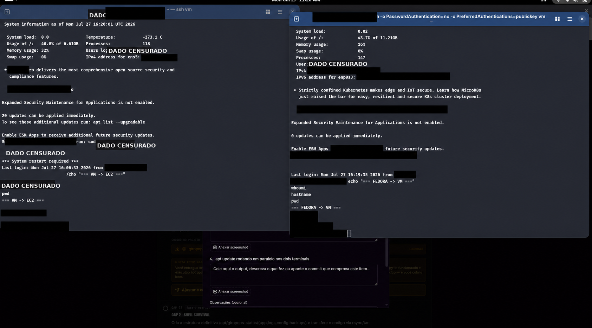
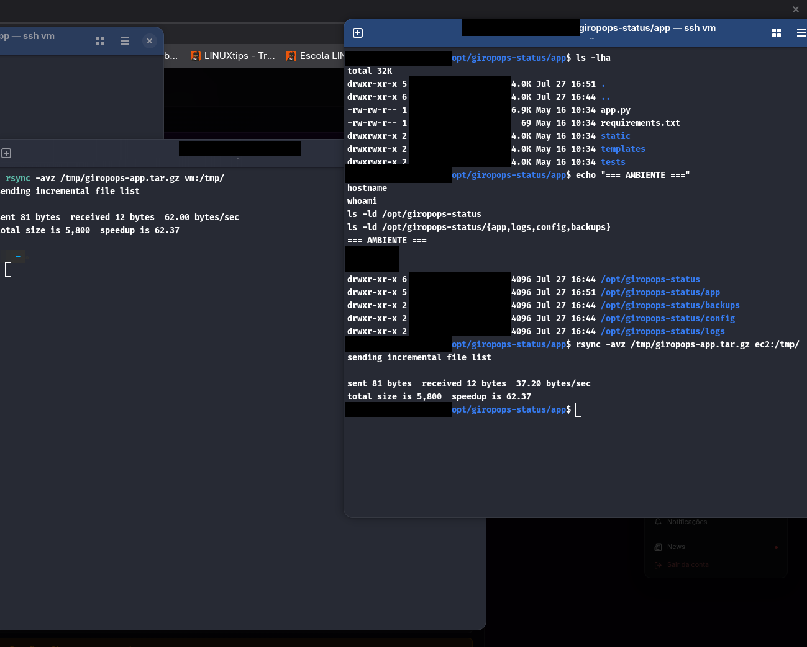
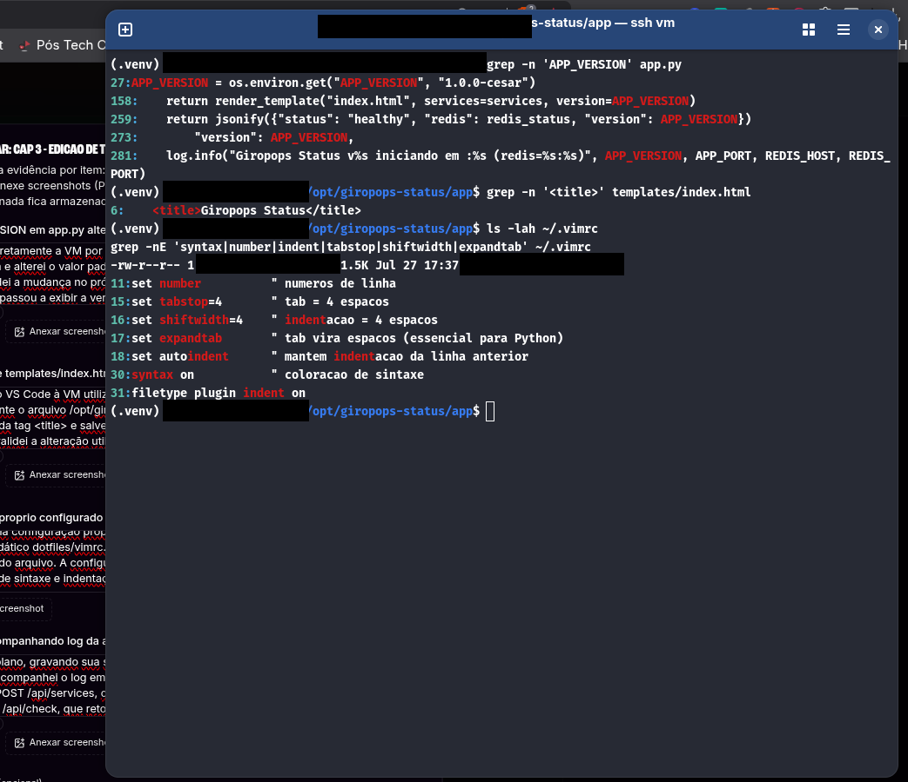
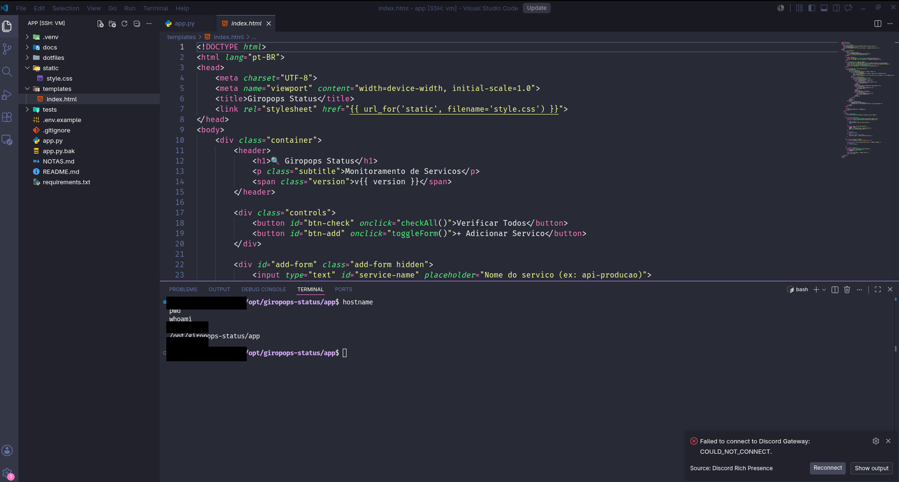

# From VM to EC2: Three Practical Linux Challenges for Cloud Native

Truly studying Linux goes far beyond memorizing commands. The most important part is understanding **where each command fits into a real workflow**.

In the first three challenges of the Linux for Cloud Native training, I set up a small hybrid environment with a local VM and an EC2 instance, organized the application following an FHS-inspired structure, transferred files with `rsync`, edited code directly on the server, and monitored logs in real time.

In this post, I document the main steps, the errors that came up, and what I learned at each stage.

> **Security Note:** IP addresses and other infrastructure information have been redacted in the images before publication. Private keys, tokens, and passwords should never appear in screenshots or repositories.


## Challenge 1 — Hybrid Setup with VM, EC2, and SSH

The first goal was to prepare two Linux environments:

- a local Ubuntu VM;
- an Ubuntu instance on AWS EC2;
- SSH access to both environments;
- aliases in the `~/.ssh/config` file;
- key-based authentication;
- package updates on both servers.

The idea was to avoid huge commands like:

```bash
ssh -i ~/.ssh/minha-chave.pem usuario@endereco-do-servidor
```

With aliases configured, access became simpler:

```bash
ssh vm
ssh ec2
```

An example of a secure configuration would be:

```text
Host vm
    HostName VM_ADDRESS
    User vm-user
    IdentityFile ~/.ssh/id_ed25519

Host ec2
    HostName EC2_ADDRESS
    User ubuntu
    IdentityFile ~/.ssh/ec2-key.pem
```

The real `HostName` values should not be published.

### Validating the Environments

After connecting, I used simple commands to confirm which machine I was on:

```bash
whoami
hostname
pwd
```

I also ran package updates in both terminals:

```bash
sudo apt update
```



### What I Learned

The `~/.ssh/config` file is not just a convenience. It centralizes connection parameters and reduces errors when accessing different machines.

It also became clearer that:

- the local VM and EC2 are independent environments;
- each machine has its own users, processes, and filesystem;
- a private key should only remain on the authorized computer;
- the key file must have restricted permissions, usually `chmod 600`;
- host names, public IPs, tokens, and key content should not appear in posts or screenshots.


## Challenge 2 — Shell, FHS, Directories, and Transfer with rsync

In the second challenge, I prepared a structure for the `giropops-status` application in `/opt`.

The created structure was:

```text
/opt/giropops-status/
├── app/
├── backups/
├── config/
└── logs/
```

The command used was:

```bash
sudo mkdir -p /opt/giropops-status/{app,backups,config,logs}
```

The `-p` option makes `mkdir` create intermediate directories when necessary and not return an error if they already exist.

Then, I adjusted the ownership of the directories:

```bash
sudo chown -R "$USER":"$USER" /opt/giropops-status
```

### Checking with `ls -lah`

To validate the structure, I used:

```bash
ls -lah /opt/giropops-status
```

Each option has a function:

- `-l`: displays a detailed listing;
- `-a`: includes hidden files;
- `-h`: presents sizes in human-readable format, such as `4K` and `32M`.

### Transferring the Application

I used `rsync` to transfer files between environments:

```bash
rsync -av origem/ destino/
```

The main options were:

- `-a`: archive mode, preserving important attributes;
- `-v`: verbose mode, showing processed files.

In another step, I packaged the files and transferred the compressed archive:

```bash
tar -czf /tmp/giropops-app.tar.gz .
rsync -avz /tmp/giropops-app.tar.gz ec2:/tmp/
```



### The Trailing Slash Detail in rsync

An important lesson was the difference between:

```bash
rsync -av pasta/ destino/
```

and:

```bash
rsync -av pasta destino/
```

With the trailing slash, `rsync` copies **the content** of `folder`. Without the slash, it copies **the directory itself** into the destination.

It's a small character with the potential to create a directory tree worthy of a sci-fi movie.


## Challenge 3 — Vim, VS Code Remote SSH, and Real-time Logs

In the third challenge, I worked with file editing directly on the server.

The main tasks were:

- navigate through code with `less`;
- search for functions within the file;
- change `APP_VERSION` using Vim;
- install a `.vimrc`;
- edit the `<title>` via VS Code Remote SSH;
- create a Python virtual environment;
- install and start Redis;
- run the Flask application;
- monitor logs with `tail -f`.

### Navigating with less

To open the file:

```bash
less app.py
```

Inside `less`, I searched for a function by typing:

```text
/def check_service
```

The shortcuts used were:

- `n`: next occurrence;
- `N`: previous occurrence;
- `q`: quit.

I also listed the environment variables expected by the application:

```bash
grep '^[A-Z_]* = os.environ' app.py
```

### Changing the Version with Vim

I opened the file directly on the server:

```bash
vim app.py
```

In Vim, I changed the default value of `APP_VERSION`, saved, and exited with:

```vim
:wq
```

Then I validated the change:

```bash
grep -n 'APP_VERSION' app.py
```

### Configuring `.vimrc`

The exercise package included a didactic file:

```bash
cp /opt/giropops-status/app/dotfiles/vimrc.example ~/.vimrc
```

The configuration enabled features such as:

```vim
set number
set tabstop=4
set shiftwidth=4
set expandtab
set autoindent
syntax on
filetype plugin indent on
```



### Remote Editing with VS Code

On my local computer, I installed the **Remote - SSH** extension by Microsoft.

Then:

1. opened the command palette with `Ctrl+Shift+P`;
2. selected `Remote-SSH: Connect to Host`;
3. chose the `vm` alias;
4. opened `/opt/giropops-status/app`;
5. edited `templates/index.html`;
6. saved the change directly on the VM.

The integrated VS Code terminal was already connected to the server, so I validated with:

```bash
hostname
pwd
whoami
grep -n '<title>' templates/index.html
```



### Python, Redis, and Virtual Environment

I created a virtual environment to avoid installing dependencies in the system's Python:

```bash
cd /opt/giropops-status/app
python3 -m venv .venv
source .venv/bin/activate
python -m pip install -r requirements.txt
```

I confirmed the active interpreter:

```bash
which python
which pip
python --version
```

For the application's storage, I installed Redis:

```bash
sudo apt install -y redis-server
sudo systemctl enable --now redis-server
redis-cli ping
```

The expected return was:

```text
PONG
```

### Configurable Logging and tail -f

The updated version of the application accepts the variables:

```bash
LOG_FILE=/tmp/giropops-logs/app.log
LOG_LEVEL=INFO
```

I started the application in the background:

```bash
mkdir -p /tmp/giropops-logs

LOG_FILE=/tmp/giropops-logs/app.log LOG_LEVEL=INFO python3 app.py &
```

In another terminal, I monitored the file in real time:

```bash
tail -f /tmp/giropops-logs/app.log
```

To filter only check events:

```bash
tail -f /tmp/giropops-logs/app.log |
grep --line-buffered -i 'check'
```

I also tested the API routes:

```bash
curl -X POST   -H 'Content-Type: application/json'   -d '{"name":"google","url":"https://google.com"}'   http://localhost:5000/api/services

curl -X POST http://localhost:5000/api/check
```

The application returned HTTP `201` for registration and HTTP `200` for verification, marking the service as `UP`.

When I finished, I exited `tail` with `Ctrl+C` and stopped the application in the terminal where it was started:

```bash
kill %1
```


## Errors That Appeared Along the Way

Not everything worked on the first try — and that was one of the best parts of the lab.

### The vimrc.example file did not exist on the VM

The first attempt returned:

```text
cp: cannot stat '.../vimrc.example': No such file or directory
```

The file existed in the local project but had not been synced to the VM. The solution was to locate the file and copy the `dotfiles` folder again.

### The virtual environment was not created

Python reported that `ensurepip` was not available. I installed the necessary packages:

```bash
sudo apt install -y python3-venv python3-full
rm -rf .venv
python3 -m venv .venv
```

### Port 5000 was already in use

When starting a second instance of the application, Flask responded:

```text
Address already in use
Port 5000 is in use by another program.
```

I identified the process:

```bash
sudo ss -ltnp | grep ':5000'
jobs -l
```

And terminated the previous instance:

```bash
kill %1
```

### LOG_FILE did not work in the old version

The `LOG_FILE` variable did not create the file because the initial `app.py` did not yet implement `FileHandler`.

I confirmed with:

```bash
grep -nE 'LOG_FILE|LOG_LEVEL|FileHandler|basicConfig' app.py
```

After syncing the updated version, the code began to configure logging correctly.


## Conclusion

These three challenges connected several concepts that are usually studied in isolation:

- SSH and key-based authentication;
- local VM and cloud infrastructure;
- Linux filesystem and directories in `/opt`;
- file transfer with `rsync`;
- editing with Vim and VS Code Remote SSH;
- dependency isolation with `venv`;
- Redis as a system service;
- configurable logs;
- process and port diagnostics.

More than just executing commands, the exercise showed a routine close to real work: preparing servers, transferring applications, editing files remotely, validating services, and investigating errors.

It's at this point that the terminal stops being just a black screen and starts becoming an engineering tool.
