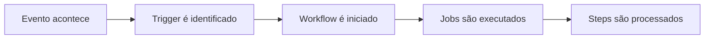
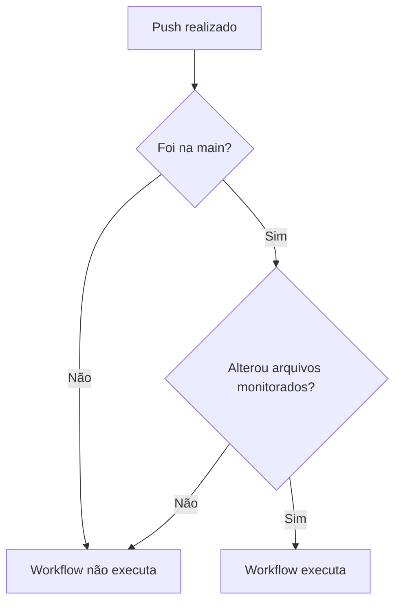
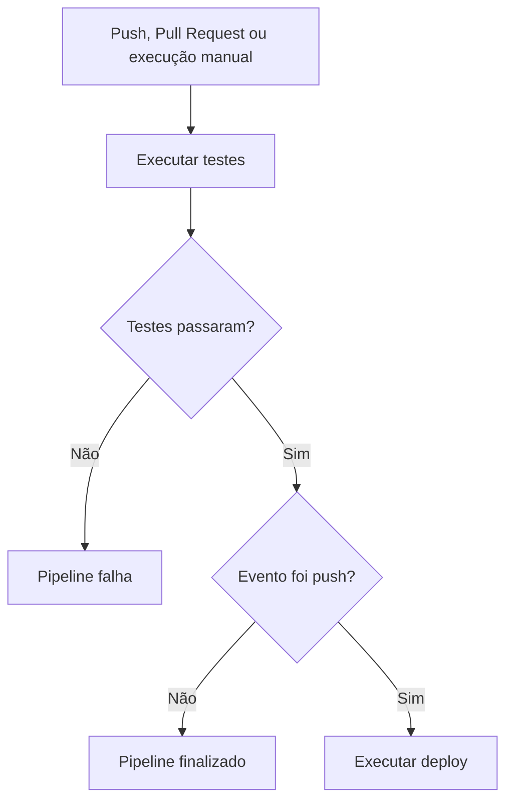

A GitHub Actions workflow needs to know when it should run.

It can start when:

- someone pushes code to the repository;
- a Pull Request is opened;
- a branch is created;
- a tag is deleted;
- a scheduled time arrives;
- someone runs the workflow manually;
- a protection rule is changed.

The events that initiate a workflow are called **triggers**.

In the YAML file, they are configured using the `on` property.

```yaml
on:
  push:
```

In this example, the workflow will be initiated when a `push` occurs.

# Workflow Structure

A GitHub Actions workflow is created inside the folder:

```text
.github/workflows/
```

For example:

```text
.github/workflows/pipeline.yml
```

A simple workflow can be written like this:

```yaml
name: Primeiro workflow

on:
  push:

jobs:
  exemplo:
    runs-on: ubuntu-latest

    steps:
      - name: Exibir mensagem
        run: echo "O workflow foi executado"
```

The `on` property defines when the workflow will run.

The `jobs` property defines which tasks will be performed.



# `push` Trigger

The `push` trigger initiates the workflow when commits or tags are pushed to the repository.

```yaml
on:
  push:
```

With this configuration, any push can initiate the workflow.

For example:

```bash
git add .
git commit -m "feat: adiciona tela de login"
git push origin main
```

After the push, GitHub looks for workflows configured with this event.

# Running only on a specific branch

We can limit the workflow to a specific branch:

```yaml
on:
  push:
    branches:
      - main
```

Now the workflow will only run when there's a push to `main`.

We can also monitor multiple branches:

```yaml
on:
  push:
    branches:
      - main
      - develop
```

# Using branch patterns

We can use patterns to monitor groups of branches:

```yaml
on:
  push:
    branches:
      - main
      - "feature/**"
```

This pattern can match branches like:

```text
feature/login
feature/cadastro
feature/pagamento/pix
```

When using characters like `*`, it's recommended to enclose the value in quotes.

# Ignoring branches

We can also define branches that should not initiate the workflow:

```yaml
on:
  push:
    branches-ignore:
      - develop
      - "feature/**"
```

In this case, pushes made to `develop` or `feature` branches will be ignored.

# Running workflows with tags

The `push` event can also monitor tags:

```yaml
on:
  push:
    tags:
      - "v*"
```

This workflow can be initiated by tags like:

```text
v1.0.0
v1.1.0
v2.0.0
```

To create and push a tag:

```bash
git tag v1.0.0
git push origin v1.0.0
```

This type of trigger is common in workflows used for:

- creating releases;
- generating artifacts;
- publishing packages;
- publishing Docker images;
- initiating deploys.

Example:

```yaml
name: Publicar versão

on:
  push:
    tags:
      - "v*"

jobs:
  release:
    runs-on: ubuntu-latest

    steps:
      - name: Baixar o código
        uses: actions/checkout@v4

      - name: Mostrar versão
        run: echo "Publicando a versão ${{ github.ref_name }}"
```

# File filters with `paths`

Not every change needs to run all pipelines.

Imagine a repository with:

```text
frontend/
backend/
infra/
docs/
.github/
```

A change only in the documentation doesn't necessarily need to run backend tests.

We can use the `paths` filter:

```yaml
on:
  push:
    branches:
      - main
    paths:
      - "backend/**"
      - ".github/workflows/**"
```

The workflow will run when:

1. the push occurs on `main`;
2. any file in `backend` or `.github/workflows` is modified.



# Ignoring files

We can also use `paths-ignore`:

```yaml
on:
  push:
    paths-ignore:
      - "docs/**"
      - "**/*.md"
```

In this case, changes made only to Markdown files or in the `docs` folder will not initiate the workflow.

# `pull_request` Trigger

The `pull_request` event initiates the workflow when any activity related to a Pull Request occurs.

```yaml
on:
  pull_request:
```

It is frequently used for:

- running tests;
- validating the build;
- checking formatting;
- running linters;
- finding vulnerabilities;
- preventing the merge of broken code.

Example:

```yaml
name: Validar Pull Request

on:
  pull_request:

jobs:
  test:
    runs-on: ubuntu-latest

    steps:
      - name: Baixar o código
        uses: actions/checkout@v4

      - name: Executar testes
        run: echo "Executando testes do Pull Request"
```

# Pull Request for a specific branch

We can run the workflow only when the target branch is `main`:

```yaml
on:
  pull_request:
    branches:
      - main
```

Consider this Pull Request:

```text
feature/login → main
```

The source is:

```text
feature/login
```

The target is:

```text
main
```

In the `pull_request` event, the `branches` filter considers the target branch.

# Pull Request activity types

We can control which activities will initiate the workflow:

```yaml
on:
  pull_request:
    types:
      - opened
      - synchronize
      - reopened
```

In this example, the workflow will be initiated when the Pull Request is:

- opened;
- updated with new commits;
- reopened.

Full example:

```yaml
name: Testes do Pull Request

on:
  pull_request:
    branches:
      - main
    types:
      - opened
      - synchronize
      - reopened

jobs:
  test:
    runs-on: ubuntu-latest

    steps:
      - name: Baixar o repositório
        uses: actions/checkout@v4

      - name: Executar testes
        run: echo "Validando o Pull Request"
```

# Filtering files in Pull Request

We can also use `paths`:

```yaml
on:
  pull_request:
    branches:
      - main
    paths:
      - "backend/**"
```

The workflow will run when:

- the Pull Request targets `main`;
- any file in the `backend` folder has been modified.

# `workflow_dispatch` Trigger

The `workflow_dispatch` trigger allows you to run the workflow manually.

```yaml
on:
  workflow_dispatch:
```

With it, the workflow can be started from the GitHub Actions tab.

This trigger is useful for:

- performing manual deploys;
- performing maintenance;
- generating reports;
- cleaning up resources;
- testing an automation;
- initiating an on-demand task.

Example:

```yaml
name: Workflow manual

on:
  workflow_dispatch:

jobs:
  executar:
    runs-on: ubuntu-latest

    steps:
      - name: Exibir mensagem
        run: echo "O workflow foi iniciado manualmente"
```

# Receiving parameters manually

The `workflow_dispatch` can also receive user-provided values.

```yaml
name: Executar imagem Docker

on:
  workflow_dispatch:
    inputs:
      imagem:
        description: Imagem Docker que será utilizada
        required: true
        default: nginx:latest

jobs:
  executar:
    runs-on: ubuntu-latest

    steps:
      - name: Mostrar imagem
        run: echo "Imagem selecionada: ${{ inputs.imagem }}"
```

When starting the workflow manually, you will be able to specify which image should be used.

# `schedule` Trigger

The `schedule` trigger runs workflows at scheduled times.

```yaml
on:
  schedule:
    - cron: "0 9 * * 1-5"
```

In this example, the workflow will run Monday through Friday at 09:00 UTC.

A cron expression has five positions:

```text
┌──────────── minute
│ ┌────────── hour
│ │ ┌──────── day of month
│ │ │ ┌────── month
│ │ │ │ ┌──── day of week
│ │ │ │ │
0 9 * * 1-5
```

The expression:

```text
0 9 * * 1-5
```

means:

```text
minute: 0
hour: 9
day of month: any
month: any
day of week: Monday to Friday
```

Example:

```yaml
name: Testes agendados

on:
  schedule:
    - cron: "0 9 * * 1-5"

jobs:
  test:
    runs-on: ubuntu-latest

    steps:
      - name: Baixar o código
        uses: actions/checkout@v4

      - name: Executar testes
        run: echo "Executando testes agendados"
```

Times configured in `schedule` use UTC.

# `create` Trigger

The `create` event initiates a workflow when a Git reference is created.

This reference can be:

- a branch;
- a tag.

```yaml
on:
  create:
```

For example, the event may occur when a new branch is pushed:

```bash
git checkout -b feature/login
git push -u origin feature/login
```

It can also occur when pushing a tag:

```bash
git tag v1.0.0
git push origin v1.0.0
```

Example:

```yaml
name: Monitorar criação de referências

on:
  create:

jobs:
  audit:
    runs-on: ubuntu-latest

    steps:
      - name: Mostrar referência
        run: |
          echo "Referência: ${{ github.ref }}"
          echo "Tipo: ${{ github.ref_type }}"
```

# `delete` Trigger

The `delete` event initiates a workflow when a branch or tag is deleted.

```yaml
on:
  delete:
```

For example:

```bash
git push origin --delete feature/login
```

This trigger can be used for:

- logging deletions;
- sending notifications;
- removing temporary environments;
- deleting resources linked to a feature;
- maintaining repository audit.

Example:

```yaml
name: Monitorar exclusão de referências

on:
  delete:

jobs:
  audit:
    runs-on: ubuntu-latest

    steps:
      - name: Registrar exclusão
        run: |
          echo "Referência excluída: ${{ github.event.ref }}"
          echo "Tipo: ${{ github.event.ref_type }}"
```

# `branch_protection_rule` Trigger

The `branch_protection_rule` event initiates a workflow when a branch protection rule is created, edited, or deleted.

```yaml
on:
  branch_protection_rule:
```

We can define the activity types:

```yaml
on:
  branch_protection_rule:
    types:
      - created
      - edited
      - deleted
```

The types represent:

```text
created
└── rule created

edited
└── rule modified

deleted
└── rule removed
```

This event can help with repository auditing.

Example:

```yaml
name: Auditoria da proteção de branches

on:
  branch_protection_rule:
    types:
      - created
      - edited
      - deleted

jobs:
  audit:
    runs-on: ubuntu-latest

    steps:
      - name: Mostrar alteração
        run: |
          echo "Uma regra de proteção foi alterada"
          echo "Ação: ${{ github.event.action }}"
```

# Combining multiple triggers

A workflow can have more than one trigger.

```yaml
name: Pipeline principal

on:
  push:
    branches:
      - main

  pull_request:
    branches:
      - main

  workflow_dispatch:

jobs:
  validar:
    runs-on: ubuntu-latest

    steps:
      - name: Baixar o código
        uses: actions/checkout@v4

      - name: Executar validação
        run: echo "Validando o projeto"
```

This workflow can be initiated:

```text
by a push to main
        or
by a Pull Request to main
        or
manually
```

# Identifying the event that initiated the workflow

We can find out which trigger initiated the workflow using:

```yaml
${{ github.event_name }}
```

Example:

```yaml
name: Identificar evento

on:
  push:
  pull_request:
  workflow_dispatch:

jobs:
  identificar:
    runs-on: ubuntu-latest

    steps:
      - name: Mostrar evento
        run: echo "Evento recebido: ${{ github.event_name }}"
```

The result could be:

```text
push
```

```text
pull_request
```

```text
workflow_dispatch
```

# Running steps based on the trigger

We can also use conditions:

```yaml
name: Pipeline por evento

on:
  push:
    branches:
      - main

  pull_request:
    branches:
      - main

  workflow_dispatch:

jobs:
  pipeline:
    runs-on: ubuntu-latest

    steps:
      - name: Baixar o código
        uses: actions/checkout@v4

      - name: Executar testes
        run: echo "Executando testes"

      - name: Executar deploy
        if: github.event_name == 'push'
        run: echo "Executando deploy"
```

In this example:

- tests are run on all events;
- deployment is executed only when the event is `push`.

# Complete pipeline example

```yaml
name: Pipeline da aplicação

on:
  push:
    branches:
      - main
    paths:
      - "src/**"
      - "package.json"
      - "package-lock.json"

  pull_request:
    branches:
      - main
    paths:
      - "src/**"
      - "package.json"
      - "package-lock.json"

  workflow_dispatch:

jobs:
  test:
    runs-on: ubuntu-latest

    steps:
      - name: Baixar o código
        uses: actions/checkout@v4

      - name: Configurar Node.js
        uses: actions/setup-node@v4
        with:
          node-version: 22

      - name: Instalar dependências
        run: npm ci

      - name: Executar testes
        run: npm test

  deploy:
    if: github.event_name == 'push'
    needs: test
    runs-on: ubuntu-latest

    steps:
      - name: Realizar deploy
        run: echo "Realizando deploy da aplicação"
```

The flow of this pipeline will be:



# Summary of main triggers

| Trigger | When executed |
|---|---|
| `push` | When commits or tags are pushed |
| `pull_request` | When an activity occurs in a Pull Request |
| `workflow_dispatch` | When the workflow is manually initiated |
| `schedule` | When a scheduled time arrives |
| `create` | When a branch or tag is created |
| `delete` | When a branch or tag is deleted |
| `branch_protection_rule` | When a branch protection rule is changed |

# Best practices

Avoid running all workflows on every change.

Instead of:

```yaml
on:
  push:
```

We can be more specific:

```yaml
on:
  push:
    branches:
      - main
    paths:
      - "backend/**"
```

It's also good practice to separate workflows according to their responsibilities.

A test workflow can use:

```yaml
on:
  pull_request:
```

A deploy workflow can use:

```yaml
on:
  push:
    branches:
      - main
```

Manual maintenance can use:

```yaml
on:
  workflow_dispatch:
```

This way, each pipeline will run only when truly necessary.

# Conclusion

Triggers define when a GitHub Actions workflow should run.

The `push` reacts to pushes of commits or tags. The `pull_request` allows validating changes before merging. The `workflow_dispatch` offers manual execution, while the `schedule` allows creating scheduled automations.

Events like `create`, `delete`, and `branch_protection_rule` can also be used for repository auditing, security, and management.

With branch and path filters, we can precisely control when the workflow should run:

```yaml
on:
  push:
    branches:
      - main
    paths:
      - "backend/**"
```

Thus, the pipeline stops running for every change and only responds to events important for the project.

## References

- [GitHub Docs — Events that trigger workflows](https://docs.github.com/pt/actions/reference/workflows-and-actions/events-that-trigger-workflows) — documents the available triggers in GitHub Actions.
- [GitHub Docs — Workflow syntax for `on`](https://docs.github.com/pt/actions/writing-workflows/workflow-syntax-for-github-actions#on) — explains events, branch filters, and path filters.
- [LINUXtips — Training](https://linuxtips.io/treinamentos/) — courses I use as the basis for my studies in DevOps, pipelines, and GitHub Actions.
