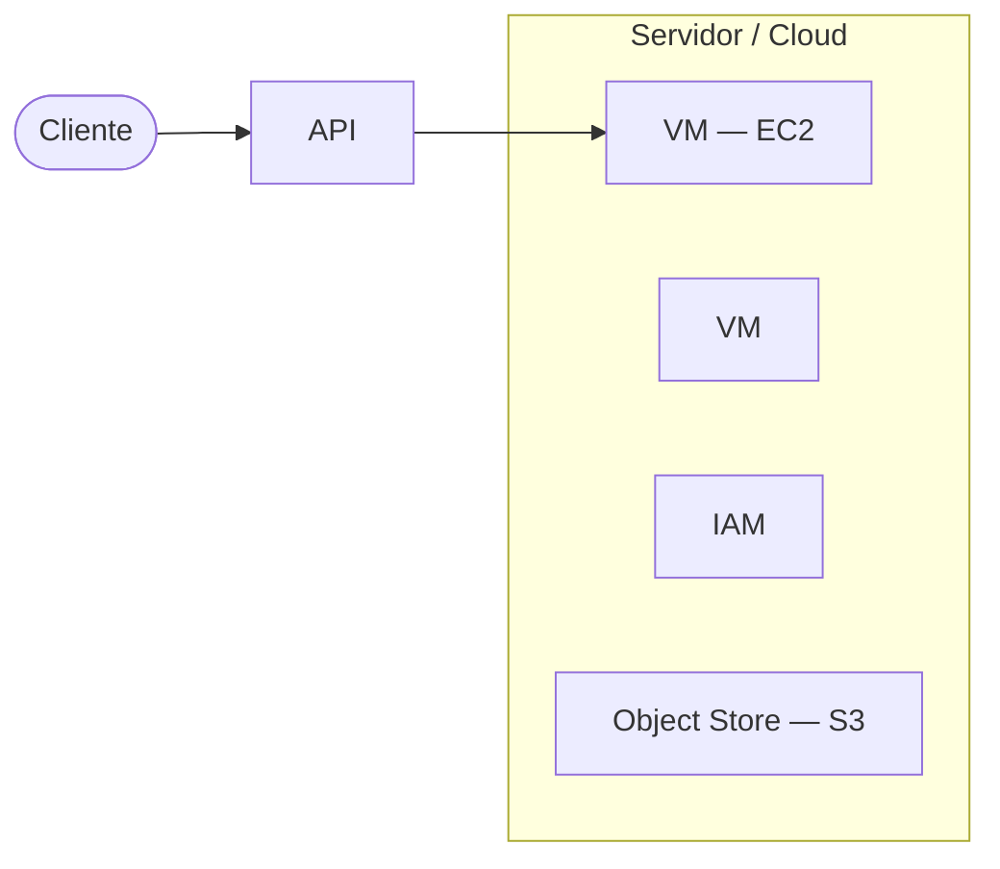
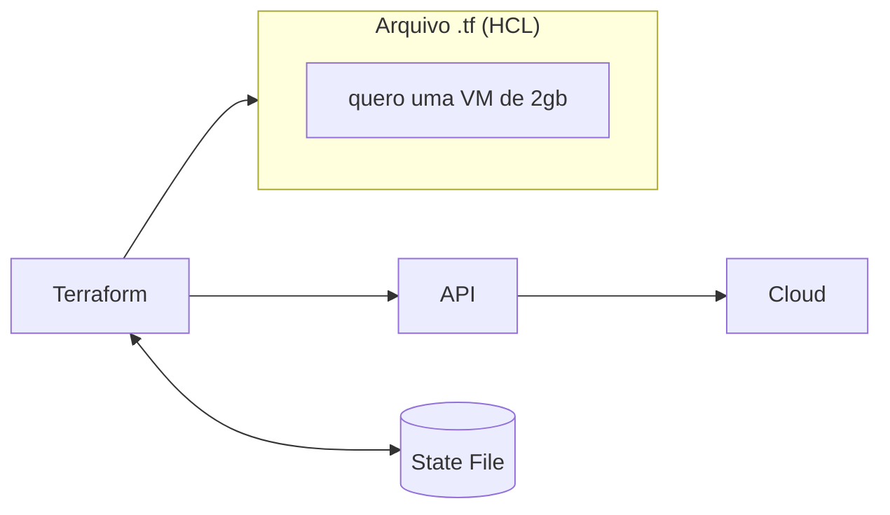

I started the **Infrastructure as Code (IaC)** course at LINUXtips, and before writing the first line of HCL, the course pauses at a point that makes perfect sense: to understand what Terraform does, you first need to understand what an API is and what Cloud is. Without this, "Terraform talks to AWS behind the scenes" is just a memorized phrase, not something I truly understand.

These are the notes from the first week: from API to Terraform's `write / plan / apply` workflow.

# What is an API

An **API** (*Application Programming Interface*) is a standardized way to allow one system to communicate with another system.

The analogy that stuck: think of an API as a waiter.

* You → place an order
* API → takes the order to the system
* System → processes the order
* API → returns the response to you

A practical example: a weather app doesn't need to know how the meteorological service calculates anything internally. It just makes a request:

```text
GET /weather?city=Rio-Branco
```

And receives a response:

```json
{
  "city": "Rio Branco",
  "temperature": 28,
  "condition": "Ensolarado"
}
```

In summary: **API = an interface that defines how systems can request information or perform actions on each other.** It typically defines:

*   **Endpoint**: where to make the request
*   **Method**: `GET`, `POST`, `PUT`, `DELETE`
*   **Parameters**: information sent
*   **Authentication**: who can access
*   **Response**: usually in JSON
*   **HTTP Status**: `200`, `404`, `500`, etc.

A more relatable example from backend daily life, in a banking system:

```text
POST /usuarios
```

You send user data → the API processes it → the backend saves it to the database → the API returns the result.

**Backend + API + Database** form an extremely common combination in modern development — and this is exactly the combination that exists on the other side when Terraform "talks" to a cloud.



# What is Cloud, in practice

**Cloud** is, in simple terms, a series of datacenters available for use, with an infrastructure accessible via an API. These resources can include:

*   virtual machines
*   storage
*   networks
*   databases
*   managed services
*   security tools
*   automation APIs

In practice, companies like AWS, Google Cloud, and Microsoft Azure have enormous infrastructure, with various machines and services available for use. The major differential of a cloud is that these resources can be created, modified, and removed **via an API**.

## The importance of the API for understanding the Cloud

The API is one of the most important parts for understanding how a cloud works. When you access the AWS web console, that interface also communicates with the AWS API behind the scenes. Similarly, tools like Terraform also communicate with that same API to create, modify, or remove resources.

In other words, there are several different ways to interact with a cloud, but they all go through the same place in the end:

*   using the web console
*   using command-line interface (CLI) tools
*   using SDKs
*   using Infrastructure as Code tools, such as Terraform

In Terraform's case, it reads the configuration written in code and uses the cloud's API to apply the necessary changes.

# Cloud Services (AWS)

A cloud offers several different services. In AWS, some of the most important services for this course are:

## EC2

**EC2** is the AWS service used to create and manage virtual machines. When you need to create an instance, you choose the machine type, define the operating system, network, and other details. This process can be done via the AWS console or through the API.

With Terraform, this process becomes described in code: instead of manually creating a machine via the console, you declare the desired machine, and Terraform requests the creation of that resource from AWS.

## S3

**S3** is an object storage service. Simply put, it can be understood as a place where you can store files.

> In the course, S3 will be important because it can be used to store Terraform's **state file**.

## IAM

**IAM** (*Identity and Access Management*) is the AWS service used to manage access and permissions. With IAM, you can create:

*   users
*   groups
*   roles
*   permission policies
*   access credentials

> In the context of the course, IAM will be used to create a user and generate credentials that allow Terraform to communicate with the AWS API. These credentials function as a form of authentication, enabling Terraform to create, modify, or remove resources from the account.

# Regions and availability zones

**Regions** represent geographical locations where the cloud has available infrastructure. In AWS, some examples are: Northern Virginia, Ohio, Oregon, Northern California, Canada, and São Paulo.

When creating resources in a cloud, it is usually necessary to choose in which region they will be created. This choice can influence factors such as latency, availability, cost, and proximity to application users.

Within a region there are **availability zones**. Zones are smaller divisions within a region. A simple way to understand them is to imagine a zone as something close to the idea of a datacenter — it's not entirely correct to say that a zone is always a single datacenter, but this analogy helps to understand the concept. For example, within a region there may be zones A, B, and C.

When creating certain resources, such as virtual machines, it may be necessary to define in which region **and** in which zone they will be created.

## Why understand these concepts

These concepts are important because Terraform needs to know where and how to create resources. When working with cloud, we need to understand at least the concepts of **API, service, region, zone, credentials, permissions, and remote storage**. These elements frequently appear when using Terraform in real-world environments.

# What is Terraform

**Terraform** is an Infrastructure as Code tool that allows you to build, change, and version infrastructure resources safely and efficiently, both in the cloud and in on-premise environments.

In practice, it works as a binary executed on the command line. This binary reads configuration files written in **HCL** (*HashiCorp Configuration Language*) and, through *providers*, communicates with service APIs to create, modify, or remove resources.

Instead of executing manual steps saying exactly how each action should happen, you describe the **desired state** of the infrastructure. For example: you state that you want a virtual machine with certain characteristics, and Terraform interprets this configuration to create or adjust that resource in the chosen provider.

Terraform reads the HCL file from the directory where it was called — any file with a `.tf` extension — uses the **state file** to know what already exists, and uses that content to communicate with the cloud's API.



> Terraform source code: [github.com/hashicorp/terraform](https://github.com/hashicorp/terraform)

## Terraform Architecture: Core and Plugins

Terraform is built on a plugin-based architecture and is logically divided into two main parts.

### Terraform Core

Terraform Core is a compiled binary, written in Go. Its main responsibilities are:

*   reading and interpreting configuration and module files
*   managing resource state
*   executing the action plan

### Terraform Plugins (providers)

*Providers* are executable binaries that the Core invokes via RPC (*Remote Procedure Call*). Each plugin implements the logic to interact with a specific service — AWS, Azure, GCP, Kubernetes, GitHub, Datadog, and many others.

The responsibilities of providers are:

*   initialization of libraries for API calls
*   authentication with the infrastructure provider
*   definition of managed resources and *data sources*
*   helper functions to simplify logic in configurations

HashiCorp and the community have already written thousands of publicly available providers on the [Terraform Registry](https://registry.terraform.io/).

# HCL and declarative configuration

Terraform files are written in **HCL** (*HashiCorp Configuration Language*), a high-level configuration language also used by other HashiCorp products.

The language syntax is built around two main concepts:

*   **Arguments**: assign a value to a name. Example: `image_id = "abc123"`
*   **Blocks**: are containers for other content. A block has a type, *labels*, and a body delimited by `{ }`.

```hcl
resource "aws_instance" "exemplo" {
  # argumentos dentro do bloco
}
```

## How Terraform communicates with providers

Terraform connects to different types of providers: cloud, SaaS platforms, monitoring tools, and other services that offer API integration.

Terraform is **provider-agnostic** (*cloud-agnostic*), allowing multiple providers and services to be combined in a single configuration. For example, it's possible to simultaneously orchestrate an AWS and OpenStack cluster, while integrating third-party providers like Cloudflare and DNSimple to provide CDN and DNS services.

This communication allows the same tool to be used to manage different types of infrastructure and services. Terraform uses a plugin-based model to support providers and *provisioners*, giving it the ability to support almost any service that exposes an API.

# The Role of the State File

An essential concept in Terraform is the **State File**. The state is a necessary requirement for Terraform to function, and it serves three main purposes:

## 1. Mapping to the real world

Terraform needs a database to map each configuration resource to the actual object existing in the cloud. For example, when you have `resource "aws_instance" "foo"` in the configuration, Terraform uses this mapping to know that this resource represents an instance with ID `i-abcd1234`.

## 2. Metadata

Terraform also needs to track dependencies between resources. When you remove a resource from the configuration, Terraform needs to know how to destroy it correctly, since the configuration no longer exists and the destruction order cannot be determined by code alone. The state maintains a copy of the most recent dependencies to ensure the correct order.

## 3. Performance

Terraform stores a cache of all resource attribute values in the state, which improves performance during planning.

The state file is an important piece for Terraform to be able to track the infrastructure's state over time — and precisely for this reason, it should not remain only on one person's local machine, but rather in a remote and shared location, such as an S3 bucket.

# The Terraform workflow

Terraform's core workflow consists of three stages:

## 1. Write

We define resources in HCL configuration files, which can span multiple providers and services. For example, you can create a configuration to deploy an application on virtual machines within a VPC, with *security groups* and a *load balancer*.

```hcl
resource "aws_vpc" "minha-vpc" {
  cidr_block = "10.0.0.0/16"

  tags = {
    Name = "minha-vpc"
  }
}
```

> **VPC** (*Virtual Private Cloud*) is a private virtual network created within a cloud, like AWS. In summary: a VPC is like your home or company's local network, but within AWS.
>
> Terraform is not the VPC — it is the tool that describes and creates this infrastructure automatically.

## 2. Plan

Terraform creates an execution plan describing the infrastructure that will be created, updated, or destroyed, based on existing infrastructure and your configuration.

## 3. Apply

After approval, Terraform executes the proposed operations in the correct order, respecting dependencies between resources. For example, if you update a VPC's properties and change the number of VMs within it, Terraform will recreate the VPC before scaling the VMs.

# Terraform use cases

*   **Multi-Cloud Deployment**: provisioning infrastructure across multiple clouds, increasing fault tolerance and allowing more graceful recovery from outages. Terraform allows using the same workflow to manage multiple providers and handle cross-cloud dependencies.
*   **Application Infrastructure Deployment, Scaling and Monitoring**: deploying, scaling, and monitoring infrastructure for *multi-tier* applications. Terraform manages the resources of each layer together and automatically handles dependencies between them.
*   **Self-Service Clusters**: building a *self-service* infrastructure model that allows product teams to manage their own infrastructure independently, using modules that codify organizational standards.

Additionally, Terraform can be used for:

*   cloud and multi-cloud infrastructure provisioning
*   resource creation on SaaS platforms
*   monitoring tool automation
*   creation of reusable modules
*   provisioning of standardized clusters and environments

Although cloud usage is one of the most common examples, Terraform is not limited to just that.

## Mutable vs. immutable infrastructure

**Mutable**: the same server is changed over time, potentially becoming a *snowflake* — unique and difficult to reproduce.

**Immutable**: instead of changing the server, a new, updated one is created and replaces the old one. It is safer and easier to reproduce.

## Where Terraform fits in

Terraform helps make the use of immutable infrastructure viable:

*   defining and managing infrastructure consistently and repeatedly
*   using human-readable configuration files that can be versioned, reused, and shared
*   managing low-level components (compute, storage, network) and high-level components (DNS, SaaS functionalities)

The goal is to move from a model based on manual changes to a more predictable, automated, and reproducible model.

# Summary

*   **API**: standardized interface for systems to communicate (endpoint, method, parameters, authentication, response)
*   **Cloud**: datacenters whose resources (VMs, storage, networks, databases, managed services) are accessible via API
*   **EC2 / S3 / IAM**: virtual machines, object storage, and access management in AWS
*   **Region / Availability Zone**: where infrastructure is geographically created and in which subdivision
*   **Terraform**: IaC tool divided into Core (reads configuration, manages state, executes plan) and Plugins/providers (communicate with each service's API via RPC)
*   **HCL**: Terraform's declarative language, based on arguments and blocks
*   **State file**: maps code ↔ real resource, tracks dependencies, and improves performance — should live remotely and be shared
*   **Workflow**: Write → Plan → Apply
*   **Immutable infrastructure**: replace instead of alter, easier to reproduce

# Next steps

The course continues with the practical part: creating an AWS account → creating an IAM user → creating an S3 bucket → blocking public access to the bucket, with extra attention when dealing with the credentials generated in IAM.

# Conclusion

What remains from these two weeks of notes is that Terraform is not magic: it's just another client talking to a cloud's API, in the same way that the web console or a `GET /weather` call communicates with an API. The difference is that instead of clicking buttons, you describe the desired state in HCL, and the Core bridges with the right provider to get there — storing this mapping in the state file to know, next time, what already exists and what still needs to change.

Understanding API and Cloud before Terraform itself prevented the next steps (remote state, providers, `plan`/`apply` workflow) from becoming just "commands I memorized" — now there's a clear reason behind each piece.

## References

*   [HashiCorp Developer — What is Terraform?](https://developer.hashicorp.com/terraform/intro) — official overview of what Terraform is and what it's for.
*   [HashiCorp Developer — HCL Syntax](https://developer.hashicorp.com/terraform/language/syntax/configuration) — reference for the configuration language syntax.
*   [HashiCorp Developer — Terraform state](https://developer.hashicorp.com/terraform/language/state) — documents the purpose and functioning of the state, deepened in [Terraform state: o arquivo que pode derrubar sua infra](/posts/terraform-state-primeiros-passos).
*   [Terraform Registry](https://registry.terraform.io/) — public catalog of providers and modules maintained by HashiCorp and the community.
*   [github.com/hashicorp/terraform](https://github.com/hashicorp/terraform) — Terraform Core source code.
*   [AWS — O que é o Amazon EC2?](https://docs.aws.amazon.com/pt_br/AWSEC2/latest/UserGuide/concepts.html) — official documentation for the virtual machine service.
*   [AWS — O que é o Amazon S3?](https://docs.aws.amazon.com/pt_br/AmazonS3/latest/userguide/Welcome.html) — official documentation for the object storage service.
*   [AWS — O que é o IAM?](https://docs.aws.amazon.com/pt_br/IAM/latest/UserGuide/introduction.html) — official documentation for the identity and access service.
*   [LINUXtips — IaC and Pipeline Specialist Training](https://linuxtips.io/iac-pipeline-specialist/) — IaC and Terraform training used as the basis for my studies and these notes.
