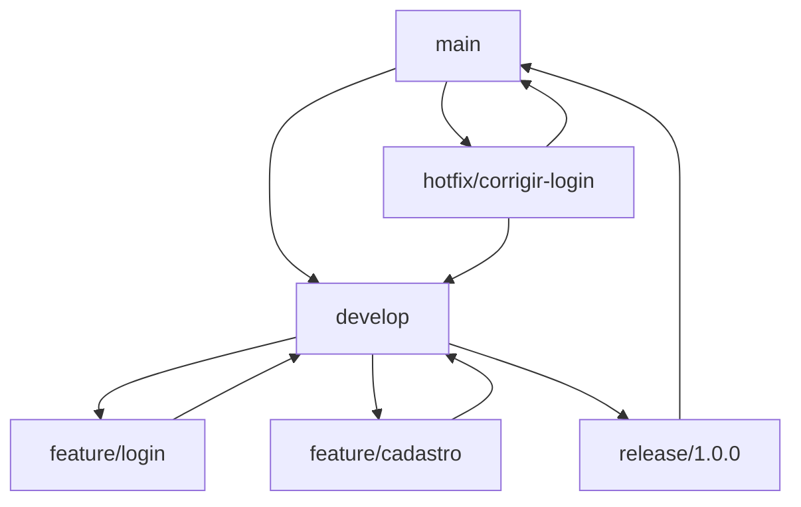
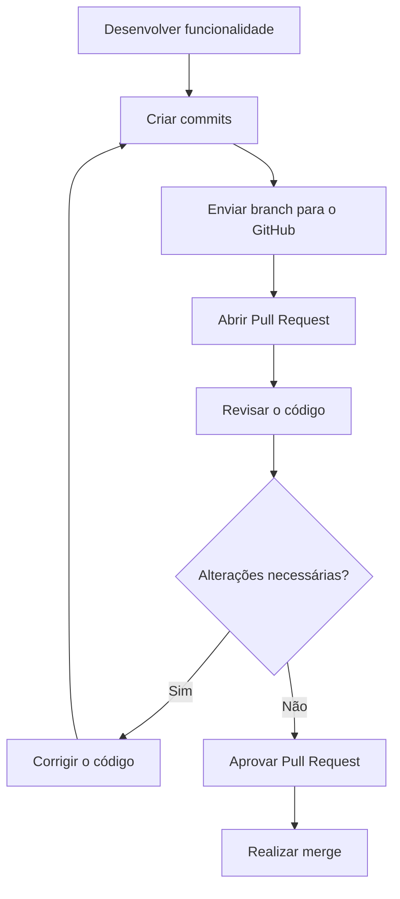
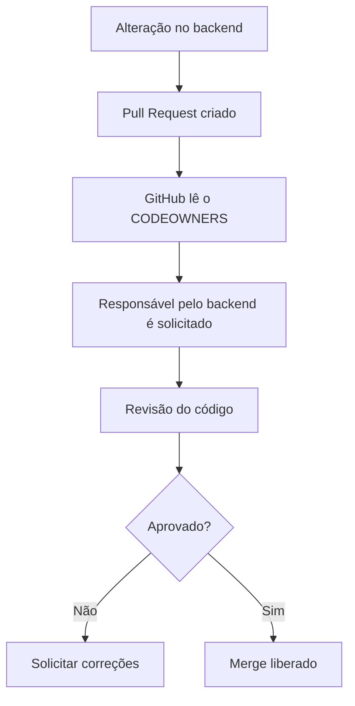
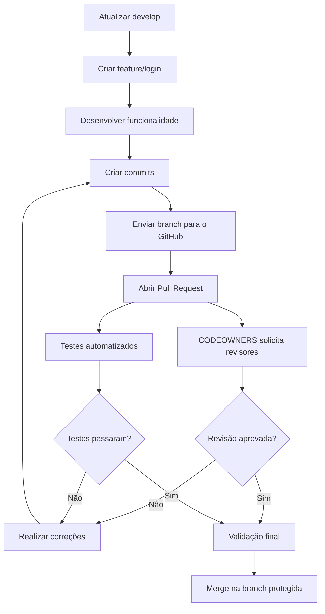

When working alone on a small project, it's common to make all changes directly to the main branch.

The flow typically looks like this:

```bash
git add .
git commit -m "adiciona nova funcionalidade"
git push origin main
```

This process can work for personal projects, but it starts to cause problems when multiple people work on the same repository.

Imagine a team where:

- one person works on the front-end;
- another develops the back-end;
- another manages the infrastructure;
- another configures GitHub Actions workflows.

If everyone pushes changes directly to `main`, the chances of conflicts, failures, and unreviewed code reaching production increase.

To organize this process, we can use:

- GitFlow;
- feature branches;
- Pull Requests;
- branch protection;
- CODEOWNERS.

# What is GitFlow?

`GitFlow` is a branch organization model in Git.

It defines a standardized way to separate code that is in production, code that is under development, and features that are still being built.

In the traditional model, the main branches are:

```text
main
develop
feature
release
hotfix
```

Each one has a different responsibility.

# The `main` Branch

The `main` branch represents the stable code of the project.

Typically, it contains the version that is ready for production or already published.

```text
main
└── stable version of the project
```

For this reason, it is not recommended to develop features directly on it.

`main` should only receive changes that have already been:

- developed;
- reviewed;
- tested;
- approved.

# The `develop` Branch

The `develop` branch gathers features being prepared for the next version.

```text
develop
└── next version of the project
```

The different feature branches are integrated into `develop`.

When the next version is stable, it can proceed to a release branch or be integrated into `main`, depending on the project's adopted workflow.

# `feature` Branches

`feature` branches are used to develop new functionalities.

For example:

```text
feature/login
```

```text
feature/login-google
```

```text
feature/cadastro-usuario
```

Each feature is developed in isolation.

This allows one person to work on the login screen while another develops the registration, without one change directly interfering with the other.

A common flow would be:

```text
develop
   └── feature/login
```

Once the feature is ready, it returns to `develop` via a Pull Request.

# Creating a Feature Branch

First, we access the development branch:

```bash
git checkout develop
```

We update the local code:

```bash
git pull origin develop
```

Then, we create the new branch:

```bash
git checkout -b feature/login
```

We can also use the more recent command:

```bash
git switch -c feature/login
```

After developing the feature, we add the files:

```bash
git add .
```

We create the commit:

```bash
git commit -m "feat: adiciona tela de login"
```

And push the branch to the remote repository:

```bash
git push -u origin feature/login
```

Now the branch will be available on GitHub.

# `release` Branches

`release` branches are used to prepare a new version of the project.

Example:

```text
release/1.2.0
```

At this stage, major features are usually not added.

The branch is used for:

- performing final tests;
- fixing minor issues;
- updating the project version;
- preparing documentation;
- validating publication.

When the version is ready, it can be integrated into `main`.

# `hotfix` Branches

`hotfix` branches are used to fix urgent problems that are already in production.

Example:

```text
hotfix/fix-login
```

Since the problem is occurring in the current version of the system, the branch is usually created from `main`.

```bash
git checkout main
git pull origin main
git checkout -b hotfix/corrigir-login
```

After the fix:

```bash
git add .
git commit -m "fix: corrige erro no login"
git push -u origin hotfix/corrigir-login
```

The fix can then be integrated back into `main` and also into `develop`, preventing the problem from reappearing in the next version.

# GitFlow Overview

The flow can be represented as follows:



The main idea is to separate each type of change.

```text
main
└── stable code

develop
└── next version

feature/*
└── new features

release/*
└── version preparation

hotfix/*
└── urgent fixes
```

# What is a Pull Request?

A `Pull Request`, also known as a `PR`, is a proposal to integrate changes from one branch into another.

For example:

```text
feature/login → develop
```

In this case, we are proposing that the code developed in the `feature/login` branch be integrated into the `develop` branch.

In projects that do not use the `develop` branch, the flow might be:

```text
feature/login → main
```

The Pull Request creates a review step before the merge.

Other people can:

- analyze the changes;
- leave comments;
- request corrections;
- verify tests;
- approve the code;
- block the merge if there is an issue.

# Creating a Pull Request

After pushing the branch:

```bash
git push -u origin feature/login
```

We can open a Pull Request on GitHub.

In this Pull Request, we choose:

```text
base: develop
compare: feature/login
```

This means:

```text
target branch: develop
source branch: feature/login
```

The title could be:

```text
feat: add login screen
```

And the description could explain:

```markdown
## O que foi desenvolvido?

Foi criada a tela de login da aplicação.

## Alterações

- criação do formulário;
- validação dos campos;
- integração com a API;
- tratamento de mensagens de erro.

## Como testar?

1. Execute a aplicação.
2. Acesse `/login`.
3. Informe um usuário válido.
4. Verifique o redirecionamento.
```

A good description greatly facilitates the work of those who will review the code.

# Pull Request Flow



A Pull Request is not just a button to merge branches.

It also serves as a:

- decision history;
- discussion space;
- review process;
- record of changes;
- integration point for automated tests.

# What is Branch Protection?

Branch protection is a set of rules used to prevent dangerous changes on important branches.

Typically, we protect branches such as:

```text
main
develop
```

Without a protection rule, someone could execute:

```bash
git push origin main
```

This would allow pushing code directly to the main branch, without review and without tests.

In a team, this type of change can break the application for everyone.

# Branch Protection Rules

Protection rules can require that:

- changes be submitted via Pull Request;
- the Pull Request has one or more approvals;
- project tests pass;
- the branch is up to date before merging;
- all comments are resolved;
- the code has no conflicts;
- specific owners review the code;
- commits are signed;
- the branch cannot be deleted;
- direct pushes are blocked.

A protected workflow might look like this:

```text
feature/login
      ↓
Pull Request
      ↓
Code Review
      ↓
Automated Tests
      ↓
Approval
      ↓
Merge to main
```

# Why Protect `main`?

The main branch represents the most important version of the repository.

If anyone can change it directly, problems such as:

- broken code;
- incomplete features;
- exposed credentials;
- ignored tests;
- important files deleted;
- difficult-to-resolve conflicts;
- production failures.

Branch protection turns `main` into a controlled area.

No one enters through the window. Everyone goes through the Pull Request.

# Example Rule for `main`

A common configuration might require:

```text
Require Pull Request before merging
Require at least one approval
Require tests to pass
Require comments to be resolved
Block direct pushes
Prevent branch deletion
```

With this, even if someone tries to execute:

```bash
git push origin main
```

GitHub can block the operation.

# What is CODEOWNERS?

The `CODEOWNERS` file allows you to define owners for different parts of the project.

It tells GitHub who should review a change depending on the modified files.

We can understand its function as follows:

> When someone changes this part of the project, request a review from these people.

The file can be created in:

```text
.github/CODEOWNERS
```

# CODEOWNERS Example

Imagine a project with this structure:

```text
frontend/
backend/
infra/
docs/
.github/
```

The file could be:

```text
*                     @cesarsantos96
/frontend/            @dev-frontend
/backend/             @dev-backend
/infra/               @dev-infra
/docs/                 @cesarsantos96
/.github/              @cesarsantos96
```

In this example:

- changes in the front-end request the front-end owner;
- changes in the back-end request the back-end owner;
- infrastructure changes request the infrastructure owner;
- workflow changes request a specific review;
- the `*` defines a default owner.

# Using Teams in CODEOWNERS

In a GitHub organization, we can also use teams:

```text
/frontend/     @empresa/time-frontend
/backend/      @empresa/time-backend
/infra/        @empresa/time-devops
/.github/      @empresa/time-devops
```

Thus, when someone changes a file within `backend`, GitHub can automatically request a review from the responsible team.

# CODEOWNERS and Branch Protection

`CODEOWNERS` becomes even more useful when used in conjunction with protection rules.

The rule can require approval from the owners defined in the file.

The flow then works as follows:



# Complete Flow

Using GitFlow, Pull Requests, branch protection, and CODEOWNERS, the process can look like this:



Each tool has a responsibility:

```text
GitFlow
└── organizes branches

Pull Request
└── organizes review and integration

Branch Protection
└── defines mandatory rules

CODEOWNERS
└── defines who should review
```

# Conclusion

GitFlow helps organize development through branches with different responsibilities.

`feature` branches isolate new functionalities. `release` branches prepare new versions, while `hotfix` branches fix urgent problems in production.

Pull Requests create a review step before code integration.

Protection rules prevent direct changes to important branches, and the `CODEOWNERS` file helps route each change to the correct owners.

When these tools are used together, development becomes more organized, secure, and predictable.

The code stops following this path:

```text
change → main
```

And starts following a controlled process:

```text
branch → commit → Pull Request → review → tests → approval → merge
```

## References

- [Git — Git Branching](https://git-scm.com/book/pt-br/v2/Branches-no-Git-Branches-em-poucas-palavras) — presents the fundamentals of Git branches.
- [GitHub Docs — About pull requests](https://docs.github.com/pt/pull-requests/collaborating-with-pull-requests/proposing-changes-to-your-work-with-pull-requests/about-pull-requests) — documents the review and merge flow.
- [GitHub Docs — About protected branches](https://docs.github.com/pt/repositories/configuring-branches-and-merges-in-your-repository/managing-protected-branches/about-protected-branches) — explains protection rules and requirements.
- [GitHub Docs — About code owners](https://docs.github.com/pt/repositories/managing-your-repositorys-settings-and-features/customizing-your-repository/about-code-owners) — official reference for the `CODEOWNERS` file.
- [LINUXtips — GitHub Essentials](https://linuxtips.io/treinamento/github-essentials/) — course used as the basis for my studies in Git and GitHub.
