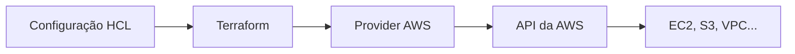

Terraform can describe resources from AWS, Azure, Google Cloud, Kubernetes, databases, SaaS platforms, and many other APIs. But the Terraform binary doesn't know all these systems on its own. Integration happens through **providers**.

# What is a provider

A provider is a plugin that allows Terraform to communicate with an external system. It implements the resource types and data sources of that platform and translates Terraform operations into calls to the corresponding API.



The AWS provider understands resources like `aws_instance` and `aws_s3_bucket`. The Kubernetes provider understands cluster API objects. A database provider, on the other hand, can manage users, permissions, and configurations exposed by that system.

The provider is not the cloud itself, nor does it store resources: it is the bridge that knows how to authenticate, assemble requests, and interpret responses.

# Where to find providers

The recommended place to search for public providers is the [Terraform Registry](https://registry.terraform.io/browse/providers). Each provider's page brings together:

* resource and data source documentation
* available versions
* configuration examples
* accepted arguments
* supported authentication mechanisms
* namespace of the organization responsible for publishing

Whenever possible, the provider documentation should be the primary source when writing configuration. Each service's interface is different, so there isn't a universal list of arguments that works for everyone.

# Categories in the Registry

The Registry uses badges to indicate who publishes and maintains each provider:

* **Official**: maintained by HashiCorp or by organizations designated as official in the Registry
* **Partner** and **Partner Premier**: maintained by companies participating in HashiCorp's partner programs
* **Community**: published by individuals or organizations from the community
* **Archived**: provider that is no longer maintained

A community provider can be useful and well-maintained, but the decision requires checking documentation, release frequency, repository, and open issues. Archived providers deserve additional caution and are not a good choice for new projects without a conscious risk analysis.

# Declaring a provider

Each root module must declare the providers it needs in the `required_providers` block:

```hcl
terraform {
  required_providers {
    aws = {
      source  = "hashicorp/aws"
      version = "~> 6.0"
    }
  }
}

provider "aws" {
  region = "us-east-2"
}
```

The two blocks have different roles:

* `required_providers` informs the origin and version constraint of the plugin
* `provider "aws"` configures an instance of the plugin, in this case with the region

The address `hashicorp/aws` is a shorthand for `registry.terraform.io/hashicorp/aws`. The first part is the publisher's namespace; the second is the provider type.

# What happens during `terraform init`

When executing:

```bash
terraform init
```

Terraform analyzes the configuration, identifies the necessary providers, and installs compatible versions. The binaries are stored within `.terraform`, a local directory that should not be committed.

The command also creates or updates `.terraform.lock.hcl`. This file records the selected versions and their checksums, allowing other machines and pipelines to install the same verified dependencies. Unlike the `.terraform` folder, the lock file should be versioned in Git.

To ask Terraform to look for newer versions within the declared constraints:

```bash
terraform init -upgrade
```

This does not mean that every new version should be automatically accepted. Planning and testing are still necessary, especially when there is a major version change.

# Version constraints

A constraint makes the set of accepted versions explicit:

```hcl
version = ">= 6.0.0"
version = "~> 6.0"
version = ">= 6.0, < 7.0"
```

`>= 6.0.0` accepts any subsequent version, including a future major version. `~> 6.0`, on the other hand, keeps the selection within the 6.x series. The explicit combination `>= 6.0, < 7.0` communicates this intention directly.

In reusable modules, HashiCorp recommends declaring at least the minimum compatible version and letting the root module manage the upper limits. In the root project, the lock file records the concrete version chosen.

# Configuration and authentication

The configuration block varies depending on the provider. In AWS, the region is a common argument:

```hcl
provider "aws" {
  region = "us-east-2"
}
```

Credentials should not be hardcoded in this file. Providers typically offer their own mechanisms to find them, such as environment variables, profile files, or identities assigned to the machine and pipeline. The official documentation for each provider describes the order and supported methods.

It is also possible to create more than one configuration of the same provider using `alias`. This is useful, for example, for managing resources in two regions:

```hcl
provider "aws" {
  region = "us-east-2"
}

provider "aws" {
  alias  = "virginia"
  region = "us-east-1"
}

resource "aws_s3_bucket" "logs" {
  provider = aws.virginia
  bucket   = "exemplo-logs-unicos"
}
```

# A provider is not a backend

The names might appear together in a configuration, but they solve different problems:

* the **provider** communicates with the API that creates and manages resources
* the **backend** determines where Terraform stores the state

Using the AWS provider does not force the state to reside in S3. Similarly, an S3 backend can store the state of a configuration that manages resources on other platforms.

# Conclusion

Providers are Terraform's integration layer. HCL code declares the intent, Terraform orchestrates the changes, and the provider knows the API needed to execute them.

To use this layer securely, the workflow is straightforward: find the provider in the Registry, confirm who maintains it, read the documentation for the chosen version, declare origin and constraint in `required_providers`, configure only what is necessary, and version the `.terraform.lock.hcl`.

## References

* [HashiCorp Developer, providers overview](https://developer.hashicorp.com/terraform/language/providers): role of providers in Terraform configuration.
* [HashiCorp Developer, provider requirements](https://developer.hashicorp.com/terraform/language/providers/requirements): origin, local name, and version constraints.
* [HashiCorp Developer, provider configuration](https://developer.hashicorp.com/terraform/language/providers/configuration): arguments, aliases, and resource association.
* [HashiCorp Developer, providers in the Registry](https://developer.hashicorp.com/terraform/registry/providers): categories, namespaces, and maintenance responsibilities.
* [HashiCorp Developer, dependency lock file](https://developer.hashicorp.com/terraform/language/files/dependency-lock): how `.terraform.lock.hcl` works.
* [LINUXtips, IaC and Pipeline Specialist Training](https://linuxtips.io/iac-pipeline-specialist/): IaC training with Terraform used as the basis for my studies and these notes.
