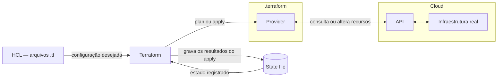
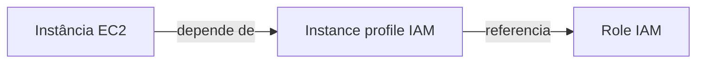

During my Terraform studies in the LINUXtips course, a question helped me understand the role of the state: **how does Terraform know which cloud resource corresponds to what I wrote in the code?**

The name that appears in HCL is not necessarily the identifier used by AWS. Between the configuration and the infrastructure, there is a record of this relationship: the **state**.

## Terraform's flow in the notes

The class diagram connects HCL code, Terraform, the state, and the cloud infrastructure:



Terraform reads the HCL and the state and queries the infrastructure via the provider. In the `plan`, this comparison generates the proposed changes; in the `apply`, the changes are executed, and the results are recorded in the state.

## The role of the state file

Terraform stores the state in JSON format. By default, in the local backend, the file is called `terraform.tfstate`. It records the links between configuration resources and real objects, as well as attributes and metadata. To inspect or modify it, prefer Terraform commands over manual JSON editing. [State documentation](https://developer.hashicorp.com/terraform/language/state).

In my class notes, I organized its importance into three points: mapping, dependencies, and performance.

### 1. Mapping between configurations and the real world

Consider this HCL snippet, which assumes an `aws_ami.ubuntu` data source has already been declared:

```hcl
resource "aws_instance" "example" {
  ami           = data.aws_ami.ubuntu.id
  instance_type = "t3.micro"
}
```

The address `aws_instance.example` identifies the resource in the configuration. The state associates this address with the instance ID in AWS. This relationship allows tracking the same object in subsequent executions. [State documentation](https://developer.hashicorp.com/terraform/language/state).

A simplified and fictitious excerpt of the record would be:

```json
{
  "mode": "managed",
  "type": "aws_instance",
  "name": "example",
  "provider": "provider[\"registry.terraform.io/hashicorp/aws\"]",
  "instances": [
    {
      "schema_version": 2,
      "attributes": {
        "ami": "ami-0123456789abcdef0",
        "arn": "arn:aws:ec2:us-east-1:123456789012:instance/i-0123456789abcdef0",
        "availability_zone": "us-east-1d",
        "id": "i-0123456789abcdef0",
        "instance_type": "t3.micro"
      },
      "dependencies": [
        "data.aws_ami.ubuntu"
      ]
    }
  ]
}
```

This example is just a fragment of the state, with attributes omitted for readability. The fields and format may vary depending on Terraform and provider versions.

| In the configuration | In the real object |
| --- | --- |
| `aws_instance.example` | EC2 instance `i-0123456789abcdef0` |
| `ami = data.aws_ami.ubuntu.id` | AMI used by the instance |
| `instance_type = "t3.micro"` | Registered instance type |

Each remote object must be associated with a single resource instance in the configuration. Importing the same object at different addresses makes this link ambiguous. [Purpose of state](https://developer.hashicorp.com/terraform/language/state/purpose).

This rule also requires attention when using `terraform import` or `terraform state rm`. The first associates an existing object with an address in the state; the second removes this link without destroying the remote object. If the resource remains in the HCL after a `state rm`, a subsequent plan may propose its creation again. [`terraform state rm` documentation](https://developer.hashicorp.com/terraform/cli/commands/state/rm).

### 2. Metadata and dependencies

The state preserves the most recent dependencies. This helps determine the destruction order when a resource has been removed from the HCL and its configuration is no longer available. [State metadata](https://developer.hashicorp.com/terraform/language/state/purpose#metadata).

In the example from the notes:

```json
"dependencies": [
  "data.aws_ami.ubuntu"
]
```

The reference records a dependency on the data source used to query the AMI. A data source queries information; this entry does not mean that Terraform created or should destroy the queried image.

The same reasoning applies when an instance references a subnet or an IAM instance profile: the configuration expresses relationships that Terraform needs to consider when organizing operations.

In my notes, I drew this relationship as **EC2 depends on IAM**. A concrete example is an instance that uses an instance profile to receive a role:



When these resources are managed in the same project and the references are in the HCL, Terraform considers the dependencies to create the role and instance profile before the instance. For destruction, it considers the reverse order. If the resources are removed from the configuration, the relationships preserved in the state help organize their removal. [State metadata](https://developer.hashicorp.com/terraform/language/state/purpose#metadata).

### 3. Performance

The state also maintains a cache of known attributes. This is useful in large infrastructures where querying each resource involves API latency and limits. However, **having this cache does not eliminate the standard refresh**. [State performance](https://developer.hashicorp.com/terraform/language/state/purpose#performance).

Normally, `terraform plan` queries existing objects via providers before calculating changes. It is possible to disable this step with `-refresh=false`, but the plan may be incomplete or incorrect by ignoring external changes. [`terraform plan` documentation](https://developer.hashicorp.com/terraform/cli/commands/plan).

# How Terraform uses the state in the plan

The normal planning flow can be organized as follows:

1. Reads the state available in the backend.
2. Queries existing resources via provider APIs.
3. Compares the data obtained with the configuration in the `.tf` files.
4. Proposes the necessary actions, such as creating, updating, replacing, or destroying resources.

The `plan` presents these actions for review. The `apply` executes the plan and records the results in the state. [`terraform plan` documentation](https://developer.hashicorp.com/terraform/cli/commands/plan).

## What exists inside the state

In addition to the resource records presented in the example, my notes highlight the following fields:

*   **Bindings:** links between addresses in the configuration and real objects.
*   **Attributes:** known values of resources, such as ID, ARN, and IP, according to the resource type.
*   **Metadata:** dependencies, provider reference, and information about the state itself.
*   **Outputs:** output values of the root module recorded in the state.

| Field | What it represents |
| --- | --- |
| `version` | Version of the state format |
| `terraform_version` | Version of Terraform that wrote the snapshot |
| `serial` | Counter incremented when the state changes |
| `lineage` | Identifier of the state's lineage |
| `resources` | Records of resources and data sources, with their instances |
| `outputs` | Stored output values of the root module |

The `schema_version` within an instance refers to that resource's schema in the provider. It plays a different role from the file's `version` field.

## Remote backend: sharing the same state

The **backend** defines where Terraform stores the state. By default, the local backend saves the JSON file to disk. A remote backend, such as S3, allows this record to be kept off the machine of whoever is executing Terraform.

If each person works with an independent copy of the state, the team loses a common reference. A remote backend centralizes this record for developers and pipelines. Protection against concurrent writing depends on the backend's locking support and configuration. [Remote state](https://developer.hashicorp.com/terraform/language/state/remote).

### Advantages of a remote backend

In my notes, I separated four advantages:

*   **Sharing:** people and pipelines work with the same state.
*   **State locking:** when supported and enabled, prevents two operations from writing to the same state simultaneously.
*   **Security:** with a remote backend, Terraform normally keeps the state in memory during execution, without persisting a local copy. A failure to write to the backend can generate a local recovery file; commands like `state pull` also allow creating copies.
*   **Versioning:** depends on the service and configuration. In S3, enabling bucket versioning allows retaining previous object versions for recovery.

The remote backend shares the state; locking coordinates who can modify it at a time. [Storage and locking](https://developer.hashiCorp.com/terraform/language/state/backends), [S3 backend](https://developer.hashicorp.com/terraform/language/backend/s3).

To delve deeper into configuration and migration, also see the post [Remote Backend in Terraform: S3 State](/posts/backend-remoto-s3-no-terraform/).

## State locking in S3

When the backend offers locking, Terraform acquires a lock on operations that can write to the state. If it fails to obtain it, the operation does not proceed. This protects against concurrent executions on the same state. [State locking documentation](https://developer.hashicorp.com/terraform/language/state/locking).

For example: two people execute `terraform apply` on the same remote state. One execution acquires the lock; the other must wait for its release, if a waiting time is configured, or fails to acquire the lock. Independent local states do not offer this coordination between machines.

In S3, the configuration from the notes looks like this:

```hcl
terraform {
  backend "s3" {
    bucket       = "meu-bucket-de-state-unico"
    key          = "aula/backend.tfstate"
    region       = "us-east-1"
    encrypt      = true
    use_lockfile = true
  }
}
```

Each field plays a role in the configuration:

| Field | Function |
| --- | --- |
| `backend "s3"` | Defines S3 as the remote backend |
| `bucket` | Name of the bucket that stores the state |
| `key` | Path of the state object within the bucket |
| `region` | AWS region of the bucket |
| `encrypt` | Requests encryption of the state in storage |
| `use_lockfile` | Enables the lock file to prevent simultaneous writes |

The bucket needs to exist before `init`. S3's native lock is disabled by default. HashiCorp recommends enabling bucket versioning for recovery. [S3 Backend](https://developer.hashicorp.com/terraform/language/backend/s3).

In the `default` workspace, the lock object in this example is located at `aula/backend.tfstate.tflock`. The AWS identity needs the following permissions:

*   `s3:ListBucket` on the bucket, limited to the necessary path.
*   `s3:GetObject` and `s3:PutObject` on the state object.
*   `s3:GetObject`, `s3:PutObject` and `s3:DeleteObject` on the `.tflock` object.

Locking via DynamoDB is deprecated in the current documentation. [S3 backend permissions and locking](https://developer.hashicorp.com/terraform/language/backend/s3#permissions-required).

To allow retries for acquiring the lock for up to five minutes:

```bash
terraform apply -lock-timeout=5m
```

This time limit applies to waiting for the lock, not the duration of the `apply`. [Locking options](https://developer.hashicorp.com/terraform/cli/commands/plan).

## Backend initialization and migration

To transfer an existing local state to S3, use:

```bash
terraform init -migrate-state
```

Whereas `terraform init -reconfigure` discards the previous backend configuration and initializes the new one without migrating the state. The choice depends on whether there is a state to transfer. [`terraform init` documentation](https://developer.hashicorp.com/terraform/cli/commands/init).

### Commands to inspect the state

Some useful commands from the notes:

```bash
# Exibe o state em formato legível
terraform show

# Lista os endereços presentes no state
terraform state list

# Exibe os atributos de um recurso específico
terraform state show aws_instance.example

# Obtém o state do backend e escreve o JSON na saída padrão
terraform state pull
```

`state pull` works with both local and remote backends. To save an inspection copy:

```bash
terraform state pull > state-inspecao.json
```

This command creates a local copy, even when the backend is remote. Treat this file as sensitive. [`terraform state pull` documentation](https://developer.hashicorp.com/terraform/cli/commands/state/pull).

The state may contain secrets and should not be committed to Git. Control access to the backend and local copies. [State storage](https://developer.hashicorp.com/terraform/language/state#storing-state).

## Conclusion

Understanding the state was an important part of my Terraform studies. It is where the links between code and real resources, the dependencies needed to organize operations, and the known attributes that aid in planning reside.

The three points from the notes are connected: mapping identifies which object to manage, metadata preserves its relationships, and the attribute cache contributes to performance. Even so, refresh remains part of the standard planning to account for changes made outside of Terraform.

When a project becomes shared, managing this record is also part of working with infrastructure. A remote backend allows the team to use the same state; locking protects against simultaneous writes; and versioning helps with recovery. Therefore, the state deserves restricted access, protection of copies, and attention during any migration.

## References

*   [HashiCorp Developer, state overview](https://developer.hashicorp.com/terraform/language/state): structure, storage, and care for infrastructure state.
*   [HashiCorp Developer, purpose of state](https://developer.hashicorp.com/terraform/language/state/purpose): mapping between configuration and real objects, metadata, dependencies, and performance.
*   [HashiCorp Developer, remote state](https://developer.hashicorp.com/terraform/language/state/remote): sharing state among people and pipelines.
*   [HashiCorp Developer, storage and locking](https://developer.hashicorp.com/terraform/language/state/backends): state persistence in backends and recovery in case of failure.
*   [HashiCorp Developer, state locking](https://developer.hashicorp.com/terraform/language/state/locking): locking the state during operations that can modify it.
*   [HashiCorp Developer, S3 backend](https://developer.hashicorp.com/terraform/language/backend/s3): configuration, permissions, versioning, and native S3 locking.
*   [HashiCorp Developer, `terraform plan` command](https://developer.hashicorp.com/terraform/cli/commands/plan): change planning, refresh, and locking options.
*   [HashiCorp Developer, `terraform init` command](https://developer.hashicorp.com/terraform/cli/commands/init): initialization, migration, and backend reconfiguration.
*   [HashiCorp Developer, `terraform state pull` command](https://developer.hashicorp.com/terraform/cli/commands/state/pull): obtaining the state from the backend in JSON format.
*   [HashiCorp Developer, `terraform state rm` command](https://developer.hashicorp.com/terraform/cli/commands/state/rm): removing the link to an object without destroying it in the infrastructure.
*   [LINUXtips, IaC and Pipeline Specialist Training](https://linuxtips.io/iac-pipeline-specialist/): IaC training with Terraform used as the basis for my studies and these notes.
