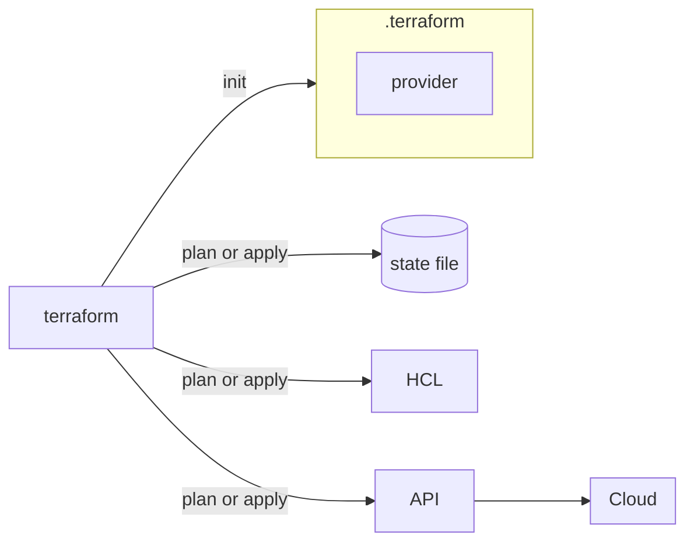

After [putting `init`, `plan`, and `apply` into practice](/posts/terraform-init-plan-apply-na-pratica), the last piece of the cycle was missing: undoing what Terraform created. These are notes on `terraform destroy`, including a detail that has confused me before: the provider region.



# A reminder about the provider region

When working with AWS, the region is important information in any operation, including when destroying resources. If the region is not explicitly configured in the code, Terraform might end up using a default region defined in the environment, rather than the one you expect.

This can cause confusion because a resource cannot be found (or destroyed) in a different region from where it was actually created. It's always worth checking the `provider` block before running any destructive command.

# Terraform Destroy

```bash
terraform destroy
```

The `terraform destroy` command is used to destroy resources managed by Terraform, meaning everything registered in that project's state file.

Before destroying anything, Terraform shows a destruction plan and asks for confirmation, exactly like `apply` does. In the command output, resources to be removed are marked with the `-` symbol, the same symbol used in `plan` to indicate destruction.

This confirmation exists precisely to give a final chance to review what will be removed before the command proceeds.

# Generating a separate destruction plan

It is also possible to generate a destruction plan before applying the removal of resources, without relying on the interactive confirmation of `terraform destroy`:

```bash
terraform plan -destroy -out destruir
```

This command creates a plan file indicating exactly what will be destroyed, in the same way that `terraform plan -out` saves a creation or alteration plan.

Afterward, this plan can be applied with:

```bash
terraform apply destruir
```

`apply` recognizes that file as a destruction plan and executes the removal of the resources listed in it, without needing to re-create the plan at the time.

## Why separate plan and apply for destruction

The same logic as `plan -out` applies here: by saving the destruction plan to a file, what will be removed is recorded and reviewable before execution. This is especially useful in automated pipelines, where it makes sense to have a human step review the plan before a separate step applies the destruction, without relying on an interactive prompt in the middle of the process.

# What destroy doesn't reach

The `terraform destroy` command only knows how to destroy what is in the state file. Resources created manually via the AWS console, or by any other tool outside of Terraform, simply do not appear in this plan, because Terraform has no knowledge of them. This is another reason to keep the state file updated and, in real environments, remote: I talked about this in the post [Terraform state, the file that can bring down your infra](/posts/terraform-state-primeiros-passos).

# Conclusion

The `terraform destroy` command closes the cycle that starts with `write` and goes through `plan` and `apply`: just like creating and changing, removal also goes through a reviewable plan before anything truly happens. The most important takeaway is this: the `-` symbol in the plan output is the same warning, whether it's part of a regular `apply` or a dedicated `destroy`, and it's always worth pausing and reading before confirming.

## References

* [HashiCorp Developer, `terraform destroy` command](https://developer.hashicorp.com/terraform/cli/commands/destroy): official reference for the resource destruction command.
* [HashiCorp Developer, `terraform plan` command](https://developer.hashicorp.com/terraform/cli/commands/plan): documents the `destroy` option, used to generate a removal plan.
* [HashiCorp Developer, `terraform apply` command](https://developer.hashicorp.com/terraform/cli/commands/apply): explains how to apply a saved plan file, whether for creation or destruction.
* [HashiCorp Developer, Terraform state](https://developer.hashicorp.com/terraform/language/state): documents why destroy only affects what is registered in the state.
* [LINUXtips, IaC and Pipeline Specialist Training](https://linuxtips.io/iac-pipeline-specialist/): IaC and Terraform training used as the basis for my studies and these notes.
