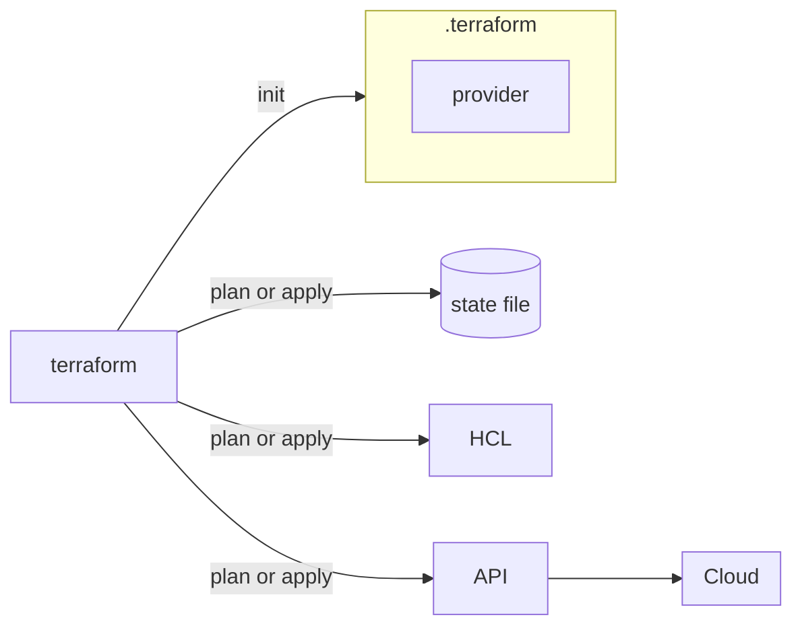

In the [previous post about IaC fundamentals](/posts/fundamentos-de-iac-com-terraform) I focused more on the concept: what an API is, what Cloud is, and how Terraform fits into all of it. In these notes, I went to the practical side of the course and tested, command by command, the `init`, `plan`, and `apply` flow against a real AWS environment.

# Revisiting the Terraform flow

Before running any command, it's worth remembering the elements involved in this flow:

*   HCL files, which describe the desired state of the infrastructure
*   the Terraform binary, which reads these files
*   the providers, which know how to communicate with the API of each service
*   the state file, where resource information is recorded
*   the infrastructure itself, within the chosen provider (in my case, AWS)

The binary reads the HCL, uses the necessary provider to communicate with the provider's API, and records the result in the state file. It's this cycle that the commands below set in motion.



# Terraform Init

The first basic command is:

```bash
terraform init
```

It initializes the Terraform working directory. When you run `terraform init`, Terraform creates a local folder called `.terraform`.

This folder stores the necessary files for the provider plugins used in that project, including the AWS provider. If the Terraform code uses AWS resources, `terraform init` identifies this need and downloads the corresponding provider.

## Terraform Init Upgrade

```bash
terraform init -upgrade
```

It's good practice to run this option occasionally: it makes Terraform check for newer versions of providers and modules used in the project.

## The lock file

After initialization, Terraform also creates a lock file (`.terraform.lock.hcl`). This file records information about the providers used, including versions and hashes. It ensures that the project uses consistent versions of plugins across different executions and environments, which prevents surprises when another team member runs the same code.

# The Role of the Provider

The provider is the component that Terraform uses to communicate with an external platform. In my case, the provider is AWS.

Terraform itself doesn't know how to directly create an EC2 instance, an S3 bucket, or any other AWS resource. The provider is who knows how to do this: it needs AWS to know how to communicate with the service API and perform these actions.

# Configuring AWS credentials

For Terraform to communicate with AWS, credentials must be provided. A common way to do this is through environment variables:

```bash
export AWS_ACCESS_KEY_ID="sua_access_key"
export AWS_SECRET_ACCESS_KEY="sua_secret_key"
```

These variables allow the AWS provider to authenticate calls made by Terraform. Credentials must be handled with care, especially when they have broad permissions.

> They must not be shared, exposed, or disclosed under any circumstances.

# Configuring the provider in code

In addition to credentials, it's also important to configure the provider within the Terraform code itself:

```hcl
terraform {
  required_providers {
    aws = {
      source  = "hashicorp/aws"
      version = ">= 5.0"
    }
  }
}

provider "aws" {
  region = "us-east-2"
}
```

The `terraform` block defines which providers are needed. The `provider` block configures the provider's details, such as the AWS region to be used.

## Beware of the region

When working with AWS, the region is important information. If it's not explicitly configured in the code, Terraform might end up using a default region defined in the environment, rather than the region you expect. This causes confusion, as a resource might end up being created in a different region than intended.

# Terraform Plan

After initializing the project and configuring credentials, you can run:

```bash
terraform plan
```

`terraform plan` shows what Terraform intends to do. To arrive at this, it compares three sources:

*   what is described in the code
*   what is recorded in the state file
*   what actually exists in the provider

Based on this comparison, Terraform builds an execution plan. This plan can indicate that resources will be created, altered, destroyed, or kept unchanged.

## Understanding the plan output

In the `terraform plan` output, Terraform shows a legend indicating the planned actions:

*   the `+` symbol indicates that a resource will be created
*   the `-` symbol indicates that a resource will be destroyed
*   other symbols may indicate alteration or replacement

When a resource doesn't yet exist, Terraform shows that it will be created.

> Some information only becomes known after `apply`, because it depends on the provider creating the resource before returning that data.

## Saving a plan with `out`

```bash
terraform plan -out plano
```

You can save the plan to a file using the `out` option. This generates a plan file that can be applied later, and the advantage is ensuring that `apply` executes exactly the plan that was analyzed.

Without this file, something might change in the environment between the `plan` and `apply` moments, and what is applied will no longer be exactly what was reviewed.

# Terraform Apply

```bash
terraform apply
```

`apply` applies the planned changes. When executed directly, Terraform shows the plan again and asks for confirmation before applying.

It's also possible to apply an already saved plan:

```bash
terraform apply plano
```

During `apply`, Terraform uses the provider to communicate with AWS, creates or modifies the necessary resources, and updates the state file with the result.

# An example with a data source

A practical case that appeared in the notes was dynamically fetching the ID of an AMI (the image used to create an EC2 instance), instead of hardcoding that value in the code:

```hcl
data "aws_ami" "ubuntu" {
  most_recent = true

  filter {
    name   = "name"
    values = ["ubuntu/images/hvm-ssd/ubuntu-*-amd64-server-*"]
  }

  filter {
    name   = "virtualization-type"
    values = ["hvm"]
  }

  owners = ["099720109477"] # Canonical
}

resource "aws_instance" "example" {
  ami           = data.aws_ami.ubuntu.id
  instance_type = "t3.micro"

  tags = {
    Name = "HelloWorld"
  }
}
```

The `data` block queries AWS and retrieves the latest Ubuntu AMI that matches the specified filters. The `resource` uses this value via `data.aws_ami.ubuntu.id`, instead of a fixed ID. This way, the code continues to work even when Canonical publishes a new version of the image.

# Local state file

After Terraform creates a resource, it registers the information in the state file. When Terraform is used locally, this file can be created in the project's own directory.

While this works for testing and learning, in professional environments, it's ideal to use a remote state file. This allows different team members to access the same infrastructure state in a shared manner, without relying on a single person's laptop. I talked about this in more detail in the post [Terraform state, the file that can bring down your infra](/posts/terraform-state-primeiros-passos).

# Conclusion

What becomes clear when putting `init`, `plan`, and `apply` into practice is that each command has a well-defined responsibility: `init` prepares the environment and downloads providers, `plan` compares code, state, and provider to build a readable plan, and `apply` executes that plan and updates the state. Understanding this separation greatly helps in reading Terraform output without alarm, especially when the plan indicates an unexpected destruction.

## References

*   [HashiCorp Developer, `terraform init` command](https://developer.hashicorp.com/terraform/cli/commands/init): official reference for initializing the working directory.
*   [HashiCorp Developer, `terraform plan` command](https://developer.hashicorp.com/terraform/cli/commands/plan): documents how the execution plan is assembled.
*   [HashiCorp Developer, `terraform apply` command](https://developer.hashicorp.com/terraform/cli/commands/apply): official reference for applying changes.
*   [HashiCorp Developer, Providers](https://developer.hashicorp.com/terraform/language/providers): explains the role of providers in Terraform's architecture.
*   [Terraform Registry, AWS provider](https://registry.terraform.io/providers/hashicorp/aws/latest/docs): authentication and configuration documentation for the AWS provider.
*   [Terraform Registry, `aws_ami` data source](https://registry.terraform.io/providers/hashicorp/aws/latest/docs/data-sources/ami): reference for the data source used to fetch the Ubuntu AMI.
*   [LINUXtips, IaC and Pipeline Specialist Training](https://linuxtips.io/iac-pipeline-specialist/): IaC and Terraform training used as the basis for my studies and these notes.
