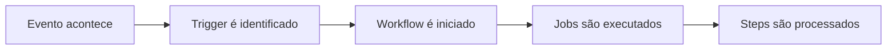
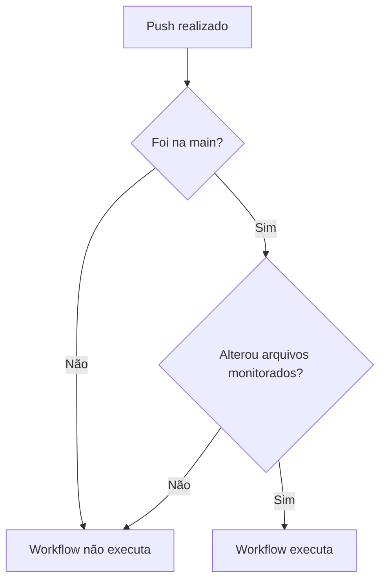
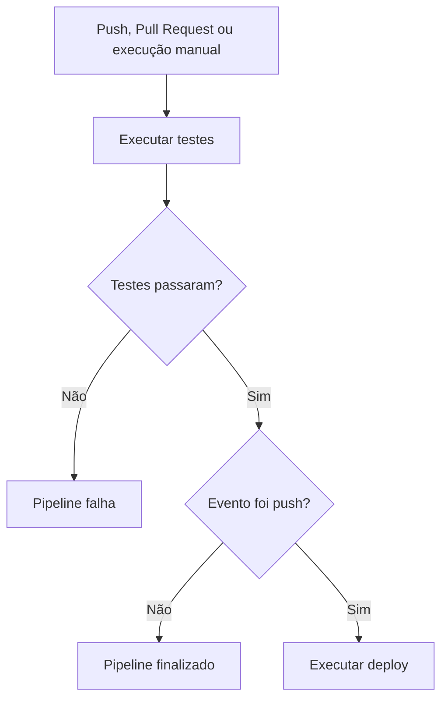

Um workflow do GitHub Actions precisa saber quando deverá ser executado.

Ele pode começar quando:

- alguém envia código para o repositório;
- um Pull Request é aberto;
- uma branch é criada;
- uma tag é excluída;
- chega um horário programado;
- alguém executa o workflow manualmente;
- uma regra de proteção é alterada.

Os eventos que iniciam um workflow são chamados de **triggers**, ou gatilhos.

No arquivo YAML, eles são configurados por meio da propriedade `on`.

```yaml
on:
  push:
```

Nesse exemplo, o workflow será iniciado quando acontecer um `push`.

# Estrutura de um workflow

Um workflow do GitHub Actions é criado dentro da pasta:

```text
.github/workflows/
```

Por exemplo:

```text
.github/workflows/pipeline.yml
```

Um workflow simples pode ser escrito assim:

```yaml
name: Primeiro workflow

on:
  push:

jobs:
  exemplo:
    runs-on: ubuntu-latest

    steps:
      - name: Exibir mensagem
        run: echo "O workflow foi executado"
```

A propriedade `on` define quando o workflow será executado.

A propriedade `jobs` define quais tarefas serão realizadas.



# Trigger `push`

O trigger `push` inicia o workflow quando commits ou tags são enviados para o repositório.

```yaml
on:
  push:
```

Com essa configuração, qualquer push poderá iniciar o workflow.

Por exemplo:

```bash
git add .
git commit -m "feat: adiciona tela de login"
git push origin main
```

Depois do push, o GitHub procura os workflows configurados com esse evento.

# Executando apenas em uma branch

Podemos limitar o workflow para uma branch específica:

```yaml
on:
  push:
    branches:
      - main
```

Agora o workflow será executado somente quando houver um push na `main`.

Também podemos acompanhar várias branches:

```yaml
on:
  push:
    branches:
      - main
      - develop
```

# Utilizando padrões de branches

Podemos utilizar padrões para acompanhar grupos de branches:

```yaml
on:
  push:
    branches:
      - main
      - "feature/**"
```

Esse padrão pode corresponder a branches como:

```text
feature/login
feature/cadastro
feature/pagamento/pix
```

Quando utilizamos caracteres como `*`, é recomendado colocar o valor entre aspas.

# Ignorando branches

Também podemos definir branches que não deverão iniciar o workflow:

```yaml
on:
  push:
    branches-ignore:
      - develop
      - "feature/**"
```

Nesse caso, pushes realizados na `develop` ou em branches `feature` serão ignorados.

# Executando workflows com tags

O evento `push` também pode acompanhar tags:

```yaml
on:
  push:
    tags:
      - "v*"
```

Esse workflow poderá ser iniciado por tags como:

```text
v1.0.0
v1.1.0
v2.0.0
```

Para criar e enviar uma tag:

```bash
git tag v1.0.0
git push origin v1.0.0
```

Esse tipo de trigger é comum em workflows utilizados para:

- criar releases;
- gerar artefatos;
- publicar pacotes;
- publicar imagens Docker;
- iniciar deploys.

Exemplo:

```yaml
name: Publicar versão

on:
  push:
    tags:
      - "v*"

jobs:
  release:
    runs-on: ubuntu-latest

    steps:
      - name: Baixar o código
        uses: actions/checkout@v4

      - name: Mostrar versão
        run: echo "Publicando a versão ${{ github.ref_name }}"
```

# Filtros por arquivos com `paths`

Nem toda alteração precisa executar todos os pipelines.

Imagine um repositório com:

```text
frontend/
backend/
infra/
docs/
.github/
```

Uma mudança apenas na documentação não precisa necessariamente executar os testes do back-end.

Podemos utilizar o filtro `paths`:

```yaml
on:
  push:
    branches:
      - main
    paths:
      - "backend/**"
      - ".github/workflows/**"
```

O workflow será executado quando:

1. o push acontecer na `main`;
2. algum arquivo de `backend` ou `.github/workflows` for modificado.



# Ignorando arquivos

Também podemos utilizar `paths-ignore`:

```yaml
on:
  push:
    paths-ignore:
      - "docs/**"
      - "**/*.md"
```

Nesse caso, alterações realizadas apenas em arquivos Markdown ou na pasta `docs` não iniciarão o workflow.

# Trigger `pull_request`

O evento `pull_request` inicia o workflow quando acontece alguma atividade relacionada a um Pull Request.

```yaml
on:
  pull_request:
```

Ele é bastante utilizado para:

- executar testes;
- validar o build;
- verificar a formatação;
- executar linters;
- encontrar vulnerabilidades;
- impedir o merge de código quebrado.

Exemplo:

```yaml
name: Validar Pull Request

on:
  pull_request:

jobs:
  test:
    runs-on: ubuntu-latest

    steps:
      - name: Baixar o código
        uses: actions/checkout@v4

      - name: Executar testes
        run: echo "Executando testes do Pull Request"
```

# Pull Request para uma branch específica

Podemos executar o workflow somente quando a branch de destino for a `main`:

```yaml
on:
  pull_request:
    branches:
      - main
```

Considere este Pull Request:

```text
feature/login → main
```

A origem é:

```text
feature/login
```

O destino é:

```text
main
```

No evento `pull_request`, o filtro `branches` considera a branch de destino.

# Tipos de atividade do Pull Request

Podemos controlar quais atividades iniciarão o workflow:

```yaml
on:
  pull_request:
    types:
      - opened
      - synchronize
      - reopened
```

Nesse exemplo, o workflow será iniciado quando o Pull Request for:

- aberto;
- atualizado com novos commits;
- reaberto.

Exemplo completo:

```yaml
name: Testes do Pull Request

on:
  pull_request:
    branches:
      - main
    types:
      - opened
      - synchronize
      - reopened

jobs:
  test:
    runs-on: ubuntu-latest

    steps:
      - name: Baixar o repositório
        uses: actions/checkout@v4

      - name: Executar testes
        run: echo "Validando o Pull Request"
```

# Filtrando arquivos no Pull Request

Também podemos utilizar `paths`:

```yaml
on:
  pull_request:
    branches:
      - main
    paths:
      - "backend/**"
```

O workflow será executado quando:

- o Pull Request tiver a `main` como destino;
- algum arquivo da pasta `backend` tiver sido modificado.

# Trigger `workflow_dispatch`

O trigger `workflow_dispatch` permite executar o workflow manualmente.

```yaml
on:
  workflow_dispatch:
```

Com ele, o workflow pode ser iniciado pela aba Actions do GitHub.

Esse trigger é útil para:

- realizar deploy manual;
- executar manutenção;
- gerar relatórios;
- limpar recursos;
- testar uma automação;
- iniciar uma tarefa sob demanda.

Exemplo:

```yaml
name: Workflow manual

on:
  workflow_dispatch:

jobs:
  executar:
    runs-on: ubuntu-latest

    steps:
      - name: Exibir mensagem
        run: echo "O workflow foi iniciado manualmente"
```

# Recebendo parâmetros manualmente

O `workflow_dispatch` também pode receber valores informados pelo usuário.

```yaml
name: Executar imagem Docker

on:
  workflow_dispatch:
    inputs:
      imagem:
        description: Imagem Docker que será utilizada
        required: true
        default: nginx:latest

jobs:
  executar:
    runs-on: ubuntu-latest

    steps:
      - name: Mostrar imagem
        run: echo "Imagem selecionada: ${{ inputs.imagem }}"
```

Ao iniciar o workflow manualmente, será possível informar qual imagem deve ser utilizada.

# Trigger `schedule`

O trigger `schedule` executa workflows em horários programados.

```yaml
on:
  schedule:
    - cron: "0 9 * * 1-5"
```

Nesse exemplo, o workflow será executado de segunda a sexta-feira, às 09:00 UTC.

Uma expressão cron possui cinco posições:

```text
┌──────────── minuto
│ ┌────────── hora
│ │ ┌──────── dia do mês
│ │ │ ┌────── mês
│ │ │ │ ┌──── dia da semana
│ │ │ │ │
0 9 * * 1-5
```

A expressão:

```text
0 9 * * 1-5
```

significa:

```text
minuto: 0
hora: 9
dia do mês: qualquer
mês: qualquer
dia da semana: segunda a sexta
```

Exemplo:

```yaml
name: Testes agendados

on:
  schedule:
    - cron: "0 9 * * 1-5"

jobs:
  test:
    runs-on: ubuntu-latest

    steps:
      - name: Baixar o código
        uses: actions/checkout@v4

      - name: Executar testes
        run: echo "Executando testes agendados"
```

Os horários configurados no `schedule` utilizam UTC.

# Trigger `create`

O evento `create` inicia um workflow quando uma referência Git é criada.

Essa referência pode ser:

- uma branch;
- uma tag.

```yaml
on:
  create:
```

Por exemplo, o evento poderá ocorrer quando uma nova branch for enviada:

```bash
git checkout -b feature/login
git push -u origin feature/login
```

Também poderá ocorrer ao enviar uma tag:

```bash
git tag v1.0.0
git push origin v1.0.0
```

Exemplo:

```yaml
name: Monitorar criação de referências

on:
  create:

jobs:
  audit:
    runs-on: ubuntu-latest

    steps:
      - name: Mostrar referência
        run: |
          echo "Referência: ${{ github.ref }}"
          echo "Tipo: ${{ github.ref_type }}"
```

# Trigger `delete`

O evento `delete` inicia um workflow quando uma branch ou tag é excluída.

```yaml
on:
  delete:
```

Por exemplo:

```bash
git push origin --delete feature/login
```

Esse trigger pode ser utilizado para:

- registrar exclusões;
- enviar notificações;
- remover ambientes temporários;
- apagar recursos ligados a uma feature;
- manter auditoria do repositório.

Exemplo:

```yaml
name: Monitorar exclusão de referências

on:
  delete:

jobs:
  audit:
    runs-on: ubuntu-latest

    steps:
      - name: Registrar exclusão
        run: |
          echo "Referência excluída: ${{ github.event.ref }}"
          echo "Tipo: ${{ github.event.ref_type }}"
```

# Trigger `branch_protection_rule`

O evento `branch_protection_rule` inicia um workflow quando uma regra de proteção é criada, alterada ou removida.

```yaml
on:
  branch_protection_rule:
```

Podemos definir os tipos de atividade:

```yaml
on:
  branch_protection_rule:
    types:
      - created
      - edited
      - deleted
```

Os tipos representam:

```text
created
└── regra criada

edited
└── regra modificada

deleted
└── regra removida
```

Esse evento pode ajudar na auditoria do repositório.

Exemplo:

```yaml
name: Auditoria da proteção de branches

on:
  branch_protection_rule:
    types:
      - created
      - edited
      - deleted

jobs:
  audit:
    runs-on: ubuntu-latest

    steps:
      - name: Mostrar alteração
        run: |
          echo "Uma regra de proteção foi alterada"
          echo "Ação: ${{ github.event.action }}"
```

# Combinando vários triggers

Um workflow pode possuir mais de um trigger.

```yaml
name: Pipeline principal

on:
  push:
    branches:
      - main

  pull_request:
    branches:
      - main

  workflow_dispatch:

jobs:
  validar:
    runs-on: ubuntu-latest

    steps:
      - name: Baixar o código
        uses: actions/checkout@v4

      - name: Executar validação
        run: echo "Validando o projeto"
```

Esse workflow poderá ser iniciado:

```text
por um push na main
        ou
por um Pull Request para a main
        ou
manualmente
```

# Identificando o evento que iniciou o workflow

Podemos descobrir qual trigger iniciou o workflow utilizando:

```yaml
${{ github.event_name }}
```

Exemplo:

```yaml
name: Identificar evento

on:
  push:
  pull_request:
  workflow_dispatch:

jobs:
  identificar:
    runs-on: ubuntu-latest

    steps:
      - name: Mostrar evento
        run: echo "Evento recebido: ${{ github.event_name }}"
```

O resultado poderá ser:

```text
push
```

```text
pull_request
```

```text
workflow_dispatch
```

# Executando passos conforme o trigger

Também podemos utilizar condições:

```yaml
name: Pipeline por evento

on:
  push:
    branches:
      - main

  pull_request:
    branches:
      - main

  workflow_dispatch:

jobs:
  pipeline:
    runs-on: ubuntu-latest

    steps:
      - name: Baixar o código
        uses: actions/checkout@v4

      - name: Executar testes
        run: echo "Executando testes"

      - name: Executar deploy
        if: github.event_name == 'push'
        run: echo "Executando deploy"
```

Nesse exemplo:

- os testes são executados em todos os eventos;
- o deploy é executado somente quando o evento for `push`.

# Exemplo de pipeline completo

```yaml
name: Pipeline da aplicação

on:
  push:
    branches:
      - main
    paths:
      - "src/**"
      - "package.json"
      - "package-lock.json"

  pull_request:
    branches:
      - main
    paths:
      - "src/**"
      - "package.json"
      - "package-lock.json"

  workflow_dispatch:

jobs:
  test:
    runs-on: ubuntu-latest

    steps:
      - name: Baixar o código
        uses: actions/checkout@v4

      - name: Configurar Node.js
        uses: actions/setup-node@v4
        with:
          node-version: 22

      - name: Instalar dependências
        run: npm ci

      - name: Executar testes
        run: npm test

  deploy:
    if: github.event_name == 'push'
    needs: test
    runs-on: ubuntu-latest

    steps:
      - name: Realizar deploy
        run: echo "Realizando deploy da aplicação"
```

O fluxo desse pipeline será:



# Resumo dos principais triggers

| Trigger | Quando é executado |
|---|---|
| `push` | Quando commits ou tags são enviados |
| `pull_request` | Quando ocorre uma atividade em um Pull Request |
| `workflow_dispatch` | Quando o workflow é iniciado manualmente |
| `schedule` | Quando chega um horário programado |
| `create` | Quando uma branch ou tag é criada |
| `delete` | Quando uma branch ou tag é excluída |
| `branch_protection_rule` | Quando uma regra de proteção é alterada |

# Boas práticas

Evite executar todos os workflows em qualquer alteração.

Em vez de:

```yaml
on:
  push:
```

Podemos ser mais específicos:

```yaml
on:
  push:
    branches:
      - main
    paths:
      - "backend/**"
```

Também é interessante separar os workflows de acordo com suas responsabilidades.

Um workflow de testes pode utilizar:

```yaml
on:
  pull_request:
```

Um workflow de deploy pode utilizar:

```yaml
on:
  push:
    branches:
      - main
```

Uma manutenção manual pode utilizar:

```yaml
on:
  workflow_dispatch:
```

Dessa forma, cada pipeline será executado apenas quando realmente necessário.

# Conclusão

Os triggers definem quando um workflow do GitHub Actions deverá ser executado.

O `push` reage ao envio de commits ou tags. O `pull_request` permite validar alterações antes do merge. O `workflow_dispatch` oferece execução manual, enquanto o `schedule` permite criar automações programadas.

Eventos como `create`, `delete` e `branch_protection_rule` também podem ser utilizados para auditoria, segurança e gerenciamento do repositório.

Com filtros de branches e caminhos, conseguimos controlar exatamente quando o workflow deverá rodar:

```yaml
on:
  push:
    branches:
      - main
    paths:
      - "backend/**"
```

Assim, o pipeline deixa de executar por qualquer mudança e passa a responder apenas aos eventos importantes para o projeto.