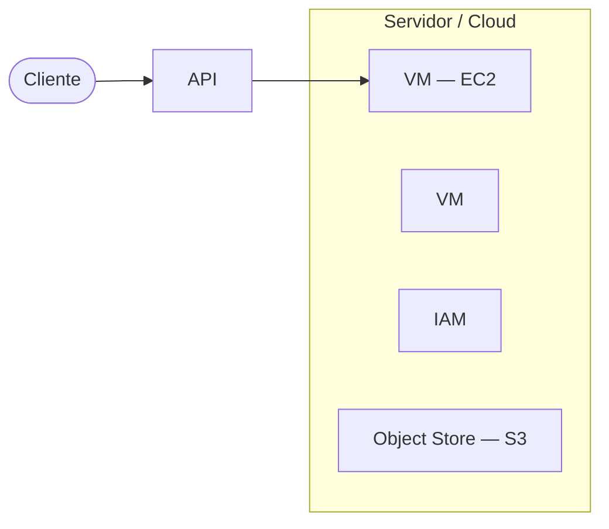
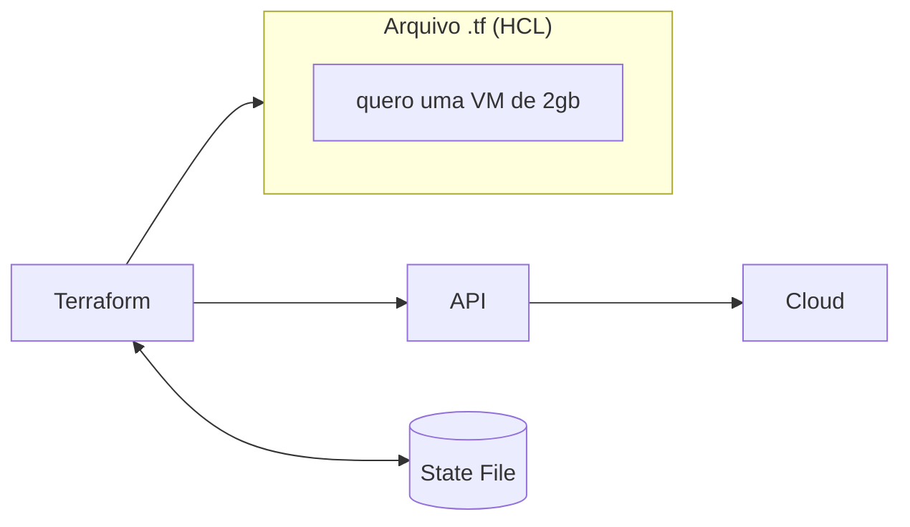

Comecei o curso de **Infraestrutura como Código (IaC)** da LINUXtips e, antes de escrever a primeira linha de HCL, o curso para num ponto que faz todo sentido: para entender o que o Terraform faz, primeiro é preciso entender o que é uma API e o que é Cloud. Sem isso, "Terraform fala com a AWS por trás dos panos" é só uma frase decorada, não algo que eu realmente entendo.

Essas são as anotações da primeira semana: da API até o workflow `write / plan / apply` do Terraform.

# O que é uma API

Uma **API** (*Application Programming Interface*) é uma forma padronizada de permitir que um sistema converse com outro sistema.

A analogia que ficou: pensa numa API como um garçom.

* Você → faz um pedido
* API → leva o pedido para o sistema
* Sistema → processa o pedido
* API → devolve a resposta para você

Um exemplo prático: um aplicativo de previsão do tempo não precisa saber como o serviço meteorológico calcula nada internamente. Ele só faz uma requisição:

```text
GET /weather?city=Rio-Branco
```

E recebe uma resposta:

```json
{
  "city": "Rio Branco",
  "temperature": 28,
  "condition": "Ensolarado"
}
```

De forma resumida: **API = uma interface que define como sistemas podem solicitar informações ou executar ações uns nos outros.** Ela normalmente define:

* **Endpoint**: onde fazer a requisição
* **Método**: `GET`, `POST`, `PUT`, `DELETE`
* **Parâmetros**: informações enviadas
* **Autenticação**: quem pode acessar
* **Resposta**: geralmente em JSON
* **Status HTTP**: `200`, `404`, `500`, etc.

Um exemplo mais próximo do dia a dia de backend, num sistema de banco:

```text
POST /usuarios
```

Você envia os dados do usuário → a API processa → o backend salva no banco → a API retorna o resultado.

**Backend + API + Banco de Dados** formam uma combinação extremamente comum no desenvolvimento moderno  e é exatamente essa combinação que existe do outro lado quando o Terraform "conversa" com uma cloud.




# O que é Cloud, na prática

**Cloud** é, de forma simplificada, uma série de datacenters disponíveis para uso, com uma infraestrutura acessível por meio de uma API. Esses recursos podem incluir:

* máquinas virtuais
* armazenamento
* redes
* banco de dados
* serviços gerenciados
* ferramentas de segurança
* APIs de automação

Na prática, empresas como AWS, Google Cloud e Microsoft Azure possuem uma infraestrutura enorme, com diversas máquinas e serviços disponíveis para uso. O grande diferencial de uma cloud é que esses recursos podem ser criados, modificados e removidos **por meio de uma API**.

## A importância da API para entender a Cloud

A API é uma das partes mais importantes para entender o funcionamento de uma cloud. Quando você acessa o console web da AWS, aquela interface também se comunica com a API da AWS por trás dos panos. Da mesma forma, ferramentas como o Terraform também se comunicam com essa mesma API para criar, alterar ou remover recursos.

Ou seja, existem várias formas diferentes de interagir com uma cloud, mas todas elas passam pelo mesmo lugar no fim:

* usando o console web
* usando ferramentas de linha de comando (CLI)
* usando SDKs
* usando ferramentas de infraestrutura como código, como o Terraform

No caso do Terraform, ele lê a configuração escrita em código e usa a API da cloud para aplicar as mudanças necessárias.

# Serviços de Cloud (AWS)

Uma cloud oferece vários serviços diferentes. Na AWS, alguns dos serviços mais importantes para este curso são:

## EC2

O **EC2** é o serviço da AWS usado para criar e gerenciar máquinas virtuais. Quando você precisa criar uma instância, escolhe o tipo de máquina, define sistema operacional, rede e outros detalhes. Esse processo pode ser feito pelo console da AWS ou por meio da API.

Com Terraform, esse processo passa a ser descrito em código: em vez de criar uma máquina manualmente pelo console, você declara a máquina desejada e o Terraform solicita a criação desse recurso para a AWS.

## S3

O **S3** é um serviço de armazenamento de objetos. De forma simplificada, ele pode ser entendido como um local onde você consegue armazenar arquivos.

> No curso, o S3 será importante porque pode ser usado para guardar o **state file** do Terraform.

## IAM

O **IAM** (*Identity and Access Management*) é o serviço da AWS usado para gerenciar acesso e permissões. Com o IAM é possível criar:

* usuários
* grupos
* roles
* políticas de permissão
* credenciais de acesso

> No contexto do curso, o IAM será usado para criar um usuário e gerar credenciais que permitam ao Terraform se comunicar com a API da AWS. Essas credenciais funcionam como uma forma de autenticação para que o Terraform consiga criar, alterar ou remover recursos da conta.

# Regiões e zonas de disponibilidade

As **regiões** representam localizações geográficas onde a cloud possui infraestrutura disponível. Na AWS, alguns exemplos são: Norte da Virgínia, Ohio, Oregon, Norte da Califórnia, Canadá e São Paulo.

Ao criar recursos numa cloud, normalmente é necessário escolher em qual região eles serão criados. Essa escolha pode influenciar fatores como latência, disponibilidade, custo e proximidade com os usuários da aplicação.

Dentro de uma região existem as **zonas de disponibilidade**. As zonas são divisões menores dentro de uma região. Uma forma simples de entender é imaginar uma zona como algo próximo da ideia de um datacenter  não é totalmente correto dizer que uma zona é sempre um único datacenter, mas essa analogia ajuda a entender o conceito. Por exemplo, dentro de uma região podem existir as zonas A, B e C.

Ao criar determinados recursos, como máquinas virtuais, pode ser necessário definir em qual região **e** em qual zona eles serão criados.

## Por que entender esses conceitos

Esses conceitos são importantes porque o Terraform precisa saber onde e como criar os recursos. Ao trabalhar com cloud, precisamos entender pelo menos os conceitos de **API, serviço, região, zona, credenciais, permissão e armazenamento remoto**. Esses elementos aparecem com frequência no uso do Terraform em ambientes reais.

# O que é o Terraform

O **Terraform** é uma ferramenta de infraestrutura como código (*Infrastructure as Code*) que permite construir, alterar e versionar recursos de infraestrutura de forma segura e eficiente, tanto em nuvem quanto em ambientes on-premise.

Na prática, ele funciona como um binário executado na linha de comando. Esse binário lê arquivos de configuração escritos em **HCL** (*HashiCorp Configuration Language*) e, por meio de *providers*, se comunica com as APIs dos serviços para criar, modificar ou remover recursos.

Em vez de executar passos manuais dizendo exatamente como cada ação deve acontecer, você descreve o **estado desejado** da infraestrutura. Por exemplo: você informa que deseja uma máquina virtual com determinadas características, e o Terraform interpreta essa configuração para criar ou ajustar esse recurso no provider escolhido.

O Terraform lê o arquivo HCL da pasta onde foi chamado  todo arquivo com extensão `.tf` usa o **state file** para saber o que já existe, e usa esse conteúdo para falar com a API da cloud.



> Código-fonte do Terraform: [github.com/hashicorp/terraform](https://github.com/hashicorp/terraform)

## Arquitetura do Terraform: Core e Plugins

O Terraform é construído sobre uma arquitetura baseada em plugins e é logicamente dividido em duas partes principais.

### Terraform Core

O Terraform Core é um binário compilado, escrito em Go. Suas principais responsabilidades são:

* ler e interpretar arquivos de configuração e módulo
* gerenciar o estado dos recursos (*state*)
* executar o plano de ação

### Terraform Plugins (providers)

Os *providers* são binários executáveis que o Core invoca via RPC (*Remote Procedure Call*). Cada plugin implementa a lógica para interagir com um serviço específico como: AWS, Azure, GCP, Kubernetes, GitHub, Datadog e muitos outros.

As responsabilidades dos providers são:

* inicialização de bibliotecas para chamadas à API
* autenticação com o provedor de infraestrutura
* definição de recursos gerenciados e *data sources*
* funções auxiliares para simplificar a lógica nas configurações

A HashiCorp e a comunidade já escreveram milhares de providers disponíveis publicamente no [Terraform Registry](https://registry.terraform.io/).

# HCL e configuração declarativa

Os arquivos do Terraform são escritos em **HCL** (*HashiCorp Configuration Language*), uma linguagem de configuração de alto nível também utilizada por outros produtos da HashiCorp.

A sintaxe da linguagem é construída em torno de dois conceitos principais:

* **Argumentos**: atribuem um valor a um nome. Exemplo: `image_id = "abc123"`
* **Blocos**: são containers para outros conteúdos. Um bloco tem um tipo, *labels* e um corpo delimitado por `{ }`.

```hcl
resource "aws_instance" "exemplo" {
  # argumentos dentro do bloco
}
```

## Como o Terraform se comunica com os providers

O Terraform se conecta a diferentes tipos de provedores: cloud, plataformas SaaS, ferramentas de monitoramento e outros serviços que oferecem integração via API.

O Terraform é **agnóstico em relação a provedores** (*cloud-agnostic*), permitindo combinar múltiplos providers e serviços numa única configuração. Por exemplo, é possível orquestrar simultaneamente um cluster AWS e OpenStack, enquanto integra providers de terceiros como Cloudflare e DNSimple para fornecer serviços de CDN e DNS.

Essa comunicação permite que uma mesma ferramenta seja usada para gerenciar diferentes tipos de infraestrutura e serviços. O Terraform usa um modelo baseado em plugins para suportar providers e *provisioners*, dando a ele a capacidade de suportar quase qualquer serviço que exponha uma API.

# O papel do State File

Um conceito essencial no Terraform é o **State File** (arquivo de estado). O state é um requisito necessário para o funcionamento do Terraform, e ele serve três propósitos principais:

## 1. Mapeamento para o mundo real

O Terraform precisa de um banco de dados para mapear cada recurso da configuração ao objeto real existente na nuvem. Por exemplo, quando você tem o `resource "aws_instance" "foo"` na configuração, o Terraform usa esse mapeamento para saber que esse recurso representa uma instância com o ID `i-abcd1234`.

## 2. Metadados

O Terraform também precisa rastrear a dependência entre recursos. Quando você remove um recurso da configuração, o Terraform precisa saber como destruí-lo corretamente, já que a configuração não existe mais e a ordem de destruição não pode ser determinada apenas pelo código. O state mantém uma cópia das dependências mais recentes para garantir a ordem correta.

## 3. Performance

O Terraform armazena um cache dos valores dos atributos de todos os recursos no state, o que melhora a performance durante o planejamento.

O state file é uma peça importante para que o Terraform consiga acompanhar o estado da infraestrutura ao longo do tempo  e é justamente por isso que ele não deve ficar apenas na máquina local de uma pessoa, e sim num local remoto e compartilhado, como um bucket S3.

# O workflow do Terraform

O fluxo de trabalho central do Terraform consiste em três etapas:

## 1. Write (escrever)

Definimos os recursos em arquivos de configuração HCL, que podem abranger múltiplos providers e serviços. Por exemplo, você pode criar uma configuração para implantar uma aplicação em máquinas virtuais dentro de uma VPC, com *security groups* e um *load balancer*.

```hcl
resource "aws_vpc" "minha-vpc" {
  cidr_block = "10.0.0.0/16"

  tags = {
    Name = "minha-vpc"
  }
}
```

> **VPC** (*Virtual Private Cloud*) é uma rede virtual privada criada dentro de uma nuvem, como a AWS. Resumindo: a VPC é como a rede local da sua casa ou empresa, só que dentro da AWS.
>
> O Terraform não é a VPC  ele é a ferramenta que descreve e cria essa infraestrutura automaticamente.

## 2. Plan (planejar)

O Terraform cria um plano de execução descrevendo a infraestrutura que será criada, atualizada ou destruída, com base na infraestrutura existente e na sua configuração.

## 3. Apply (aplicar)

Após aprovação, o Terraform executa as operações propostas na ordem correta, respeitando as dependências entre recursos. Por exemplo, se você atualizar as propriedades de uma VPC e alterar o número de VMs nela, o Terraform recriará a VPC antes de escalar as VMs.

# Casos de uso do Terraform

* **Multi-Cloud Deployment**: provisionamento de infraestrutura em múltiplas nuvens, aumentando a tolerância a falhas e permitindo recuperação mais graciosa de interrupções. O Terraform permite usar o mesmo workflow para gerenciar múltiplos providers e lidar com dependências entre clouds.
* **Application Infrastructure Deployment, Scaling and Monitoring**: implantação, escalonamento e monitoramento de infraestrutura para aplicações *multi-tier*. O Terraform gerencia os recursos de cada camada em conjunto e lida automaticamente com as dependências entre elas.
* **Self-Service Clusters**: construção de um modelo de infraestrutura *self-service* que permite que times de produto gerenciem sua própria infraestrutura de forma independente, usando módulos que codificam os padrões da organização.

Além disso, o Terraform pode ser usado para:

* provisionamento de infraestrutura em cloud e ambientes multi-cloud
* criação de recursos em plataformas SaaS
* automação de ferramentas de monitoramento
* criação de módulos reutilizáveis
* provisionamento de clusters e ambientes padronizados

Embora o uso em cloud seja um dos exemplos mais comuns, o Terraform não se limita apenas a isso.

## Infraestrutura mutável vs. imutável

**Mutável**: o mesmo servidor é alterado ao longo do tempo, podendo virar um *snowflake*  único e difícil de reproduzir.

**Imutável**: em vez de alterar o servidor, cria-se outro já atualizado e substitui-se o antigo. É mais seguro e fácil de reproduzir.

## Onde o Terraform entra

O Terraform ajuda a tornar viável o uso de infraestrutura imutável:

* definindo e gerenciando infraestrutura de forma consistente e repetível
* usando arquivos de configuração legíveis por humanos, que podem ser versionados, reutilizados e compartilhados
* gerenciando componentes de baixo nível (computação, armazenamento, rede) e de alto nível (DNS, funcionalidades SaaS)

O objetivo é sair de um modelo baseado em alterações manuais e avançar para um modelo mais previsível, automatizado e reproduzível.

# Resumo

* **API**: interface padronizada para sistemas se comunicarem (endpoint, método, parâmetros, autenticação, resposta)
* **Cloud**: datacenters cujos recursos (VMs, storage, redes, bancos, serviços gerenciados) são acessíveis via API
* **EC2 / S3 / IAM**: máquinas virtuais, armazenamento de objetos e gerenciamento de acesso na AWS
* **Região / Zona de disponibilidade**: onde a infraestrutura é criada geograficamente e em qual subdivisão
* **Terraform**: ferramenta de IaC dividida em Core (lê configuração, gerencia state, executa o plano) e Plugins/providers (falam com a API de cada serviço via RPC)
* **HCL**: linguagem declarativa do Terraform, baseada em argumentos e blocos
* **State file**: mapeia código ↔ recurso real, rastreia dependências e melhora performance  deve viver remoto e compartilhado
* **Workflow**: Write → Plan → Apply
* **Infraestrutura imutável**: substituir em vez de alterar, mais fácil de reproduzir

# Próximos passos

O curso segue com a parte prática: criar conta na AWS → criar um usuário no IAM → criar um bucket S3 → bloquear o acesso público do bucket, com atenção redobrada ao lidar com as credenciais geradas no IAM.

# Conclusão

O que fica dessas duas semanas de anotações é que o Terraform não é mágica: ele é só mais um cliente conversando com a API de uma cloud, do mesmo jeito que o console web ou uma chamada `GET /weather` conversam com uma API. A diferença é que, em vez de clicar em botões, você descreve o estado desejado em HCL, e o Core faz a ponte com o provider certo para chegar lá  guardando esse mapeamento no state file para saber, da próxima vez, o que já existe e o que ainda falta mudar.

Entender API e Cloud antes do Terraform em si evitou que os próximos passos (state remoto, providers, workflow `plan`/`apply`) virassem só "comandos que eu decorei"  agora tem um motivo claro por trás de cada peça.

## Referências

* [HashiCorp Developer  What is Terraform?](https://developer.hashicorp.com/terraform/intro)  visão geral oficial sobre o que o Terraform é e para que serve.
* [HashiCorp Developer  HCL Syntax](https://developer.hashicorp.com/terraform/language/syntax/configuration) referência da sintaxe da linguagem de configuração.
* [HashiCorp Developer  Terraform state](https://developer.hashicorp.com/terraform/language/state)  documenta a finalidade e o funcionamento do state, aprofundado em [Terraform state: o arquivo que pode derrubar sua infra](/posts/terraform-state-primeiros-passos).
* [Terraform Registry](https://registry.terraform.io/)  catálogo público de providers e módulos mantidos pela HashiCorp e pela comunidade.
* [github.com/hashicorp/terraform](https://github.com/hashicorp/terraform)  código fonte do Terraform Core.
* [AWS O que é o Amazon EC2?](https://docs.aws.amazon.com/pt_br/AWSEC2/latest/UserGuide/concepts.html)  documentação oficial do serviço de máquinas virtuais.
* [AWS O que é o Amazon S3?](https://docs.aws.amazon.com/pt_br/AmazonS3/latest/userguide/Welcome.html)  documentação oficial do serviço de armazenamento de objetos.
* [AWS O que é o IAM?](https://docs.aws.amazon.com/pt_br/IAM/latest/UserGuide/introduction.html)  documentação oficial do serviço de identidade e acesso.
* [LINUXtips Treinamentos Essentials](https://linuxtips.io/treinamentos-essentials/) página do curso de IaC/Terraform utilizado como base dos meus estudos e destas anotações.
