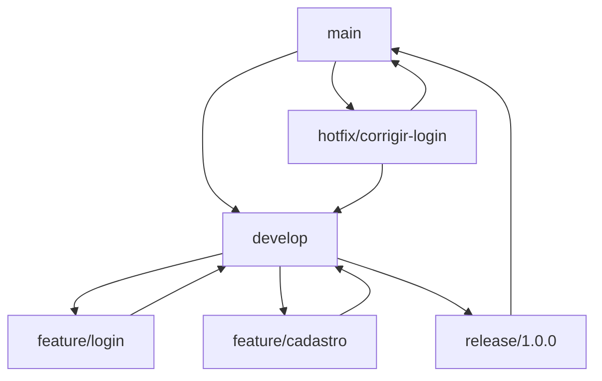
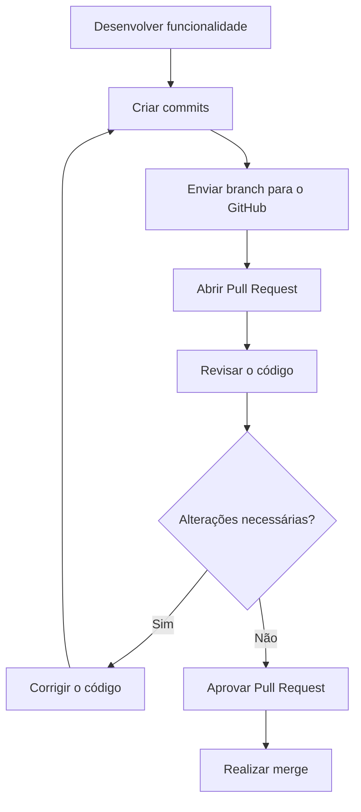
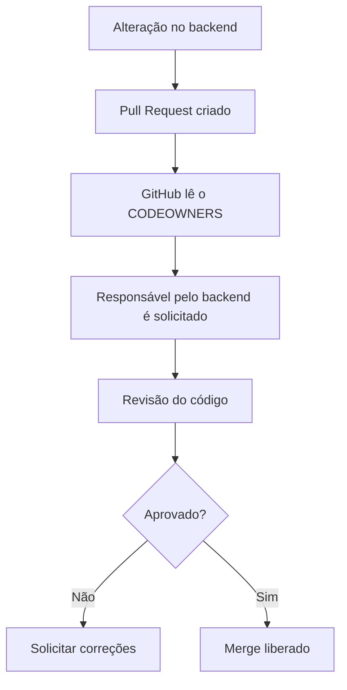
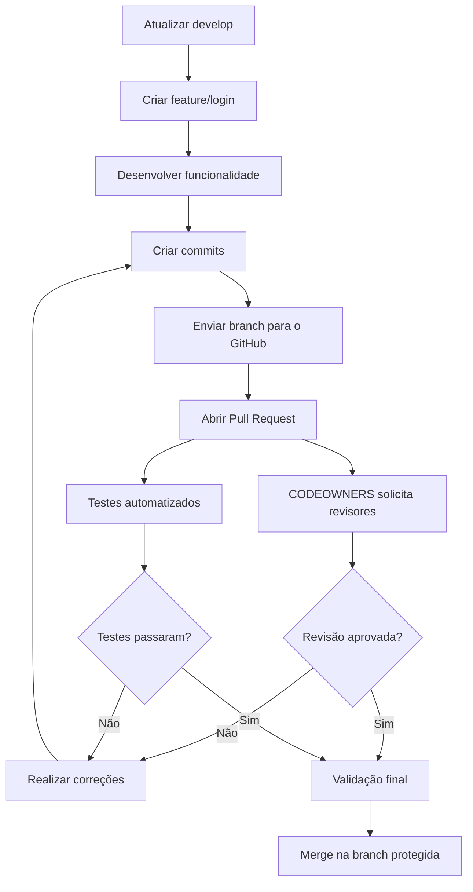

Quando trabalhamos sozinhos em um projeto pequeno, é comum realizar todas as alterações diretamente na branch principal.

O fluxo normalmente fica assim:

```bash
git add .
git commit -m "adiciona nova funcionalidade"
git push origin main
```

Esse processo pode funcionar em projetos pessoais, mas começa a apresentar problemas quando várias pessoas trabalham no mesmo repositório.

Imagine uma equipe em que:

- uma pessoa trabalha no front-end;
- outra desenvolve o back-end;
- outra cuida da infraestrutura;
- outra configura os workflows do GitHub Actions.

Se todos enviarem alterações diretamente para a `main`, aumentam as chances de conflitos, falhas e código sem revisão chegar à produção.

Para organizar esse processo, podemos utilizar:

- GitFlow;
- branches de funcionalidades;
- Pull Requests;
- proteção de branches;
- CODEOWNERS.

# O que é GitFlow?

O `GitFlow` é um modelo de organização de branches no Git.

Ele define uma forma padronizada de separar o código que está em produção, o código que está sendo desenvolvido e as funcionalidades que ainda estão em construção.

No modelo tradicional, as principais branches são:

```text
main
develop
feature
release
hotfix
```

Cada uma possui uma responsabilidade diferente.

# Branch `main`

A branch `main` representa o código estável do projeto.

Normalmente, ela contém a versão que está pronta para produção ou que já está publicada.

```text
main
└── versão estável do projeto
```

Por esse motivo, não é recomendado desenvolver funcionalidades diretamente nela.

A `main` deve receber apenas alterações que já foram:

- desenvolvidas;
- revisadas;
- testadas;
- aprovadas.

# Branch `develop`

A branch `develop` reúne as funcionalidades que estão sendo preparadas para a próxima versão.

```text
develop
└── próxima versão do projeto
```

As diferentes branches de funcionalidades são integradas na `develop`.

Quando a próxima versão estiver estável, ela poderá seguir para uma branch de release ou ser integrada na `main`, dependendo do fluxo adotado pelo projeto.

# Branches `feature`

As branches `feature` são utilizadas para desenvolver novas funcionalidades.

Por exemplo:

```text
feature/login
```

```text
feature/login-google
```

```text
feature/cadastro-usuario
```

Cada funcionalidade é desenvolvida de forma isolada.

Isso permite que uma pessoa trabalhe na tela de login enquanto outra desenvolve o cadastro, sem que uma alteração interfira diretamente na outra.

Um fluxo comum seria:

```text
develop
   └── feature/login
```

Depois que a funcionalidade estiver pronta, ela retorna para a `develop` por meio de um Pull Request.

# Criando uma branch de funcionalidade

Primeiro, acessamos a branch de desenvolvimento:

```bash
git checkout develop
```

Atualizamos o código local:

```bash
git pull origin develop
```

Depois, criamos a nova branch:

```bash
git checkout -b feature/login
```

Também podemos utilizar o comando mais recente:

```bash
git switch -c feature/login
```

Após desenvolver a funcionalidade, adicionamos os arquivos:

```bash
git add .
```

Criamos o commit:

```bash
git commit -m "feat: adiciona tela de login"
```

E enviamos a branch para o repositório remoto:

```bash
git push -u origin feature/login
```

Agora a branch estará disponível no GitHub.

# Branches `release`

As branches `release` são utilizadas para preparar uma nova versão do projeto.

Exemplo:

```text
release/1.2.0
```

Nessa etapa, normalmente não são adicionadas grandes funcionalidades.

A branch é utilizada para:

- realizar testes finais;
- corrigir pequenos problemas;
- atualizar a versão do projeto;
- preparar a documentação;
- validar a publicação.

Quando a versão estiver pronta, ela pode ser integrada na `main`.

# Branches `hotfix`

As branches `hotfix` são utilizadas para corrigir problemas urgentes que já estão em produção.

Exemplo:

```text
hotfix/corrigir-login
```

Como o problema está acontecendo na versão atual do sistema, a branch geralmente é criada a partir da `main`.

```bash
git checkout main
git pull origin main
git checkout -b hotfix/corrigir-login
```

Depois da correção:

```bash
git add .
git commit -m "fix: corrige erro no login"
git push -u origin hotfix/corrigir-login
```

A correção poderá ser integrada novamente na `main` e também na `develop`, evitando que o problema reapareça na próxima versão.

# Visão geral do GitFlow

O fluxo pode ser representado da seguinte forma:



A ideia principal é separar cada tipo de alteração.

```text
main
└── código estável

develop
└── próxima versão

feature/*
└── novas funcionalidades

release/*
└── preparação de versões

hotfix/*
└── correções urgentes
```

# O que é um Pull Request?

Um `Pull Request`, também conhecido como `PR`, é uma proposta para integrar as alterações de uma branch em outra.

Por exemplo:

```text
feature/login → develop
```

Nesse caso, estamos propondo que o código desenvolvido na branch `feature/login` seja integrado na branch `develop`.

Em projetos que não utilizam a branch `develop`, o fluxo pode ser:

```text
feature/login → main
```

O Pull Request cria uma etapa de revisão antes do merge.

Outras pessoas podem:

- analisar as alterações;
- deixar comentários;
- solicitar correções;
- verificar os testes;
- aprovar o código;
- bloquear o merge caso exista algum problema.

# Criando um Pull Request

Depois de enviar a branch:

```bash
git push -u origin feature/login
```

Podemos abrir um Pull Request no GitHub.

Nesse Pull Request, escolhemos:

```text
base: develop
compare: feature/login
```

Isso significa:

```text
branch de destino: develop
branch de origem: feature/login
```

O título poderia ser:

```text
feat: adiciona tela de login
```

E a descrição poderia explicar:

```markdown
## O que foi desenvolvido?

Foi criada a tela de login da aplicação.

## Alterações

- criação do formulário;
- validação dos campos;
- integração com a API;
- tratamento de mensagens de erro.

## Como testar?

1. Execute a aplicação.
2. Acesse `/login`.
3. Informe um usuário válido.
4. Verifique o redirecionamento.
```

Uma boa descrição facilita bastante o trabalho de quem revisará o código.

# Fluxo de um Pull Request



O Pull Request não é apenas um botão para juntar branches.

Ele também serve como:

- histórico de decisões;
- espaço de discussão;
- processo de revisão;
- registro das alterações;
- ponto de integração com testes automatizados.

# O que é proteção de branches?

A proteção de branches é um conjunto de regras utilizado para impedir mudanças perigosas em branches importantes.

Normalmente, protegemos branches como:

```text
main
develop
```

Sem uma regra de proteção, alguém poderia executar:

```bash
git push origin main
```

Isso permitiria enviar código diretamente para a branch principal, sem revisão e sem testes.

Em uma equipe, esse tipo de alteração pode quebrar a aplicação para todos.

# Regras de proteção da branch

As regras de proteção podem exigir que:

- as mudanças sejam enviadas por Pull Request;
- o Pull Request tenha uma ou mais aprovações;
- os testes do projeto sejam aprovados;
- a branch esteja atualizada antes do merge;
- todos os comentários sejam resolvidos;
- o código não tenha conflitos;
- determinados responsáveis revisem o código;
- commits sejam assinados;
- a branch não possa ser excluída;
- pushes diretos sejam bloqueados.

Um fluxo protegido pode funcionar assim:

```text
feature/login
      ↓
Pull Request
      ↓
Revisão do código
      ↓
Testes automatizados
      ↓
Aprovação
      ↓
Merge na main
```

# Por que proteger a `main`?

A branch principal representa a versão mais importante do repositório.

Se qualquer pessoa puder alterá-la diretamente, podem acontecer problemas como:

- código quebrado;
- funcionalidades incompletas;
- credenciais expostas;
- testes ignorados;
- arquivos importantes excluídos;
- conflitos difíceis de resolver;
- falhas em produção.

A proteção da branch transforma a `main` em uma área controlada.

Ninguém entra pela janela. Todo mundo passa pelo Pull Request.

# Exemplo de regra para a `main`

Uma configuração comum pode exigir:

```text
Exigir Pull Request antes do merge
Exigir pelo menos uma aprovação
Exigir que os testes passem
Exigir que os comentários sejam resolvidos
Bloquear push direto
Impedir exclusão da branch
```

Com isso, mesmo que alguém tente executar:

```bash
git push origin main
```

o GitHub poderá bloquear a operação.

# O que é CODEOWNERS?

O arquivo `CODEOWNERS` permite definir responsáveis por diferentes partes do projeto.

Ele informa ao GitHub quem deve revisar uma alteração dependendo dos arquivos modificados.

Podemos entender sua função assim:

> Quando alguém alterar esta parte do projeto, solicite a revisão destas pessoas.

O arquivo pode ser criado em:

```text
.github/CODEOWNERS
```

# Exemplo de CODEOWNERS

Imagine um projeto com esta estrutura:

```text
frontend/
backend/
infra/
docs/
.github/
```

O arquivo poderia ser:

```text
*                     @cesarsantos96
/frontend/            @dev-frontend
/backend/             @dev-backend
/infra/               @dev-infra
/docs/                 @cesarsantos96
/.github/              @cesarsantos96
```

Nesse exemplo:

- mudanças no front-end solicitam o responsável pelo front-end;
- mudanças no back-end solicitam o responsável pelo back-end;
- alterações na infraestrutura solicitam o responsável pela infraestrutura;
- mudanças nos workflows solicitam uma revisão específica;
- o `*` define um responsável padrão.

# Utilizando equipes no CODEOWNERS

Em uma organização do GitHub, também podemos utilizar equipes:

```text
/frontend/     @empresa/time-frontend
/backend/      @empresa/time-backend
/infra/        @empresa/time-devops
/.github/      @empresa/time-devops
```

Assim, quando alguém alterar um arquivo dentro de `backend`, o GitHub poderá solicitar automaticamente a revisão do time responsável.

# CODEOWNERS e proteção de branches

O `CODEOWNERS` fica ainda mais útil quando é utilizado junto com regras de proteção.

A regra pode exigir aprovação dos responsáveis definidos no arquivo.

O fluxo passa a funcionar assim:



# Fluxo completo

Utilizando GitFlow, Pull Requests, proteção de branches e CODEOWNERS, o processo pode ficar assim:



Cada ferramenta possui uma responsabilidade:

```text
GitFlow
└── organiza as branches

Pull Request
└── organiza a revisão e a integração

Branch Protection
└── define regras obrigatórias

CODEOWNERS
└── define quem deve revisar
```

# Conclusão

O GitFlow ajuda a organizar o desenvolvimento por meio de branches com responsabilidades diferentes.

As branches `feature` isolam novas funcionalidades. As branches `release` preparam novas versões, enquanto as branches `hotfix` corrigem problemas urgentes em produção.

Os Pull Requests criam uma etapa de revisão antes da integração do código.

As regras de proteção impedem alterações diretas em branches importantes, e o arquivo `CODEOWNERS` ajuda a encaminhar cada mudança para os responsáveis corretos.

Quando essas ferramentas são utilizadas em conjunto, o desenvolvimento se torna mais organizado, seguro e previsível.

O código deixa de seguir este caminho:

```text
alteração → main
```

E passa a seguir um processo controlado:

```text
branch → commit → Pull Request → revisão → testes → aprovação → merge
```