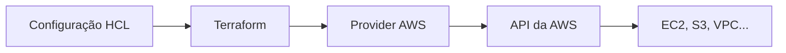

O Terraform consegue descrever recursos de AWS, Azure, Google Cloud, Kubernetes, bancos de dados, plataformas SaaS e muitas outras APIs. Mas o binário do Terraform não conhece todos esses sistemas sozinho. A integração acontece por meio dos **providers**.

# O que é um provider

Um provider é um plugin que permite ao Terraform conversar com um sistema externo. Ele implementa os tipos de recurso e data sources daquela plataforma e traduz as operações do Terraform em chamadas à API correspondente.



O provider da AWS entende recursos como `aws_instance` e `aws_s3_bucket`. O provider do Kubernetes entende objetos da API do cluster. Já um provider de banco de dados pode administrar usuários, permissões e configurações expostas por aquele sistema.

O provider não é a própria nuvem nem armazena os recursos: ele é a ponte que sabe autenticar, montar requisições e interpretar respostas.

# Onde encontrar providers

O local recomendado para pesquisar providers públicos é o [Terraform Registry](https://registry.terraform.io/browse/providers). A página de cada provider reúne:

* documentação de recursos e data sources
* versões disponíveis
* exemplos de configuração
* argumentos aceitos
* mecanismos de autenticação suportados
* namespace da organização responsável pela publicação

Sempre que possível, a documentação do provider deve ser a fonte principal durante a escrita da configuração. A interface de cada serviço é diferente, então não existe uma lista universal de argumentos que funcione para todos.

# Categorias no Registry

O Registry usa selos para indicar quem publica e mantém cada provider:

* **Official**: mantido pela HashiCorp ou por organizações indicadas como oficiais no Registry
* **Partner** e **Partner Premier**: mantido por empresas participantes dos programas de parceiros da HashiCorp
* **Community**: publicado por pessoas ou organizações da comunidade
* **Archived**: provider que deixou de receber manutenção

Um provider da comunidade pode ser útil e bem mantido, mas a decisão exige verificar documentação, frequência de releases, repositório e issues abertas. Providers arquivados merecem cuidado adicional e não são uma boa escolha para projetos novos sem uma análise consciente do risco.

# Declarando um provider

Cada módulo raiz deve declarar os providers de que precisa no bloco `required_providers`:

```hcl
terraform {
  required_providers {
    aws = {
      source  = "hashicorp/aws"
      version = "~> 6.0"
    }
  }
}

provider "aws" {
  region = "us-east-2"
}
```

Os dois blocos têm papéis diferentes:

* `required_providers` informa a origem e a restrição de versão do plugin
* `provider "aws"` configura uma instância do plugin, neste caso com a região

O endereço `hashicorp/aws` é uma forma abreviada de `registry.terraform.io/hashicorp/aws`. A primeira parte é o namespace de quem publica; a segunda é o tipo do provider.

# O que acontece no `terraform init`

Ao executar:

```bash
terraform init
```

o Terraform analisa a configuração, identifica os providers necessários e instala versões compatíveis. Os binários ficam dentro de `.terraform`, diretório local que não deve ser commitado.

O comando também cria ou atualiza `.terraform.lock.hcl`. Esse arquivo registra as versões selecionadas e seus checksums, permitindo que outras máquinas e pipelines instalem as mesmas dependências verificadas. Diferentemente da pasta `.terraform`, o lock file deve ser versionado no Git.

Para pedir ao Terraform que procure versões mais novas dentro das restrições declaradas:

```bash
terraform init -upgrade
```

Isso não significa que toda versão nova deva ser aceita automaticamente. O plano e os testes continuam sendo necessários, especialmente quando há uma mudança de versão principal.

# Restrições de versão

Uma restrição deixa explícito o conjunto de versões aceitas:

```hcl
version = ">= 6.0.0"
version = "~> 6.0"
version = ">= 6.0, < 7.0"
```

`>= 6.0.0` aceita qualquer versão posterior, inclusive uma futura versão principal. Já `~> 6.0` mantém a seleção dentro da série 6.x. A combinação explícita `>= 6.0, < 7.0` comunica essa intenção de maneira direta.

Em módulos reutilizáveis, a HashiCorp recomenda declarar pelo menos a versão mínima compatível e deixar o módulo raiz administrar os limites máximos. No projeto raiz, o lock file registra a versão concreta escolhida.

# Configuração e autenticação

O bloco de configuração varia conforme o provider. Na AWS, a região é um argumento frequente:

```hcl
provider "aws" {
  region = "us-east-2"
}
```

Credenciais não devem ser fixadas nesse arquivo. Providers normalmente oferecem mecanismos próprios para encontrá-las, como variáveis de ambiente, arquivos de perfil ou identidades atribuídas à máquina e à pipeline. A documentação oficial de cada provider descreve a ordem e os métodos suportados.

Também é possível criar mais de uma configuração do mesmo provider usando `alias`. Isso é útil, por exemplo, para gerenciar recursos em duas regiões:

```hcl
provider "aws" {
  region = "us-east-2"
}

provider "aws" {
  alias  = "virginia"
  region = "us-east-1"
}

resource "aws_s3_bucket" "logs" {
  provider = aws.virginia
  bucket   = "exemplo-logs-unicos"
}
```

# Provider não é backend

Os nomes podem aparecer juntos numa configuração, mas resolvem problemas diferentes:

* o **provider** conversa com a API que cria e gerencia recursos
* o **backend** determina onde o Terraform armazena o state

Usar o provider AWS não obriga o state a ficar no S3. Da mesma forma, um backend S3 pode armazenar o state de uma configuração que gerencia recursos em outras plataformas.

# Conclusão

Providers são a camada de integração do Terraform. O código HCL declara a intenção, o Terraform organiza as mudanças e o provider conhece a API necessária para executá-las.

Para usar essa camada com segurança, o fluxo é direto: procurar o provider no Registry, confirmar quem o mantém, ler a documentação da versão escolhida, declarar origem e restrição no `required_providers`, configurar apenas o necessário e versionar o `.terraform.lock.hcl`.

## Referências

* [HashiCorp Developer, visão geral de providers](https://developer.hashicorp.com/terraform/language/providers): papel dos providers na configuração Terraform.
* [HashiCorp Developer, requisitos de providers](https://developer.hashicorp.com/terraform/language/providers/requirements): origem, nome local e restrições de versão.
* [HashiCorp Developer, configuração de providers](https://developer.hashicorp.com/terraform/language/providers/configuration): argumentos, aliases e associação com recursos.
* [HashiCorp Developer, providers no Registry](https://developer.hashicorp.com/terraform/registry/providers): categorias, namespaces e responsabilidades de manutenção.
* [HashiCorp Developer, dependency lock file](https://developer.hashicorp.com/terraform/language/files/dependency-lock): funcionamento do `.terraform.lock.hcl`.
* [LINUXtips, Treinamento IaC e Pipeline Specialist](https://linuxtips.io/iac-pipeline-specialist/): treinamento de IaC com Terraform utilizado como base dos meus estudos e destas anotações.
