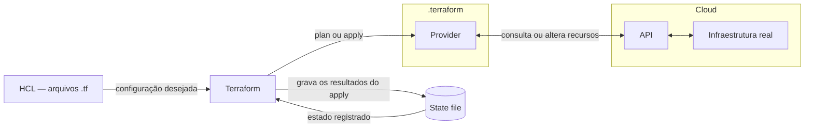
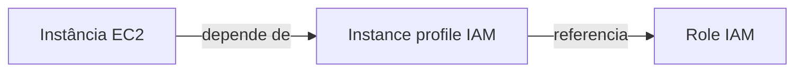

Durante meus estudos de Terraform no curso da LINUXtips, uma pergunta ajudou a entender o papel do state: **como o Terraform sabe qual recurso na nuvem corresponde ao que escrevi no código?**

O nome que aparece no HCL não é necessariamente o identificador usado pela AWS. Entre a configuração e a infraestrutura existe um registro dessa relação: o **state**.

## O fluxo do Terraform nas anotações

O diagrama da aula conecta o código HCL, o Terraform, o state e a infraestrutura na nuvem:



O Terraform lê o HCL e o state e consulta a infraestrutura pelo provider. No `plan`, essa comparação gera a proposta de mudanças; no `apply`, as mudanças são executadas e os resultados são registrados no state.

## O papel do state file

O Terraform armazena o state em formato JSON. Por padrão, no backend local, o arquivo se chama `terraform.tfstate`. Ele registra os vínculos entre recursos da configuração e objetos reais, além de atributos e metadados. Para inspecioná-lo ou modificá-lo, prefira os comandos do Terraform à edição manual do JSON. [Documentação de state](https://developer.hashicorp.com/terraform/language/state).

Nas anotações da aula, organizei sua importância em três pontos: mapeamento, dependências e performance.

### 1. Mapeamento entre configurações e mundo real

Considere este trecho de HCL, que pressupõe um data source `aws_ami.ubuntu` já declarado:

```hcl
resource "aws_instance" "example" {
  ami           = data.aws_ami.ubuntu.id
  instance_type = "t3.micro"
}
```

O endereço `aws_instance.example` identifica o recurso na configuração. O state associa esse endereço ao ID da instância na AWS. Essa relação permite acompanhar o mesmo objeto nas próximas execuções. [Documentação de state](https://developer.hashicorp.com/terraform/language/state).

Um recorte simplificado e fictício do registro seria:

```json
{
  "mode": "managed",
  "type": "aws_instance",
  "name": "example",
  "provider": "provider[\"registry.terraform.io/hashicorp/aws\"]",
  "instances": [
    {
      "schema_version": 2,
      "attributes": {
        "ami": "ami-0123456789abcdef0",
        "arn": "arn:aws:ec2:us-east-1:123456789012:instance/i-0123456789abcdef0",
        "availability_zone": "us-east-1d",
        "id": "i-0123456789abcdef0",
        "instance_type": "t3.micro"
      },
      "dependencies": [
        "data.aws_ami.ubuntu"
      ]
    }
  ]
}
```

Esse exemplo é apenas um fragmento do state, com atributos omitidos para facilitar a leitura. Os campos e o formato podem variar conforme as versões do Terraform e do provider.

| Na configuração | No objeto real |
| --- | --- |
| `aws_instance.example` | Instância EC2 `i-0123456789abcdef0` |
| `ami = data.aws_ami.ubuntu.id` | AMI usada pela instância |
| `instance_type = "t3.micro"` | Tipo de instância registrado |

Cada objeto remoto deve estar associado a uma única instância de recurso na configuração. Importar o mesmo objeto em endereços diferentes torna esse vínculo ambíguo. [Finalidade do state](https://developer.hashicorp.com/terraform/language/state/purpose).

Essa regra também exige atenção ao usar `terraform import` ou `terraform state rm`. O primeiro associa um objeto existente a um endereço no state; o segundo remove esse vínculo sem destruir o objeto remoto. Se o recurso continuar no HCL depois de um `state rm`, um próximo plano pode propor sua criação novamente. [Documentação de `terraform state rm`](https://developer.hashicorp.com/terraform/cli/commands/state/rm).

### 2. Metadados e dependências

O state preserva as dependências mais recentes. Isso ajuda a determinar a ordem de destruição quando um recurso foi removido do HCL e sua configuração já não está disponível. [Metadados do state](https://developer.hashicorp.com/terraform/language/state/purpose#metadata).

No exemplo das anotações:

```json
"dependencies": [
  "data.aws_ami.ubuntu"
]
```

A referência registra uma dependência do data source usado para consultar a AMI. Um data source consulta informações; essa entrada não significa que o Terraform criou ou deva destruir a imagem consultada.

O mesmo raciocínio aparece quando uma instância referencia uma subnet ou um instance profile do IAM: a configuração expressa relações que o Terraform precisa considerar ao organizar as operações.

Nas anotações, desenhei essa relação como **EC2 depende de IAM**. Um exemplo concreto é uma instância que usa um instance profile para receber uma role:



Quando esses recursos são gerenciados no mesmo projeto e as referências estão no HCL, o Terraform considera as dependências para criar a role e o instance profile antes da instância. Na destruição, considera a ordem inversa. Se os recursos forem retirados da configuração, as relações preservadas no state ajudam a organizar sua remoção. [Metadados do state](https://developer.hashicorp.com/terraform/language/state/purpose#metadata).

### 3. Performance

O state também mantém um cache dos atributos conhecidos. Isso é útil em infraestruturas grandes, nas quais consultar cada recurso envolve latência e limites das APIs. Entretanto, **ter esse cache não elimina o refresh padrão**. [Performance do state](https://developer.hashicorp.com/terraform/language/state/purpose#performance).

Normalmente, o `terraform plan` consulta os objetos existentes pelos providers antes de calcular as mudanças. É possível desabilitar essa etapa com `-refresh=false`, mas o plano pode ficar incompleto ou incorreto por ignorar alterações externas. [Documentação de `terraform plan`](https://developer.hashicorp.com/terraform/cli/commands/plan).

# Como o Terraform utiliza o state no plan

O fluxo normal de planejamento pode ser organizado assim:

1. Lê o state disponível no backend.
2. Consulta os recursos existentes pelas APIs dos providers.
3. Compara os dados obtidos com a configuração dos arquivos `.tf`.
4. Propõe as ações necessárias, como criar, atualizar, substituir ou destruir recursos.

O `plan` apresenta essas ações para revisão. O `apply` executa o plano e registra os resultados no state. [Documentação de `terraform plan`](https://developer.hashicorp.com/terraform/cli/commands/plan).

## O que existe dentro do state

Além dos registros de recursos apresentados no exemplo, minhas anotações destacam os seguintes campos:

* **Bindings:** vínculos entre os endereços na configuração e os objetos reais.
* **Atributos:** valores conhecidos dos recursos, como ID, ARN e IP, conforme o tipo de recurso.
* **Metadados:** dependências, referência ao provider e informações sobre o próprio state.
* **Outputs:** valores de saída do módulo raiz registrados no state.

| Campo | O que representa |
| --- | --- |
| `version` | Versão do formato do state |
| `terraform_version` | Versão do Terraform que gravou o snapshot |
| `serial` | Contador incrementado quando o state muda |
| `lineage` | Identificador da linhagem do state |
| `resources` | Registros de recursos e data sources, com suas instâncias |
| `outputs` | Valores de saída armazenados do módulo raiz |

O `schema_version` dentro de uma instância se refere ao schema daquele recurso no provider. Ele tem um papel diferente do campo `version` do arquivo.

## Backend remoto: compartilhando o mesmo estado

O **backend** define onde o Terraform armazena o state. Por padrão, o backend local guarda o arquivo JSON no disco. Um backend remoto, como o S3, permite manter esse registro fora da máquina de quem executa o Terraform.

Se cada pessoa trabalha com uma cópia independente do state, o time perde uma referência comum. Um backend remoto centraliza esse registro para desenvolvedores e pipelines. A proteção contra escrita concorrente depende do suporte e da configuração de locking do backend. [State remoto](https://developer.hashicorp.com/terraform/language/state/remote).

### Vantagens do backend remoto

Nas anotações, separei quatro vantagens:

* **Compartilhamento:** pessoas e pipelines trabalham com o mesmo estado.
* **State locking:** quando suportado e habilitado, impede que duas operações escrevam no mesmo state ao mesmo tempo.
* **Segurança:** com um backend remoto, o Terraform normalmente mantém o state em memória durante a execução, sem persistir uma cópia local. Uma falha ao gravar no backend pode gerar um arquivo local de recuperação; comandos como `state pull` também permitem criar cópias.
* **Versionamento:** depende do serviço e da configuração. No S3, habilitar o versionamento do bucket permite manter versões anteriores do objeto para recuperação.

O backend remoto compartilha o state; o locking coordena quem pode alterá-lo por vez. [Armazenamento e locking](https://developer.hashicorp.com/terraform/language/state/backends), [Backend S3](https://developer.hashicorp.com/terraform/language/backend/s3).

Para aprofundar a configuração e a migração, veja também o post [Backend Remoto no Terraform: State no S3](/posts/backend-remoto-s3-no-terraform/).

## State locking no S3

Quando o backend oferece locking, o Terraform adquire uma trava nas operações que podem escrever no state. Se não conseguir obtê-la, não continua a operação. Isso protege contra execuções concorrentes sobre o mesmo estado. [Documentação de state locking](https://developer.hashicorp.com/terraform/language/state/locking).

Por exemplo: duas pessoas executam `terraform apply` sobre o mesmo state remoto. Uma execução adquire a trava; a outra precisa aguardar sua liberação, se houver um tempo de espera configurado, ou falha ao obter o bloqueio. States locais independentes não oferecem essa coordenação entre as máquinas.

No S3, a configuração das anotações fica assim:

```hcl
terraform {
  backend "s3" {
    bucket       = "meu-bucket-de-state-unico"
    key          = "aula/backend.tfstate"
    region       = "us-east-1"
    encrypt      = true
    use_lockfile = true
  }
}
```

Cada campo tem um papel na configuração:

| Campo | Função |
| --- | --- |
| `backend "s3"` | Define o S3 como backend remoto |
| `bucket` | Nome do bucket que armazena o state |
| `key` | Caminho do objeto do state dentro do bucket |
| `region` | Região AWS do bucket |
| `encrypt` | Solicita criptografia do state no armazenamento |
| `use_lockfile` | Habilita o arquivo de bloqueio para evitar escritas simultâneas |

O bucket precisa existir antes do `init`. O lock nativo do S3 é desabilitado por padrão. A HashiCorp recomenda habilitar o versionamento do bucket para recuperação. [Backend S3](https://developer.hashicorp.com/terraform/language/backend/s3).

No workspace `default`, o objeto de bloqueio desse exemplo fica em `aula/backend.tfstate.tflock`. A identidade AWS precisa das permissões:

* `s3:ListBucket` no bucket, limitado ao caminho necessário.
* `s3:GetObject` e `s3:PutObject` no objeto do state.
* `s3:GetObject`, `s3:PutObject` e `s3:DeleteObject` no objeto `.tflock`.

O locking via DynamoDB está depreciado na documentação atual. [Permissões e locking do backend S3](https://developer.hashicorp.com/terraform/language/backend/s3#permissions-required).

Para permitir novas tentativas de aquisição da trava por até cinco minutos:

```bash
terraform apply -lock-timeout=5m
```

Esse tempo limita a espera pela trava, não a duração do `apply`. [Opções de locking](https://developer.hashicorp.com/terraform/cli/commands/plan).

## Inicialização e migração do backend

Ao transferir um state local existente para o S3, use:

```bash
terraform init -migrate-state
```

Já `terraform init -reconfigure` descarta a configuração anterior do backend e inicializa a nova sem migrar o state. A escolha depende de haver um estado a transferir. [Documentação de `terraform init`](https://developer.hashicorp.com/terraform/cli/commands/init).

### Comandos para inspecionar o state

Alguns comandos úteis das anotações:

```bash
# Exibe o state em formato legível
terraform show

# Lista os endereços presentes no state
terraform state list

# Exibe os atributos de um recurso específico
terraform state show aws_instance.example

# Obtém o state do backend e escreve o JSON na saída padrão
terraform state pull
```

O `state pull` funciona com backends locais e remotos. Para salvar uma cópia de inspeção:

```bash
terraform state pull > state-inspecao.json
```

Esse comando cria uma cópia local, mesmo quando o backend é remoto. Trate esse arquivo como sensível. [Documentação de `terraform state pull`](https://developer.hashicorp.com/terraform/cli/commands/state/pull).

O state pode conter segredos e não deve ser commitado no Git. Controle o acesso ao backend e às cópias locais. [Armazenamento do state](https://developer.hashicorp.com/terraform/language/state#storing-state).

## Conclusão

Entender o state foi uma parte importante dos meus estudos de Terraform. É nele que ficam os vínculos entre o código e os recursos reais, as dependências necessárias para organizar operações e os atributos conhecidos que ajudam no planejamento.

Os três pontos das anotações se conectam: o mapeamento identifica qual objeto gerenciar, os metadados preservam suas relações e o cache de atributos contribui para a performance. Mesmo assim, o refresh continua sendo parte do planejamento padrão para considerar mudanças feitas fora do Terraform.

Quando o projeto passa a ser compartilhado, cuidar desse registro também faz parte do trabalho com infraestrutura. Um backend remoto permite que o time use o mesmo estado; o locking protege contra escritas simultâneas; e o versionamento ajuda na recuperação. Por isso, o state merece acesso restrito, proteção das cópias e atenção em qualquer migração.

## Referências

* [HashiCorp Developer, visão geral de state](https://developer.hashicorp.com/terraform/language/state): estrutura, armazenamento e cuidados com o estado da infraestrutura.
* [HashiCorp Developer, finalidade do state](https://developer.hashicorp.com/terraform/language/state/purpose): mapeamento entre configuração e objetos reais, metadados, dependências e performance.
* [HashiCorp Developer, state remoto](https://developer.hashicorp.com/terraform/language/state/remote): compartilhamento do estado entre pessoas e pipelines.
* [HashiCorp Developer, armazenamento e locking](https://developer.hashicorp.com/terraform/language/state/backends): persistência do state em backends e recuperação em caso de falha.
* [HashiCorp Developer, state locking](https://developer.hashicorp.com/terraform/language/state/locking): bloqueio do state durante operações que podem modificá-lo.
* [HashiCorp Developer, backend S3](https://developer.hashicorp.com/terraform/language/backend/s3): configuração, permissões, versionamento e locking nativo do S3.
* [HashiCorp Developer, comando `terraform plan`](https://developer.hashicorp.com/terraform/cli/commands/plan): planejamento de mudanças, refresh e opções de locking.
* [HashiCorp Developer, comando `terraform init`](https://developer.hashicorp.com/terraform/cli/commands/init): inicialização, migração e reconfiguração do backend.
* [HashiCorp Developer, comando `terraform state pull`](https://developer.hashicorp.com/terraform/cli/commands/state/pull): obtenção do state do backend em formato JSON.
* [HashiCorp Developer, comando `terraform state rm`](https://developer.hashicorp.com/terraform/cli/commands/state/rm): remoção do vínculo com um objeto sem destruí-lo na infraestrutura.
* [LINUXtips, Treinamento IaC e Pipeline Specialist](https://linuxtips.io/iac-pipeline-specialist/): treinamento de IaC com Terraform utilizado como base dos meus estudos e destas anotações.
