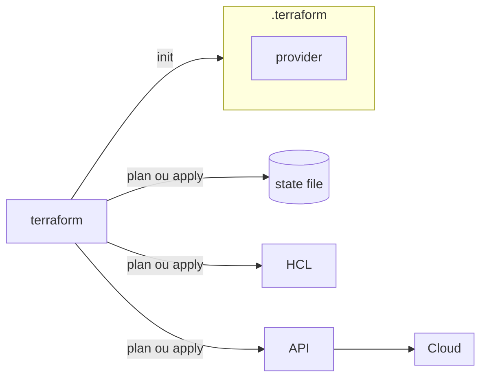

No [post anterior sobre os fundamentos de IaC](/posts/fundamentos-de-iac-com-terraform) fiquei mais no conceito: o que é uma API, o que é Cloud e como o Terraform se encaixa nisso tudo. Nessas anotações eu fui para o lado prático do curso e testei, comando por comando, o fluxo `init`, `plan` e `apply` contra a AWS de verdade.

# Revisando o fluxo do Terraform

Antes de rodar qualquer comando, vale lembrar os elementos que participam desse fluxo:

* arquivos HCL, que descrevem o estado desejado da infraestrutura
* o binário do Terraform, que lê esses arquivos
* os providers, que sabem conversar com a API de cada serviço
* o state file, onde ficam registradas as informações dos recursos
* a infraestrutura em si, dentro do provedor escolhido (no meu caso, a AWS)

O binário lê o HCL, usa o provider necessário para se comunicar com a API do provedor e registra o resultado no state file. É esse ciclo que os comandos abaixo colocam em movimento.



# Terraform Init

O primeiro comando básico é:

```bash
terraform init
```

Ele inicializa o diretório de trabalho do Terraform. Ao rodar `terraform init`, o Terraform cria uma pasta local chamada `.terraform`.

Essa pasta armazena os arquivos necessários para os plugins dos providers usados naquele projeto, incluindo o provider da AWS. Se o código Terraform usa recursos da AWS, o `terraform init` identifica essa necessidade e baixa o provider correspondente.

## Terraform Init Upgrade

```bash
terraform init -upgrade
```

É uma boa prática rodar essa opção de vez em quando: ela faz o Terraform verificar se existem versões mais novas dos providers e módulos utilizados no projeto.

## O arquivo de lock

Depois da inicialização, o Terraform também cria um arquivo de lock (`.terraform.lock.hcl`). Esse arquivo registra informações sobre os providers utilizados, incluindo versões e hashes. Ele garante que o projeto use versões consistentes dos plugins entre diferentes execuções e ambientes, o que evita surpresas quando outra pessoa do time roda o mesmo código.

# O papel do Provider

O provider é o componente que o Terraform usa para se comunicar com uma plataforma externa. No meu caso, o provider é o da AWS.

O Terraform em si não sabe criar diretamente uma instância EC2, um bucket S3 ou qualquer outro recurso da AWS. Quem sabe fazer isso é o provider: ele precisa da AWS para saber como conversar com a API do serviço e executar essas ações.

# Configurando credenciais da AWS

Para que o Terraform consiga se comunicar com a AWS, é necessário fornecer credenciais. Uma forma comum de fazer isso é por meio de variáveis de ambiente:

```bash
export AWS_ACCESS_KEY_ID="sua_access_key"
export AWS_SECRET_ACCESS_KEY="sua_secret_key"
```

Essas variáveis permitem que o provider da AWS autentique as chamadas feitas pelo Terraform. As credenciais devem ser tratadas com cuidado, principalmente quando possuem permissões amplas.

> Elas não devem ser compartilhadas, expostas ou divulgadas em nenhuma hipótese.

# Configurando o provider no código

Além das credenciais, também é importante configurar o provider dentro do próprio código Terraform:

```hcl
terraform {
  required_providers {
    aws = {
      source  = "hashicorp/aws"
      version = ">= 5.0"
    }
  }
}

provider "aws" {
  region = "us-east-2"
}
```

O bloco `terraform` define quais providers são necessários. O bloco `provider` configura os detalhes do provider, como a região da AWS que será usada.

## Cuidado com a região

Ao trabalhar com AWS, a região é uma informação importante. Se ela não for configurada explicitamente no código, o Terraform pode acabar usando uma região padrão definida no ambiente, e não a região que você imagina. Isso gera confusão, porque um recurso pode acabar sendo criado numa região diferente da esperada.

# Terraform Plan

Depois de inicializar o projeto e configurar as credenciais, dá para rodar:

```bash
terraform plan
```

O `terraform plan` mostra o que o Terraform pretende fazer. Para chegar nisso, ele compara três fontes:

* o que está descrito no código
* o que está registrado no state file
* o que existe de fato no provider

Com base nessa comparação, o Terraform monta um plano de execução. Esse plano pode indicar que recursos serão criados, alterados, destruídos ou mantidos sem mudança.

## Entendendo a saída do plan

Na saída do `terraform plan`, o Terraform mostra uma legenda indicando as ações planejadas:

* o símbolo `+` indica que um recurso será criado
* o símbolo `-` indica que um recurso será destruído
* outros símbolos podem indicar alteração ou substituição

Quando um recurso ainda não existe, o Terraform mostra que ele será criado.

> Algumas informações só aparecem como conhecidas depois do `apply`, porque dependem do provider criar o recurso antes de retornar esses dados de volta.

## Salvando um plano com `out`

```bash
terraform plan -out plano
```

Dá para salvar o plano em um arquivo usando a opção `out`. Isso gera um arquivo de plano que pode ser aplicado depois, e a vantagem é garantir que o `apply` execute exatamente o plano que foi analisado.

Sem esse arquivo, entre o momento do `plan` e o momento do `apply` alguma coisa pode mudar no ambiente, e o que será aplicado deixa de ser exatamente o que foi revisado.

# Terraform Apply

```bash
terraform apply
```

O `apply` aplica as mudanças planejadas. Quando executado diretamente, o Terraform mostra o plano de novo e pede confirmação antes de aplicar.

Também é possível aplicar um plano já salvo:

```bash
terraform apply plano
```

Durante o `apply`, o Terraform usa o provider para se comunicar com a AWS, cria ou altera os recursos necessários e atualiza o state file com o resultado.

# Um exemplo com data source

Um caso prático que apareceu nas anotações foi buscar dinamicamente o ID de uma AMI (a imagem usada para criar uma instância EC2), em vez de fixar esse valor no código:

```hcl
data "aws_ami" "ubuntu" {
  most_recent = true

  filter {
    name   = "name"
    values = ["ubuntu/images/hvm-ssd/ubuntu-*-amd64-server-*"]
  }

  filter {
    name   = "virtualization-type"
    values = ["hvm"]
  }

  owners = ["099720109477"] # Canonical
}

resource "aws_instance" "example" {
  ami           = data.aws_ami.ubuntu.id
  instance_type = "t3.micro"

  tags = {
    Name = "HelloWorld"
  }
}
```

O bloco `data` consulta a AWS e traz a AMI mais recente da Ubuntu que combina com os filtros informados. O `resource` usa esse valor por meio de `data.aws_ami.ubuntu.id`, em vez de um ID fixo. Assim, o código continua funcionando mesmo quando a Canonical publica uma nova versão da imagem.

# State file local

Depois que o Terraform cria um recurso, ele regist-ra as informações no state file. Quando o Terraform é usado localmente, esse arquivo pode ser criado no próprio diretório do projeto.

Embora isso funcione para testes e aprendizado, em ambientes profissionais o ideal é usar um state file remoto. Isso permite que diferentes pessoas do time acessem o mesmo estado da infraestrutura de forma compartilhada, sem depender do laptop de uma única pessoa. Falei com mais detalhes sobre isso no post [Terraform state, o arquivo que pode derrubar sua infra](/posts/terraform-state-primeiros-passos).

# Conclusão

O que fica claro colocando `init`, `plan` e `apply` em prática é que cada comando tem uma responsabilidade bem definida: o `init` prepara o ambiente e baixa os providers, o `plan` compara código, state e provider para montar um plano legível, e o `apply` executa esse plano e atualiza o state. Entender essa separação ajuda bastante a ler a saída do Terraform sem susto, principalmente quando o plano indica uma destruição que não era esperada.

## Referências

* [HashiCorp Developer, comando `terraform init`](https://developer.hashicorp.com/terraform/cli/commands/init): referência oficial da inicialização do diretório de trabalho.
* [HashiCorp Developer, comando `terraform plan`](https://developer.hashicorp.com/terraform/cli/commands/plan): documenta como o plano de execução é montado.
* [HashiCorp Developer, comando `terraform apply`](https://developer.hashicorp.com/terraform/cli/commands/apply): referência oficial da aplicação de mudanças.
* [HashiCorp Developer, Providers](https://developer.hashicorp.com/terraform/language/providers): explica o papel dos providers na arquitetura do Terraform.
* [Terraform Registry, provider AWS](https://registry.terraform.io/providers/hashicorp/aws/latest/docs): documentação de autenticação e configuração do provider da AWS.
* [Terraform Registry, data source `aws_ami`](https://registry.terraform.io/providers/hashicorp/aws/latest/docs/data-sources/ami): referência do data source usado para buscar a AMI da Ubuntu.
* [LINUXtips, Treinamento IaC e Pipeline Specialist](https://linuxtips.io/iac-pipeline-specialist/): treinamento de IaC com Terraform utilizado como base dos meus estudos e destas anotações.
